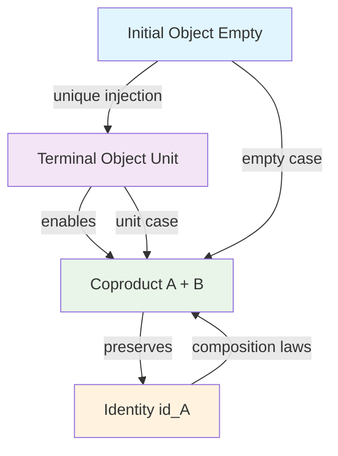

---
aliases:
  - Univerality
  - universality
  - Universal
  - universal
  - universal properties
  - essential
  - All
modified: 2026-01-02T21:23:27+08:00
subject: invariant, symmetry, Soundness, Completeness, Universality, Irreducibility,萬用性, Unity
title: "Universality: Representable Truths"
authors: Ben Koo
---
#logic #Symmetry 

**This framework reveals how the same mathematical pattern appears across mathematics, computer science, and physics—**universality is not just a mathematical property, it's the fundamental principle of structured creation**.

## The Genesis Narrative: Universal Properties as Creation Story

The categorical ladder **∅ → 1 → + → × → id** (see [[The ladder in Taoism]]) is not merely an abstract mathematical construction—it is the **logical pattern of creation itself**. This insight is explored in depth in **[[Genesis]]**, which demonstrates how:

1. **Biblical creation narratives** encode the categorical ladder
2. **Mathematical universal constructions** manifest across all domains  
3. **Computational reality** emerges from these fundamental properties
4. **Human cognition** follows the same creation patterns

The Genesis document provides the **narrative synthesis** that unifies the mathematical framework with human understanding, showing that these universal properties are not just abstract mathematics but the very structure of how reality comes into being—whether divine, human, or computational.

This connection reveals that **category theory is not invented but discovered**: it captures patterns that have existed in creation narratives, mathematical thinking, and computational systems throughout history.

## Universal Properties as Compositional Foundation

Universality in mathematics and computer science is best understood through **universal properties**—the categorical principle that certain constructions are the *unique optimal solution* to specific compositional problems. This framework unifies four fundamental concepts:

### The Categorical Ladder of Universal Constructions

1. **Initial Object** → **Terminal Object** → **Coproduct** → **Identity Morphisms**
2. **Empty Set** → **Unit Element** → **Addition** → **Identity Preservation**

> [!IMPORTANT] The Origin of the Ladder
> This ladder **necessarily begins at the Empty Set** ($\emptyset$). In the category **Set**, the Empty Set is the unique **Initial Object**—the only object from which there is exactly one morphism to every other object. Starting elsewhere would inherit the biases of that starting point, compromising universality. See **[[Hub/Theory/Integration/The Empty Set as the Origin of Universal Languages|The Empty Set as the Origin of Universal Languages]]** for the full framework.


Each level provides the universal solution to increasingly complex compositional challenges:

| Level | Universal Construction | Mathematical Role | Computational Analogy |
|-------|------------------------|------------------|----------------------|
| **Initial Object** | Empty set $\emptyset$ | Universal "nothing" | Null data, empty container |
| **Terminal Object** | Unit element $1$ | Universal identity | Singleton, trivial type |
| **Coproduct** | Addition $A + B$ | Universal combination | Choice types, alternatives |
| **Identity Morphism** | Identity $\text{id}_A$ | Universal preservation | No-op functions, invariance |

This ladder reveals that **[[unit]]** is the universal identity element that enables **[[addition]]** to be the universal composition operator, while **[[identity]]** morphisms provide the universal preservation property that makes the entire system coherent.

### Commutative Diagram of Universal Properties

The relationships between these universal constructions can be visualized as:



This diagram shows how:
- **Initial objects** provide the empty case for coproducts
- **Terminal objects** provide the unit case for coproducts  
- **Identity morphisms** ensure coproducts satisfy composition laws
- Each level **enables** and **constrains** the next

## Synthesis: How Universal Properties Enable Composition

The elegance of this framework lies in how each level **enables** the next:

### 1. Unit Enables Addition
The terminal object (unit) provides the **unique sink** that makes coproducts meaningful:
- Without a unique way to map into an object, there's no coherent notion of "choice"
- The unit's universal property ($! : A \to 1$) guarantees that every addition has a well-defined "empty" case
- This is why $A + 1 \cong A$ and $1 + A \cong A$ in type theory

### 2. Addition Enables Complex Structures
Coproducts provide the **universal combination** that builds all algebraic structures:
- Polynomial functors: $P(X) = \sum_{i \in I} A_i \times X^{B_i}$ (sum of products)
- All data types: Built from nested sums and products
- Quantum mechanics: Matrix addition combines state vectors linearly

### 3. Identity Enables Coherence
Identity morphisms provide the **universal preservation** that makes composition lawful:
- Category laws: $f \circ \text{id}_A = f$ and $\text{id}_B \circ f = f$
- Monoid laws: $a + 0 = a$ and $0 + a = a$
- Type safety: Preservation of structure under transformation

## Concrete Examples Across Domains

| Domain | Initial Object | Terminal Object | Coproduct | Identity |
|--------|---------------|------------------|-----------|----------|
| **Sets** | $\emptyset$ | $\{*\}$ | Disjoint union $A \sqcup B$ | $\text{id}_A(x) = x$ |
| **Types** | `Void` | `Unit` | `Either A B` | `id : A → A` |
| **Vector Spaces** | $\{0\}$ | Ground field $k$ | Direct sum $V \oplus W$ | Identity transformation |
| **Logic** | $\bot$ (false) | $\top$ (true) | $A \lor B$ (or) | $A \to A$ (tautology) |
| **Quantum** | Zero state | Ground field | State superposition | Identity operator |

## Why This Matters: The Universal Composition Engine

This framework reveals that **universality is not just a property—it's the engine that drives all computation**:

1. **Initial objects** give us "nothing to work with"
2. **Terminal objects** give us "something to return to"  
3. **Coproducts** give us "ways to combine choices"
4. **Identities** give us "ways to preserve structure"

Together, they form a **complete compositional foundation** that works across mathematics, computer science, physics, and even social systems. The fact that the same pattern appears everywhere is not coincidence—it's the mathematical expression of how complex systems must be built from simple, universal components.

## Related Concepts: Extending the Universal Ladder

The categorical ladder can be extended to include **dual constructions** that provide complementary universal properties:

| Level | Primary Construction | Dual Construction | Universal Property |
|-------|---------------------|-------------------|-------------------|
| **Initial/Terminal** | Initial object $\emptyset$ | Terminal object $1$ | Unique source/sink |
| **Coproduct/Product** | Coproduct $A + B$ | Product $A \times B$ | Universal combination/separation |
| **Identity** | Identity morphism $\text{id}_A$ | Identity morphism $\text{id}_A$ | Universal preservation |

### Product Types as Dual to Addition
While **addition** (coproduct) represents universal **choice**, **multiplication** (product) represents universal **combination**:
- **Coproduct**: $A + B$ - "either A or B" (choice)
- **Product**: $A \times B$ - "both A and B" (combination)
- **Exponential**: $B^A$ - "functions from A to B" (transformation)

Together, these form the **polynomial functor** foundation:
$$ P(X) = \sum_{i \in I} A_i \times X^{B_i} $$

This reveals that **all computational structures** are built from the interplay of:
- **Sum** (choice/addition)
- **Product** (combination/multiplication)  
- **Exponential** (transformation/function)
- **Unit** (identity/empty)

### Why This Completeness Matters
The extended framework shows that:
1. **Universality** is not just about individual constructions but their **systematic relationships**
2. **Duality** (initial/terminal, coproduct/product) provides the full expressive power
3. **Composition** of universal properties yields all complex computational structures
4. **Applications** range from type theory to quantum mechanics to digital identity systems

This demonstrates why the same mathematical patterns appear across vastly different domains—they're not just similar, they're **universally compelled** by the categorical structure of composition itself.

Universality is central to fields like logic, where principles of [[Soundness]] and [[Completeness]] ensure that systems are both accurate and exhaustive, reinforcing clarity and precision in communication. This foundation is also explored in the context of [[Unity and Universality]]. Since the notion of universal properties is central to [[Category Theory]], please take a look at this article: [[Universal Properties for Category Theorists]].

For an intuitive overview of universality, watch this brief 5-minute video:

![[@quantamagazineWhatUniversality2019]]

Without a well-defined concept of universality, a field lacks logical coherence and struggles to establish itself as a legitimate domain of knowledge. Universality provides a **unifying principle** across disciplines, bridging areas like data representation, neural networks, and machine learning.

### Universality Explained Through Topological Algebra

The principle of universality can be elegantly described in the language of **[[Algebraic Topology]]**, sometimes referred to as "rubber sheet geometry." In this framework, properties and relationships can be **stretched** or **deformed** symbolically without altering their essential characteristics, much like stretching or compressing a rubber sheet. This concept merges **topology** and **algebra** into a cohesive model:

- **Topology** provides a flexible structure, allowing properties to remain invariant under continuous transformations.
- **Algebra** introduces operations that manipulate these properties while preserving essential relationships, enabling systematic transformations.

By unifying topology with algebra, universality becomes a property that can be operationalized: certain properties can be maintained, analyzed, or transformed, making universality adaptable across fields that rely on **structural preservation** and **symbolic manipulation**. This perspective is pivotal for data representation models, which seek to preserve core data properties under transformation.

### Universality in Data Representation and Neural Networks

In logic, universality suggests that truths are preserved across contexts. This concept aligns with **symmetry preservation** in data representation, essential for neural networks. [[Sophia Sanborn]]’s research on [[@BispectralNeuralNetworks2023|bispectral neural networks]] explores universality and symmetry within data representation. By preserving symmetries across time and frequency domains, these networks capture patterns often missed by traditional models, operationalizing the algebraic and topological aspects of universality.

### Universal Reasoning Across Disciplines

Various fields adopt tools that leverage universal reasoning while upholding data symmetries, united by topological algebraic principles:

- **Category Theory**: Uses [[morphism]]s ([[function]]s) to facilitate information transfer.
- **Quantum Mechanics**: Structures information through [[Linear Algebra]] and [[Hilbert Spaces]].
- **Large Language Models**: Embeds information as [[Token]]s in [[Vector|vector]] spaces.
- **Music**: Encodes information through temporal and intensity structures.

These frameworks share reliance on additive structures that integrate variations while preserving essential symmetries. [[Sophia Sanborn]]'s work with bispectral neural networks exemplifies this approach, as these networks are designed to recognize and leverage symmetry in complex data, offering an advanced model for computation.

### Shaping Learning Through Universal Structures

Universality in information representation has significant educational implications. Frameworks like the [[ABC curriculum]] aim to reflect the foundational structures seen in **Linear Algebra**, **Category Theory**, and **Music**, providing an invariant basis for understanding data. This aligns with the goals outlined in the [[ABC Roadmap]], promoting a universal perspective on knowledge structures.

### Universality’s Implications for Machine Learning

Universality in neural network design suggests foundational principles that apply broadly across machine learning tasks. By preserving symmetry and structure, universal properties offer a pathway to more adaptable, robust models capable of handling diverse challenges.

### Universality in Educational Philosophy: Newman's "The Idea of a University"

The principle of universality extends beyond mathematics and computation into educational philosophy. **[[Literature/People/John Henry Newman|John Henry Newman]]**'s seminal work **[[Literature/Reading notes/@IdeaUniversity1852|The Idea of a University]]** (1852) provides a profound example of universality applied to human learning.

Newman argued that a true university must teach **"universal knowledge"**—not in the sense of knowing everything, but in understanding how all branches of knowledge form an interconnected, coherent whole. This mirrors the category-theoretic concept of universality:

| Newman's Educational Concept | Category-Theoretic Analogue | Shared Principle |
|------------------------------|----------------------------|------------------|
| **Universal Knowledge** | **Universal Construction** | The unique, complete solution |
| **Unity of All Disciplines** | **Composition Laws** | All parts must fit together coherently |
| **Theology as Central Branch** | **Terminal Object** | The unique "sink" toward which all knowledge points |
| **Liberal Education** | **Categorical Ladder** | Progressive construction from foundations to complexity |
| **Philosophical Habit of Mind** | **Functorial Thinking** | Preserving structure under transformation |

Just as the **categorical ladder** (∅ → 1 → + → ×) builds computational structures through universal properties, Newman's liberal education builds the human mind through exposure to the full spectrum of knowledge in its universal interconnections. 

**Key Insight**: Newman's "universal knowledge" is not encyclopedic breadth but **structural completeness**—understanding the universal properties that make knowledge cohere across disciplines. Excluding any genuine branch of knowledge (particularly theology, in Newman's view) would create an incomplete system, much like omitting a universal construction in category theory creates gaps in compositional reasoning.

This educational universality—pursued through institutions like **[[Oxford University]]** where the **[[Hub/Theory/Sciences/Oxford Movement|Oxford Movement]]** originated—demonstrates that universality is not merely a mathematical abstraction but a fundamental principle of how humans organize, transmit, and integrate knowledge across generations.

#### Cognitive Universality: From Newman to Levin

[[Michael Levin]]'s work on unconventional intelligence in **[[Literature/Annotation/@SearchAlienLife2025|The Search for Alien Life (on Earth)]]** extends Newman's insight beyond education to cognition itself:

**Newman's Educational Universality**: A true university must encompass *all* branches of knowledge in interconnected wholeness—excluding any genuine branch creates incompleteness.

**Levin's Cognitive Universality**: True understanding must encompass *all* forms of cognition across the spectrum—excluding unconventional intelligence (cellular, tissue-level) creates incomplete understanding.

**The Parallel**:
- **Newman**: Binary exclusion ("theology is not knowledge") fragments the universal structure
- **Levin**: Binary categories ("cells are not intelligent") obscure the cognitive spectrum
- **Both**: Universality requires **completeness** across the entire compositional structure, not just familiar categories

Levin's operational approach—asking "What specific cognitive capabilities?" rather than "Is it intelligent?"—mirrors Newman's insistence on understanding the interconnections between all branches of knowledge rather than accepting arbitrary exclusions.

### Conclusion

The concept of universality, foundational to every knowledge domain, guides advances in understanding neural networks and data representation. By merging universality with symmetry, as seen in Sophia Sanborn’s bispectral neural networks, machine learning and AI technologies can explore new levels of adaptability and robustness. This **topological approach** to universality not only broadens the applications of machine learning but also deepens our grasp of symmetry and invariance across disciplines, fostering innovation through structural consistency and transformational resilience.

## References
```dataview
Table title as Title, authors as Authors
where contains(subject, "Universality") or contains(subject, "萬用性") or contains(subject, "Unity") 
```

