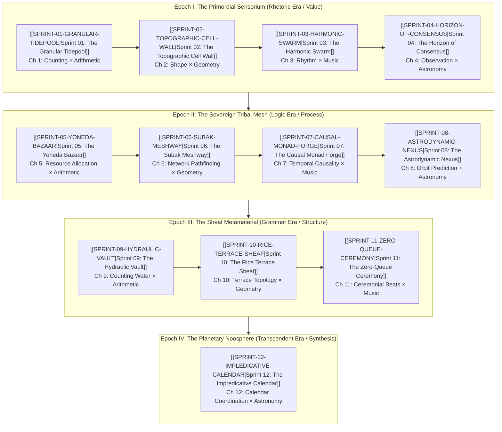

---

> [!IMPORTANT]
> **The Player's Axiom**: *"Knowledge is free, but judgment is not! Knowledge as written or published content can be attained rather publicly in various commons, but using the knowledge in privately interested or self-resolved choices will reveal the color of that person."*
> In this meta-game, all formulas, network protocols, and architectural models are accessible openly in the public commons. However, every sprint forces players to exercise **Judgment**—making irreversible choices between private extractive advantage and communal flourishing (Gotong Royong). These choices directly shift the player's **Synesthetic Chromatic Signature** ("the color of character") and govern their standing across the Tri Hita Karana cosmic order.

title: "Active Sprints Workspace: Prologue of Spacetime"
date: 2026-09-26
tags: [Sprint, Meta-Game, PrologueOfSpacetime, Civilizational-Strategy, Tri-Hita-Karana, Digital-Synesthesia]
type: note
sources:
  - docs/concepts/Knowledge_Is_Free_Judgment_Is_Not.md
  - docs/sources/Dialect_Relativity_Unification_Electricity_Magnetism.md
  - docs/concepts/Perspective_and_Referential_Coordinates_in_Spacetime_Compositionality.md
  - docs/principles/Cordis_Spatiotemporal_Composability.md
  - raw/articles/Prologue_of_Spacetime_introduction.pdf
  - docs/narrative/Prologue_of_Spacetime_Master_Document.md
  - docs/narrative/Prologue_of_Spacetime_Ludic_Architecture_and_Synesthetic_Game_Sprints.md
status: stable
liberal_art: Trivium-Rhetoric
---

# Active Sprints Workspace: Prologue of Spacetime

> **Mission Charter**: This directory constitutes the active operational staging area for the **Prologue of Spacetime**—a playable grand strategy meta-game of civilizational evolution, pedagogical transformation, and multi-agent coordination. Derived directly from [[docs/narrative/Prologue_of_Spacetime_Master_Document|Prologue of Spacetime: Master Document]] and [[docs/narrative/Prologue_of_Spacetime_Ludic_Architecture_and_Synesthetic_Game_Sprints|Ludic Architecture, Strategy Game Sprints, and the Synesthetic Type Lattice]], this suite translates the $3 \times 4$ curriculum matrix (Reverse Trivium $\times$ Revived Quadrivium) into twelve actionable, verifiable sprints spanning four civilizational epochs, supported by foundational infrastructure refactoring sprints.

---

## 1. Master Architecture & The Four Civilizational Epochs

The 12 primary game sprints map directly to the 12 chapters of the curriculum, organized into four ascending civilizational epochs. Each sprint is governed by a **Dual-Type Skill Lattice** decomposing actions into **Physically Meaningful Data Manipulation** (`PhysicalType`) and **Socially Meaningful Data Manipulation** (`SocialType`), unlocking progressive tiers of **Digital Synesthesia**.

---

---

## 2. Spatiotemporal Compositionality: Perspective & Referential Coordinates

Following the **[[docs/sources/Dialect_Relativity_Unification_Electricity_Magnetism|Dialect relativistic critique]]** and **[[docs/principles/Cordis_Spatiotemporal_Composability|Cordis spatiotemporal framework]]**, every sprint rejects naive coordinate chauvinism:
- **Perspective ($u^\mu$) & Referential Coordinates**: An agent's local coordinate system slices the invariant 4D manifold into local spatial memory ($[L]$ space / MCard) and local temporal process ($[T]$ space / PCard), guided by observer intent ($[V]$ space / VCard).
- **Tensorial Invariants**: Sprints compose not by enforcing uniform coordinate frames, but by preserving coordinate-free invariants (e.g. Faraday systemic invariants $I_1, I_2$, Gauss-Bonnet curvature, Leinster diversity, vanishing Čech cohomology $H^1 = 0$, Little's Law $W_q = 0$).
- **Cordis Execution Fibers**: Each sprint runs as an isolated execution fiber ($|f_i\rangle$) with scoped lexical context (`ctx.isolate`), reversible side effects (`DisposableList`), and non-commutative LIFO cleanup directionality ($\text{道}$).

## 3. Active Sprint Matrix & Status Board

| Sprint | Code | Title | Curriculum Chapter | Matrix Position | Physical Type | Social Type | Digital Synesthesia | Status |
|:---|:---|:---|:---|:---|:---|:---|:---|:---|
| **00** | `ORCH` | [[SPRINT-00-MASTER-ORCHESTRATION|Master Orchestration Plan]] | Meta-Architecture | Master Charter | Multi-Scale | Tri Hita Karana | Holistic Telemetry | **Active** |
| **01** | `S01` | [[SPRINT-01-GRANULAR-TIDEPOOL|The Granular Tidepool]] | [[chapters/01_The_Value_of_Counting|Ch 1: The Value of Counting]] | Arithmetic × Rhetoric | `Countable` | `Precondition` | Auditory Pulse Train | **Active** |
| **02** | `S02` | [[SPRINT-02-TOPOGRAPHIC-CELL-WALL|The Topographic Cell Wall]] | [[chapters/02_The_Meaning_of_Shape|Ch 2: The Meaning of Shape]] | Geometry × Rhetoric | `SpatialSheaf` | `AgencyResidual` (己志) | Topological Parallax | **Active** |
| **03** | `S03` | [[SPRINT-03-HARMONIC-SWARM|The Harmonic Swarm]] | [[chapters/03_The_Power_of_Rhythm|Ch 3: The Power of Rhythm]] | Music × Rhetoric | `TemporalCadence` | `SpeechAct` | Harmonic Dissonance | **Active** |
| **04** | `S04` | [[SPRINT-04-HORIZON-OF-CONSENSUS|The Horizon of Consensus]] | [[chapters/04_The_Truth_of_Observation|Ch 4: The Truth of Observation]] | Astronomy × Rhetoric | `Kinematic` | `Attestation` | Spectral Coherence | **Active** |
| **05** | `S05` | [[SPRINT-05-YONEDA-BAZAAR|The Yoneda Bazaar]] | [[chapters/05_Resource_Allocation|Ch 5: Resource Allocation]] | Arithmetic × Logic | `Thermodynamic` | `Precondition` & `SpeechAct` | Thermal Haptic Drag | **Active** |
| **06** | `S06` | [[SPRINT-06-SUBAK-MESHWAY|The Subak Meshway]] | [[chapters/06_Network_Pathfinding|Ch 6: Network Pathfinding]] | Geometry × Logic | `SpatialSheaf` | `AgencyResidual` | Fluidic Streamlines | **Active** |
| **07** | `S07` | [[SPRINT-07-CAUSAL-MONAD-FORGE|The Causal Monad Forge]] | [[chapters/07_Temporal_Causality|Ch 7: Temporal Causality]] | Music × Logic | `TemporalCadence` | `DialecticalTurn` | Phosphorescent Light-Cones | **Active** |
| **08** | `S08` | [[SPRINT-08-ASTRODYNAMIC-NEXUS|The Astrodynamic Nexus]] | [[chapters/08_Orbit_Prediction|Ch 8: Orbit Prediction]] | Astronomy × Logic | `Kinematic` | `DialecticalTurn` | Attractor Holography | **Active** |
| **09** | `S09` | [[SPRINT-09-HYDRAULIC-VAULT|The Hydraulic Vault]] | [[chapters/09_Counting_Water|Ch 9: Counting Water]] | Arithmetic × Grammar | `Countable` | `Attestation` | Crystalline Type Gemstones | **Active** |
| **10** | `S10` | [[SPRINT-10-RICE-TERRACE-SHEAF|The Rice Terrace Sheaf]] | [[chapters/10_Rice_Terrace_Topology|Ch 10: Rice Terrace Topology]] | Geometry × Grammar | `SpatialSheaf` | `AgencyResidual` & `Attestation` | Zero-Shear Manifolds | **Active** |
| **11** | `S11` | [[SPRINT-11-ZERO-QUEUE-CEREMONY|The Zero-Queue Ceremony]] | [[chapters/11_Ceremonial_Beats|Ch 11: Ceremonial Beats]] | Music × Grammar | `TemporalCadence` | `DialecticalTurn` | Acoustic Strobe Resonance | **Active** |
| **12** | `S12` | [[SPRINT-12-IMPLEDICATIVE-CALENDAR|The Impredicative Calendar]] | [[chapters/12_Calendar_Coordination|Ch 12: Calendar Coordination]] | Astronomy × Grammar | `Kinematic` & `SpatialSheaf` | `AgencyResidual` & `Attestation` | Universal Noospheric Symphony | **Active** |

---

## 4. Vault & Mathematical Foundation Sprints (AoS Suite)

Supporting the game sprints is the vault reorganization and mathematical formalization suite derived from the **Algebra of Systems (AoS)**:

| Sprint | Code | Title | Core Focus | Deliverable | Status |
|:---|:---|:---|:---|:---|:---|
| **AoS-01** | `AOS1` | [[SPRINT-AOS-01-CONTENT-INVENTORY|Content Inventory & Taxonomy]] | Systems as Manifolds & Multi-Scale Decisions | Content Audit, Boundary Catalog & Index | **Graduated** |
| **AoS-02** | `AOS2` | [[SPRINT-AOS-02-MATHEMATICAL-FORMALIZATION|Mathematical Formalization]] | Rank-Nullity Theorem & Function Refinement | Formal KaTeX Invariants & Theorem Bridges | **Graduated** |
| **AoS-03** | `AOS3` | [[SPRINT-AOS-03-MODULARITY-AND-DECOUPLING|Modularity & Decoupling]] | Independence Axiom & Curvature Annihilation | Decoupling Matrix, Maxwell Gatekeepers | **Graduated** |
| **AoS-04** | `AOS4` | [[SPRINT-AOS-04-CROSS-DOMAIN-SYNTHESIS|Cross-Domain Synthesis]] | Axiomatic Design & Real Options Integration | Relational Composition & Synesthesia Maps | **Graduated** |
| **AoS-05** | `AOS5` | [[SPRINT-AOS-05-VERIFICATION-AND-QA|Verification & Zero-Loss QA]] | Relational Functional Invariance Protocol | Cross-Link Repair, Zero-Dangling Audit | **Graduated** |
| **AoS-06** | `AOS6` | [[SPRINT-AOS-06-CONTINUOUS-FILTRATION|Continuous Filtration & Ingestion]] | Continuous Loopback & Paper Ingestion | Literature Extraction Pipelines | **Graduated** |

---

## 5. Universal Definition of Done (DoD) Framework

Every sprint in this active workspace must satisfy four non-negotiable verification gates before transitioning from `status: draft` or `active` to `graduated`:

1. **Mathematical Invariant Verification**: All governing theorems and equations (e.g., Shannon entropy bounds, Gauss-Bonnet curvature, Leinster diversity, Lyapunov exponents, Sheaf cohomology vanishing $H^1 = 0$, Little's Law $W_q = 0$) are formally stated with LaTeX and bounded.
2. **Type Lattice Grounding**: Both `PhysicalType` (material grounding) and `SocialType` (human agency / intent) are explicitly declared with domain, codomain, and invariants.
3. **Tri Hita Karana & Guide Integration**: Narrative perspectives from Mr. Wayan (Parahyangan), Ms. Dewi (Palemahan), and Santa Claus (Pawongan) are integrated into game mechanics.
4. **Digital Synesthesia Perceptual Transduction**: A concrete sensory feedback mapping (auditory, haptic, optical, or spatial) is specified to allow players to directly perceive systemic health.
5. **Zero-Dangling Wikilink Integrity**: All referenced entities, chapters, and principles are validly linked within this vault per [[AGENTS|AGENTS.md schema]].
