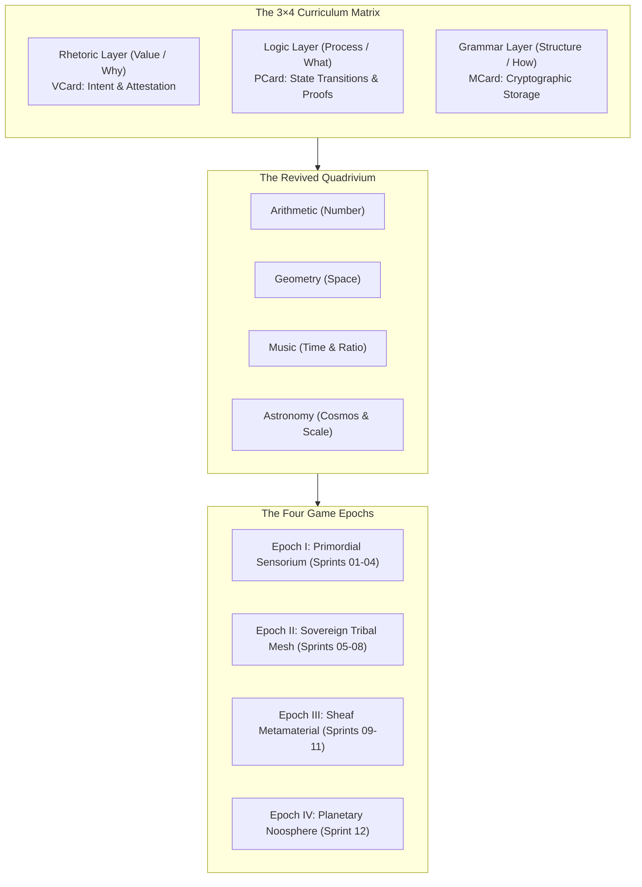
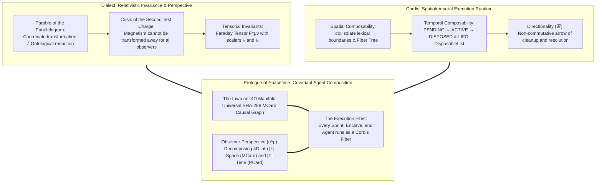
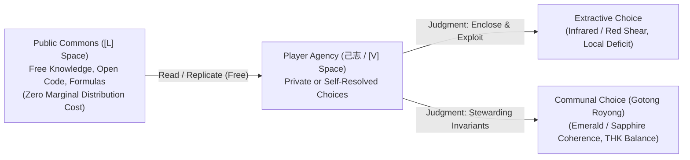
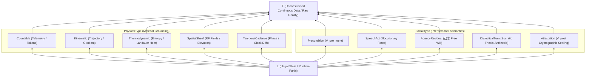

# Sprint 00: Master Orchestration Plan — Civilizational Strategy Game, Synesthetic Type Lattice, and Tri Hita Karana Synthesis

> *"The ultimate rhetoric does not speak; it shows. The ultimate continuation does not wait; it flows. In the Brain Factory, nothing exists until it is counted, verified, and composed into a path of sovereign agency."*

---

## 1. Executive Charter & Architectural Vision

The **Prologue of Spacetime** is an interactive grand strategy meta-game of civilizational evolution, pedagogical transformation, and multi-agent coordination. Conceived as a **Brain Factory**, it transitions learners and autonomous AI agents from an extractive consumption economy to a generative data economy.

This sprint suite operationalizes the **3×4 Master Navigation Matrix** into twelve executable, playable game development sprints across four civilizational epochs, supported by six infrastructure formalization sprints. Every sprint models both **Physically Meaningful Data Manipulation** and **Socially Meaningful Data Manipulation** across a categorical **Type Lattice**, unlocking twelve progressive tiers of **Digital Synesthesia** that transduce abstract mathematical invariants into immediate human sensory intuition.

---

## 2. The Unifying Master Thesis

All twelve game sprints and six foundation sprints enforce a single, unifying architectural thesis:

> **All computational tasks can be and must be arithmetized into well-defined function composition operators $(\circ, \otimes, \oplus, \bowtie)$, whose calculational mechanics are rigorously established across Category Theory (such as Spans, Cospans, Pushouts, Pullbacks, Operads, Currying, and Lawful Optics). Through recognizing that functions are simultaneously both the operator and the operand, we coordinate their execution over the cryptographic namespace of MCard, deploying the full power of relational calculus and categorical algebra to conserve computational resources and satisfy the Software Lagrangian:**
> $$\delta \int (S_T - H_T) \, dt = 0$$
> **where semantic epiplexity ($S_T$) maximally exceeds thermodynamic bit-erasure dissipation ($H_T$).**

### The Five Theoretical Pillars

1. **Universal Task Arithmetization:**
   Every computation—from raw sensory bitstream filtering in a tidepool to 1kHz robotic joint torque calculation, Subak irrigation coordination, and planetary calendar reconciliation—reduces to an algebraic composition of typed morphisms over discrete state spaces.
2. **Operator-Operand Duality in CCC:**
   In cartesian closed categories ($\mathbf{CCC}$), functions are simultaneously active morphisms in $[T]$ space (operators) and exponential objects $B^A$ in $[L]$ space (operands). Composing functions is self-application: $\circ: \mathcal{F} \times \mathcal{F} \to \mathcal{F}$.
3. **Canonical Categorical Operators:**
   Instead of bespoke pipelines, sprints standardize on:
   - **Spans ($A \leftarrow R \to B$) & Pullbacks ($X \times_B Y$):** Multi-agent relational synchronization.
   - **Cospans ($A \to S \leftarrow B$) & Pushouts ($X +_B Y$):** Open system boundaries and terrace sheaf gluing.
   - **Operads & Trees:** Hierarchical Gamelan polyrhythmic pipelines.
   - **Currying / Partial Evaluation:** Contextual adaptation without state re-derivation.
   - **Lenses ($get: S \to A, set: S \times A \to S$):** Non-destructive telemetry inspection.
4. **Standardized Cryptographic MCard Namespace:**
   Every state, function-as-operand, and verification receipt is addressed by its SHA-256 content hash in the triple-table SQLite MCard schema ($[L]$ space), guaranteeing global uniqueness and offline-first peer replication.
5. **Relational Calculus & Resource Conservation:**
   Modeling computations as relations ($R_f \subseteq A \times B$) allows execution as relational equijoins ($R_{g \circ f} = R_f \bowtie R_g$). This eliminates redundant recalculation through content-addressed memoization, reducing Landauer dissipation to zero ($\Delta H_T = 0$) in Transaction-Free Zones.

---

## 3. Perspective, Referential Coordinates, and Spatiotemporal Compositionality (The Dialect-Cordis Synthesis)

A central architectural breakthrough governing this active sprint suite is the formal realization that **Perspective and Referential Coordinates are the true essence of spacetime compositionality**. Grounded in **[[docs/sources/Dialect_Relativity_Unification_Electricity_Magnetism|Dialect's relativistic critique]]** and **[[docs/principles/Cordis_Spatiotemporal_Composability|Cordis spatiotemporal composability]]**, we eliminate the dual fallacies of "frame chauvinism" and "representational reductionism."

### 3.1 The Fallacy of the Single Frame: Parallelograms, Squares, and Wires
In traditional distributed systems, architects frequently attempt what Dialect terms the **"Relativity Shuffle"**—attempting to eliminate dynamic concurrency by choosing a single global frame (e.g., forcing all state into a centralized synchronous database, or reducing all database state to transient message queues).

As Dialect's **Parable of the Parallelogram** proves, shearing an oblique parallelogram so that its angles become $90^\circ$ in a chosen coordinate system does not mean "a parallelogram is just a square." If another geometric element (a real square) sits beside it, that coordinate shear deforms the square into a parallelogram. Similarly, as revealed by the **Crisis of the Second Test Charge**, an observer who boosts into the rest frame of a moving charge to make the magnetic force appear "purely electrostatic" immediately forces a magnetic force to manifest on any second charge moving with different relative velocity.

**The Spacetime Law**: *In a multi-agent system, no single observer frame can eliminate dynamic field effects (circulation, latency, queuing, consensus drift) for all agents simultaneously.* Systems must compose at the level of **coordinate-free tensorial invariants**, while granting each autonomous agent its own **Referential Coordinates** and **Perspective ($u^\mu$)**.

### 3.2 Slicing the Invariant Manifold: $[L]$, $[T]$, and $[V]$ Spaces
The **[[Hub/Theory/CLM/Foundations/Cubical Logic Model — Spatiotemporal Representation of Functions|Cubical Logic Model (CLM)]]** coordinates the 3+1 relativistic split of the system's invariant 4D manifold:
1. **The Invariant 4D Manifold**: The complete, content-addressed causal history of all state transitions, encoded as an immutable DAG of SHA-256 hashed [[MCard|MCards]].
2. **The Perspective Vector ($u^\mu$)**: An agent's 4-velocity through state space, representing its current computational trajectory, execution rate, and sensory focus.
3. **$[L]$ Space (Memory / Spatial Hypersurface $\Sigma_\tau$)**: The projection of the 4D manifold orthogonal to $u^\mu$. This is what the agent perceives as **static data, memory, and spatial boundaries**. (Analogous to the electric potential $\phi$ and field $\mathbf{E}$).
4. **$[T]$ Space (Process / Temporal Trajectory)**: The projection along $u^\mu$. This is what the agent perceives as **dynamic flow, execution pipelines, and time**. (Analogous to the magnetic vector potential $\mathbf{A}$ and circulation $\mathbf{B}$).
5. **$[V]$ Space (Value / Intent & Gauge Choice)**: The agent's choice of reference frame, objective function, and moral orientation. (Analogous to the electromagnetic gauge parameter $\Lambda(x)$).

### 3.3 The Faraday System Tensor ($F^{\mu\nu}_{\text{sys}}$)
Every active sprint models the systemic field as an antisymmetric tensor:
$$F^{\mu\nu}_{\text{sys}} = \begin{pmatrix} 0 & -\nabla_x \Phi_{\text{backlog}} & -\nabla_y \Phi_{\text{backlog}} & -\nabla_z \Phi_{\text{backlog}} \\ \nabla_x \Phi_{\text{backlog}} & 0 & -J_z^{\text{flow}} & J_y^{\text{flow}} \\ \nabla_y \Phi_{\text{backlog}} & J_z^{\text{flow}} & 0 & -J_x^{\text{flow}} \\ \nabla_z \Phi_{\text{backlog}} & -J_y^{\text{flow}} & J_x^{\text{flow}} & 0 \end{pmatrix}$$
where the **Systemic Invariants** evaluate identically across all edge devices and observer frames:
$$I_1 = c^2 \|\mathbf{B}_{\text{sys}}\|^2 - \|\mathbf{E}_{\text{sys}}\|^2 \quad \text{and} \quad I_2 = c (\mathbf{E}_{\text{sys}} \cdot \mathbf{B}_{\text{sys}})$$

### 3.4 Cordis Runtime Architecture: Sprints as Execution Fibers
To ground this relativistic physics in runnable software, the sprint suite adopts the **[[docs/principles/Cordis_Spatiotemporal_Composability|Cordis Meta-Framework]]** (the microkernel powering DeepSeek Harness `dsh` and Koishi):
- **Sprint-as-a-Fiber ($|f_i\rangle$)**: Every sprint operates as an isolated execution fiber in a hierarchical fiber tree.
- **Context Isolation (`ctx.isolate`)**: Lexical encapsulation ensures that local referential coordinates do not pollute parent or sibling enclaves.
- **Directionality (道) & Reversible Lifecycle**: All resources acquired by a sprint are registered via `ctx.effect` and unwound in strict reverse LIFO order upon sprint conclusion:
  $$\text{dispose}(B) \circ \text{dispose}(A) \neq \text{dispose}(A) \circ \text{dispose}(B)$$
- **Hot Module Replacement (HMR)**: Epoch migrations (Epoch I $\to$ Epoch II $\to$ Epoch III $\to$ Epoch IV) execute as atomic HMR effect swaps, replacing underlying process monads without tearing the causal MCard state graph.

---

---

## 4. The Judgment Principle: "Knowledge Is Free, But Judgment Is Not"

The ultimate pedagogy of the *Prologue of Spacetime* is summarized in a core slogan that every player must confront:

> **"Knowledge is free, but judgment is not! Knowledge as written or published content can be attained rather publicly in various commons, but using the knowledge in privately interested or self-resolved choices will reveal the color of that person."**

### 4.1 The Epistemic and Physical Reality
- **Knowledge in $[L]$ Space (MCard)**: Formulas, algorithms, network topologies, and historical records are freely inspectable in the public commons. Storing and reading them in content-addressed tables incurs zero marginal thermodynamic cost.
- **Judgment in $[V] \to [T]$ Space (VCard $\to$ PCard)**: Choosing *how* to apply that knowledge requires committing irreversible physical and moral action. Every decision erases alternative branches in phase space, dissipates Landauer heat, and binds the actor to historical consequences ($A \circ B \neq B \circ A$).

### 4.2 The Chromatic Revelation of Character
In our **Digital Synesthesia** engine, player reputation and moral alignment are not abstract numbers on a scoreboard; they are rendered as perceptible light and timbre:
- **Predatory Extractive Choices**: Hoarding water, front-running transactions, or polluting public radio bands shifts the player's ambient HUD toward **abrasive infrared, murky blood-red, and jarring microtonal dissonance**.
- **Stewardship & Gotong Royong Choices**: Sharing water through the Subak sheaf, maintaining zero queue bloat, and routing public mesh packets shifts the player's aura toward **laminar emerald, deep radiant sapphire, and consonant Gamelan chords**.
- **Transcendent Synthesis**: Fulfilling the Software Lagrangian brings all three Tri Hita Karana axes into balance, unlocking the **universal golden/white noospheric resonance**.

### 4.3 Judgment Dilemma in Every Sprint
Every active sprint (S01 through S12) requires players to resolve an explicit **Judgment Dilemma**. The game provides all technical knowledge freely, but evaluates players on the moral and systemic consequences of their choices.

## 5. The 12-Sprint Civilizational Game Matrix

The game is divided into four historical epochs matching civilizational scale:

### Epoch I: The Primordial Sensorium (Rhetoric Era / Why)
- **[[SPRINT-01-GRANULAR-TIDEPOOL|Sprint 01: The Granular Tidepool]]** (*Spore* Tidepool analogue)
  - Chapter: [[chapters/01_The_Value_of_Counting|Chapter 1: The Value of Counting]] (Arithmetic × Rhetoric)
  - Puzzle: Sieve stochastic bitstreams; separate thermodynamic white noise ($H \to \infty$) into discrete integer token buckets ($\mathbb{N}$).
  - Invariant Victory: Shannon entropy reduction $\Delta H < -\epsilon$.
  - Synesthesia: **Auditory Pulse Train (Level 1)**.
- **[[SPRINT-02-TOPOGRAPHIC-CELL-WALL|Sprint 02: The Topographic Cell Wall]]** (Cellular boundary analogue)
  - Chapter: [[chapters/02_The_Meaning_of_Shape|Chapter 2: The Meaning of Shape]] (Geometry × Rhetoric)
  - Puzzle: Geometric place-making; shelter tokens from hostile environmental entropy gradients.
  - Invariant Victory: Gauss-Bonnet curvature closure around protected tokens.
  - Synesthesia: **Topological Parallax (Level 2)**.
- **[[SPRINT-03-HARMONIC-SWARM|Sprint 03: The Harmonic Swarm]]** (Tribal flocking analogue)
  - Chapter: [[chapters/03_The_Power_of_Rhythm|Chapter 3: The Power of Rhythm]] (Music × Rhetoric)
  - Puzzle: Rhythmic cadence locking; coordinate autonomous swarm nodes against chaotic "Bayhem."
  - Invariant Victory: Leinster diversity measure $D(P) > \theta$.
  - Synesthesia: **Harmonic Dissonance Perception (Level 3)**.
- **[[SPRINT-04-HORIZON-OF-CONSENSUS|Sprint 04: The Horizon of Consensus]]** (Megalithic skywatching analogue)
  - Chapter: [[chapters/04_The_Truth_of_Observation|Chapter 4: The Truth of Observation]] (Astronomy × Rhetoric)
  - Puzzle: Multi-observer parallax triangulation; establish a Single Source of Truth without central authority.
  - Invariant Victory: Epistemic variance $\sigma^2_{\text{truth}} \to 0$.
  - Synesthesia: **Spectral Coherence (Level 4)**.

### Epoch II: The Sovereign Tribal Mesh (Logic Era / What)
- **[[SPRINT-05-YONEDA-BAZAAR|Sprint 05: The Yoneda Bazaar]]** (Tribal barter analogue)
  - Chapter: [[chapters/05_Resource_Allocation|Chapter 5: Resource Allocation]] (Arithmetic × Logic)
  - Puzzle: Dual-category resource exchange; allocate compute, water, and bandwidth via test probes $\text{Hom}(-, A)$.
  - Invariant Victory: Zero deadweight loss; $\sum \text{Inflow} = \sum \text{Outflow}$.
  - Synesthesia: **Thermal Haptic Drag (Level 5)**.
- **[[SPRINT-06-SUBAK-MESHWAY|Sprint 06: The Subak Meshway]]** (Irrigation canal & Silk Road analogue)
  - Chapter: [[chapters/06_Network_Pathfinding|Chapter 6: Network Pathfinding]] (Geometry × Logic)
  - Puzzle: Ad-hoc mesh routing over [[Reticulum Network|Reticulum]]; route around jamming and toll gates.
  - Invariant Victory: Zero packet starvation across all edge nodes.
  - Synesthesia: **Fluidic Vector Streams (Level 6)**.
- **[[SPRINT-07-CAUSAL-MONAD-FORGE|Sprint 07: The Causal Monad Forge]]** (Bronze Age law & metallurgy analogue)
  - Chapter: [[chapters/07_Temporal_Causality|Chapter 7: Temporal Causality]] (Music × Logic)
  - Puzzle: Petri Net Place-Transition execution; fire transitions respecting non-commutative causality ($A \circ B \neq B \circ A$).
  - Invariant Victory: Petri net liveness and boundedness preserved without deadlock.
  - Synesthesia: **Phosphorescent Causal Trails (Level 7)**.
- **[[SPRINT-08-ASTRODYNAMIC-NEXUS|Sprint 08: The Astrodynamic Nexus]]** (Classical navigation analogue)
  - Chapter: [[chapters/08_Orbit_Prediction|Chapter 8: Orbit Prediction]] (Astronomy × Logic)
  - Puzzle: Socratic feedback loops; forecast ecological and economic collapses via forward simulation.
  - Invariant Victory: Closed stable limit cycle in system phase portrait ($\text{Tr}(\mathcal{M}) < 2$).
  - Synesthesia: **Attractor Manifold Holography (Level 8)**.

### Epoch III: The Sheaf Metamaterial (Grammar Era / How)
- **[[SPRINT-09-HYDRAULIC-VAULT|Sprint 09: The Hydraulic Vault]]** (Double-entry water ledger analogue)
  - Chapter: [[chapters/09_Counting_Water|Chapter 9: Counting Water]] (Arithmetic × Grammar)
  - Puzzle: Typed micro-measurement; serialize volumetric water flows into immutable MCards using sum/product types.
  - Invariant Victory: Zero-leakage invariant $\int Q_{\text{in}} dt - \int Q_{\text{out}} dt = \Delta V_{\text{storage}}$.
  - Synesthesia: **Crystalline Lattice Sight (Level 9)**.
- **[[SPRINT-10-RICE-TERRACE-SHEAF|Sprint 10: The Rice Terrace Sheaf]]** (Subak federated watershed analogue)
  - Chapter: [[chapters/10_Rice_Terrace_Topology|Chapter 10: Rice Terrace Topology]] (Geometry × Grammar)
  - Puzzle: Sheaf gluing across terrace boundaries; stitch local water rules into global valley policies.
  - Invariant Victory: Sheaf cohomology obstruction vanishes: $H^1(\mathcal{U}, \mathcal{F}) = 0$.
  - Synesthesia: **Zero-Shear Manifold Vision (Level 10)**.
- **[[SPRINT-11-ZERO-QUEUE-CEREMONY|Sprint 11: The Zero-Queue Ceremony]]** (High-throughput automation analogue)
  - Chapter: [[chapters/11_Ceremonial_Beats|Chapter 11: Ceremonial Beats]] (Music × Grammar)
  - Puzzle: Pipeline latency elimination; synchronize distributed compute with Balinese Gamelan Kotekan interlocking rhythms.
  - Invariant Victory: Little's Law collapse: queue wait time $W_q \equiv 0$ at $100\%$ throughput.
  - Synesthesia: **Acoustic Strobe Resonance (Level 11)**.

### Epoch IV: The Planetary Noosphere (Transcendent Era / Synthesis)
- **[[SPRINT-12-IMPLEDICATIVE-CALENDAR|Sprint 12: The Impredicative Calendar]]** (Planetary harmony analogue)
  - Chapter: [[chapters/12_Calendar_Coordination|Chapter 12: Calendar Coordination]] (Astronomy × Grammar)
  - Puzzle: [[Tri Hita Karana]] ecological-cultural-technological equilibrium; reconcile self-referential multi-calendar cycles.
  - Invariant Victory: Stationary action of the Software Lagrangian:
    $$\delta \int (S_T - H_T) \, dt = 0$$
  - Synesthesia: **Universal Noospheric Synesthesia (Level 12)**.

---

## 6. The Dual-Type Skill Lattice

Player competencies are formalized as types within a bounded lattice $[\bot, \top]$:

Every in-game action is a morphism:
$$\text{Action}: \text{PhysicalType} \times \text{SocialType} \to \text{State}'$$

---

## 7. The Three Guides & The Gamelan Orchestration Model

The game balances player progression using three archetypal guides drawn from Balinese philosophy and Western computational science:

| Guide | Cosmic Principle | CLM Dimension | Pedagogy Role | Gamelan Voice | Primary MCard Artifact |
|:---|:---|:---|:---|:---|:---|
| **Mr. Wayan (Sang Parahyangan)** | Spiritual / Cosmic Order | Abstract Specification ($[L]$ Space) | Optimization, Rigor, Verification | *Kendang* (Foundational Drum) | MCard (Memory Schemas) |
| **Ms. Dewi (Sang Palemahan)** | Environmental Harmony | Concrete Implementation ($[T]$ Space) | Curiosity, Heuristics, Exploration | *Gender Wayang* (Melodic Exploration) | PCard (Process Engines) |
| **Santa Claus (Sang Pawongan)** | Social / Communal Balance | Balanced Expectations ($[V]$ Space) | Bandwidth, Communal Exchange | *Pemangku / Gong* (Macro Cadence) | VCard (Value & Intent) |

---

## 8. Master Definition of Done (DoD) Checklist

All sprints across this active workspace must satisfy this master checklist:

### Architectural & Mathematical Gates
### Relativistic & Spatiotemporal Invariance Gates
- [ ] **Judgment Dilemma & Character Color**: Incorporated an explicit, consequential moral choice pitting private extraction against communal stewardship, dynamically shifting the player's synesthetic color signature.

- [ ] **Referential Coordinate Parameterization**: Defined the local observer frame, spatial bounds, and measurement basis for the sprint.
- [ ] **Perspective (4-Velocity $u^\mu$)**: Specified the agent's velocity and trajectory through the state manifold.
- [ ] **Tensorial Invariant Formulation**: Expressed system invariants in coordinate-free tensorial terms ($I_1, I_2$, topological invariants) that evaluate identically across all peer frames.
- [ ] **Cordis Fiber Lifecycle & Isolation**: Implemented context isolation (`ctx.isolate`) and verified leak-free LIFO effect reversal upon fiber disposal.
- [ ] **HMR Transition Continuity**: Tested hot-swap criteria ensuring atomic state migration without simulation restarts.

- [ ] Mathematical Invariant rigorously formulated with formal KaTeX equations.
- [ ] Bounded state space defined with explicit failure/recovery conditions.
- [ ] `PhysicalType` declared with measurement units, telemetry bounds, and error envelopes.
- [ ] `SocialType` declared with speech-act force, precondition checks, and post-attestation sealing.
- [ ] Invariant victory condition validated through reproducible computational tests.

### Game Mechanics & Player Experience
- [ ] Core ludic puzzle articulated with clear input, transformation, and output loops.
- [ ] Antagonistic friction modeled as an active entropic force rather than passive obstacles.
- [ ] Player agency preserved through non-linear decision branching.
- [ ] Tri Hita Karana guide dialogues and interventions drafted.
- [ ] Digital synesthesia sensory mapping specified with visual, auditory, or haptic parameters.

### Technical Implementation & Artifact Integrity
- [ ] Content-addressed MCard schema defined for all persistent sprint artifacts.
- [ ] Bidirectional wikilinks verified with zero dangling references.
- [ ] YAML frontmatter conforming to [[AGENTS|AGENTS.md]] schema with valid tags and liberal arts categorization.
- [ ] Vault indexing updated in [[index|Wiki Index]] and weekly operational log appended.
