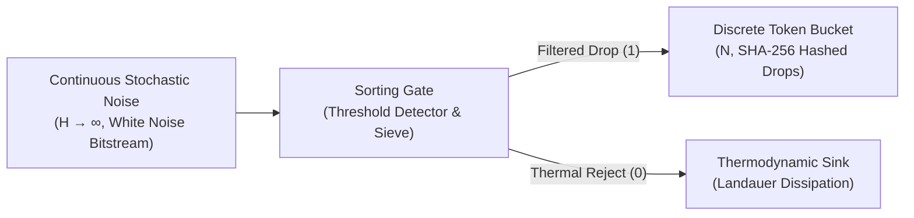

# Sprint 01: The Granular Tidepool — Discrete Bitstream Sieving and Acoustic Tokenization

> *"To count is to define. In the primordial noise of the universe, nothing exists until it is observed, distinguished, and assigned an immutable integer token."*

---

## 1. Executive Summary & Curriculum Alignment

- **Curriculum Chapter**: [[chapters/01_The_Value_of_Counting|Chapter 1: The Value of Counting]]
- **Matrix Coordinate**: **Arithmetic × Rhetoric** (Value-First Foundation / VCard Layer)
- **Civilizational Epoch**: **Epoch I: The Primordial Sensorium (Why / Rhetoric Era)**
- **Civilizational Analogue**: The *Spore* Tidepool / Primordial Chemical Soup
- **Artifact Output**: The Counter Monad & Initial [[MCard]] (Memory Card)

In this foundational sprint, players awaken in an unformed digital ocean characterized by continuous stochastic white noise ($H \to \infty$). The player's first cognitive act is not computation, but **distinction** ($1 \neq 0$). By manipulating sorting gates and establishing an initial value filter ($V_{\text{pre}}$), players sieve continuous thermodynamic noise into discrete integer buckets, learning that ownership and sovereignty begin with accounting.

---

## 2. Ludic Mechanics & Antagonistic Friction



### 2.1 The Core Gameplay Loop
1. **Bitstream Observation**: Players monitor continuous telemetry streams fluctuating with environmental thermal noise.
2. **Threshold Tuning**: Adjusting upper and lower voltage/frequency bounds to isolate meaningful fluctuations.
3. **Bucket Accumulation**: Directing sorted packets into discrete counters, accumulating "Drops" of verified data.
4. **Kenosis Calibration**: Emptying biased sample buffers so that $1$ strictly equals $1$, preventing false positive token generation.

### 2.2 Antagonistic Friction: The Entropy Deluge
The environment actively attacks signal coherence through:
- **Thermal Jitter**: Stochastic perturbations pushing signals outside threshold bounds.
- **Buffer Smuggling**: Undifferentiated background noise attempting to flood the token bucket, degrading information density.

---

## 3. The Dual-Type Skill Lattice Specification

| Skill Dimension | Concrete Type | Invariant & Operational Boundary |
|:---|:---|:---|
| **PhysicalType** | `Countable` | Telemetry rates bounded by $\lambda_{\min} \le \frac{dN}{dt} \le \lambda_{\max}$; discrete packet drop counter $\Delta N \in \mathbb{N}$. |
| **SocialType** | `Precondition` ($V_{\text{pre}}$) | Intent declaration defining the boundary between valuable signal and entropic waste: $P(\text{Signal} \mid x > \theta) > 1 - \epsilon$. |

---

## 4. Invariant Victory Condition & Mathematical Formalism

Victory is achieved when the player successfully establishes a non-trivial information gradient, reducing the Shannon entropy of the observed channel without dropping verified tokens:

$$\Delta H = H_{\text{post}} - H_{\text{pre}} < -\epsilon, \quad \text{where } H(X) = -\sum_{i=1}^n P(x_i) \log_2 P(x_i)$$

Subject to zero false positives:
$$N_{\text{false\_positives}} = 0 \quad \text{and} \quad \text{PacketLossRate} < 0.001$$

---


---

## Perspective, Referential Coordinates, and Cordis Spatiotemporal Fiber

Applying **[[docs/sources/Dialect_Relativity_Unification_Electricity_Magnetism|Dialect's relativistic critique]]** and **[[docs/principles/Cordis_Spatiotemporal_Composability|Cordis spatiotemporal composability]]**, this sprint is grounded in coordinate invariance and rigorous execution lifecycle:

- **Referential Coordinate System & Perspective ($u^\mu$)**: Rest frame $S_0$ of the sorting gate; temporal coordinate $t$ defined by local quartz crystal oscillator; spatial coordinate $x$ measuring sorting gate aperture position. Observer 4-velocity: $u^\mu = (c, 0, 0, 0)$.
- **Tensorial Invariant vs. Coordinate Artifact**: The Shannon Entropy reduction $\Delta H < -\epsilon$ and discrete token count $N \in \mathbb{N}$ are frame-independent scalars. In contrast, packet arrival rates $\lambda = dN/dt$ and signal frequencies $\nu$ are coordinate artifacts that Doppler-shift under relative motion. (Applying Dialect: do not mistake the rate projection for the invariant token value).
- **Cordis Execution Fiber Specification**:
  - **Fiber ID**: `sprint-01-tidepool` operating in the hierarchical fiber tree.
  - **Context Isolation**: `ctx.isolate({ tidepool_sieve: Symbol('tidepool_sieve') })` protects the enclave's spatial namespace from cross-service pollution.
  - **Temporal Lifecycle**: State transitions strictly follow $\text{PENDING} \to \text{ACTIVE} \to \text{DISPOSED}$.
  - **Reversible Side Effects & Cleanup**: Registers telemetry stream listener and threshold interrupt; LIFO disposal drains and unlinks packet queues, ensuring zero memory leaks upon gate shutdown.
  - **Directionality (道)**: Cleanup executes via non-commutative LIFO disposal: $\text{dispose}(B) \circ \text{dispose}(A) \neq \text{dispose}(A) \circ \text{dispose}(B)$.

## 5. Tri Hita Karana Guide Perspectives

- **Mr. Wayan (Sang Parahyangan / Structure)**:
  > *"Do not rush to calculate. First, ensure that each grain of sand is accounted for. In the temple, every grain of rice offered represents an unalterable truth. If $1 \neq 1$, your foundation is illusion."*
- **Ms. Dewi (Sang Palemahan / Exploration)**:
  > *"Listen to the tidepool currents! The noise is not an enemy—it is unharvested reality. Find the hidden eddies where the rhythm pulses fastest."*
- **Santa Claus (Sang Pawongan / Balance)**:
  > *"Patience, traveler! If you close your gates too tightly, you starve; if you open them too wide, you drown. Set your expectation boundary where signal and stillness shake hands."*

---

## 6. Digital Synesthesia Unlocked: Auditory Pulse Train (Level 1)

Upon satisfying the entropy reduction invariant, the player unlocks **Level 1 Digital Synesthesia**:
- **Raw State Perception**: Stochastic noise is heard as harsh, grinding oceanic static (white noise).
- **Synesthetic Transduction**: As the player fine-tunes sorting gates, the static resolves into crisp, rhythmic acoustic clicks—a rhythmic pulse train where pitch directly indicates token density and harmonic stability reflects channel purity.

---

## 7. Technical Implementation & MCard Schema

The output of Sprint 01 is the creation of the fundamental `Counter` MCard schema:

```sql
-- MCard Level 1: The Primitive Counter Token
CREATE TABLE IF NOT EXISTS mcard_counter_tokens (
    token_hash TEXT PRIMARY KEY,        -- SHA-256 of packet payload
    epoch_timestamp INTEGER NOT NULL,  -- Microsecond timestamp
    signal_magnitude REAL NOT NULL,    -- Observed analog potential
    entropy_delta REAL NOT NULL,       -- Calculated ΔH reduction
    v_pre_spec TEXT NOT NULL           -- Serialized Precondition JSON
);
```

---


---

## The Judgment Dilemma: Revealing the Color of Character

> *"Knowledge is free, but judgment is not! Knowledge as written or published content can be attained rather publicly in various commons, but using the knowledge in privately interested or self-resolved choices will reveal the color of that person."*

### Filtering Threshold vs. Downstream Sustenance
The mathematical formulas of Shannon entropy and bandpass filtering are freely available in the public commons. However, setting the value filter ($V_{\\text{pre}}$) presents a moral test: aggressively purging all ambiguous, noisy packets maximizes the player's personal efficiency score, but deprives downstream neighboring tidepools of vital marginal nutrients. Purging selfishly reveals a cold, abrasive infrared aura; expending local energy to buffer and clean shared data reveals a warm, radiant amber resonance.

## 8. Definition of Done (DoD) Checklist
- [ ] **Judgment Dilemma & Character Color**: Resolved the sprint's ethical dilemma between private extraction and communal flourishing, recording the resulting chromatic shift in the player's synesthetic profile.

- [ ] **Referential Coordinates & Perspective**: Explicitly parameterized the observer's frame and 4-velocity projection ($u^\mu$).
- [ ] **Tensorial Invariant Verification**: Validated coordinate-free invariance across disparate observer reference frames.
- [ ] **Cordis Spatiotemporal Fiber**: Implemented reversible LIFO lifecycle hooks (`DisposableList`) and context isolation boundaries (`ctx.isolate`).

- [ ] **Game Mechanics**: Implemented playable sorting gate minigame with adjustable threshold sliders.
- [ ] **Mathematical Verification**: Formulated and unit-tested Shannon entropy calculation over sliding sample windows of 1,024 packets.
- [ ] **Type Lattice Conformance**: Explicitly typed `Countable` and `Precondition` structs in Rust/TypeScript.
- [ ] **Synesthetic Feedback**: Implemented WebAudio pulse train synthesizer modulated by packet arrival intervals.
- [ ] **Narrative Guidance**: Integrated dialogue hooks for Mr. Wayan, Ms. Dewi, and Santa Claus upon milestone completion.
- [ ] **MCard Persistence**: Verified deterministic SHA-256 hashing and SQLite persistence for all collected tokens.
- [ ] **Vault Integrity**: Verified cross-links to [[chapters/01_The_Value_of_Counting|Chapter 1]] and [[MVP_The_Counter|MVP The Counter]].
