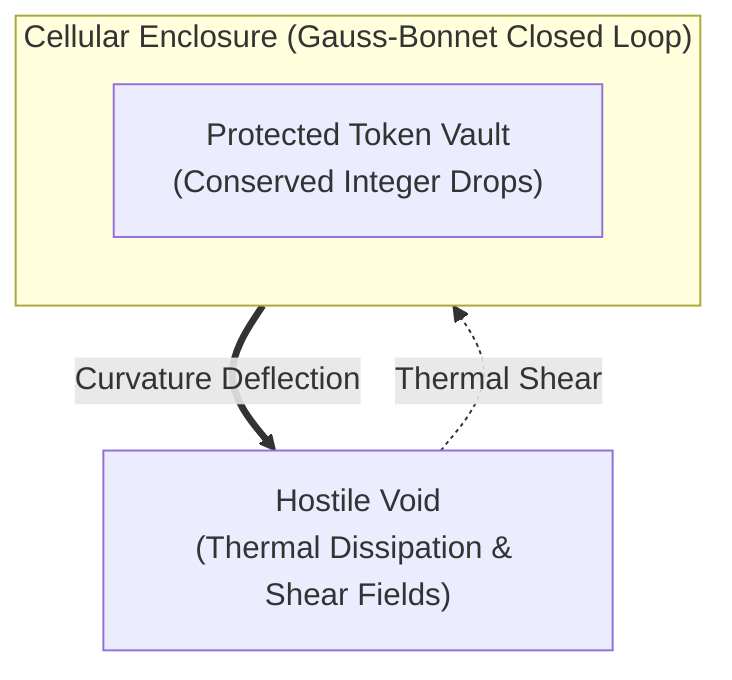

# Sprint 02: The Topographic Cell Wall — Geometric Membrane Enclosure and Parallax Boundary Marking

> *"Shape is the boundary between the sovereign self and the hostile void. A space without a closed perimeter cannot retain value."*

---

## 1. Executive Summary & Curriculum Alignment

- **Curriculum Chapter**: [[chapters/02_The_Meaning_of_Shape|Chapter 2: The Meaning of Shape]]
- **Matrix Coordinate**: **Geometry × Rhetoric** (Spatial Meaning & Boundary / VCard Layer)
- **Civilizational Epoch**: **Epoch I: The Primordial Sensorium (Why / Rhetoric Era)**
- **Civilizational Analogue**: Cellular Membrane Formation / Nomadic Boundary Marking
- **Artifact Output**: The Topological Enclosure Card ([[PCard]])

Having learned to count discrete tokens in Sprint 01, the player faces a new existential hazard: thermal dissipation gradients that scatter unprotected tokens across the void. In Sprint 02, the player masters **geometric place-making** by constructing a closed cellular membrane ($受$). By defining a geometric perimeter with optimal area-to-volume ratio, players establish their first sovereign enclave ($	ext{己志}$), protecting collected tokens from external environmental degradation.

---

## 2. Ludic Mechanics & Antagonistic Friction



### 2.1 The Core Gameplay Loop
1. **Perimeter Node Placement**: Deploying anchor nodes in 2D Riemannian coordinate space.
2. **Boundary Triangulation**: Connecting nodes with tensioned elastic geodesics to enclose token caches.
3. **Curvature Tuning**: Modulating boundary tension to ensure total angular defect satisfies topological closure.
4. **Sovereignty Demarcation**: Declaring internal agency ($	ext{己志}$), creating a sheltered micro-climate.

### 2.2 Antagonistic Friction: Thermal Shear Gradients
- **Thermal Shear**: External entropy currents induce mechanical strain on the perimeter, causing tears if curvature is uneven.
- **Boundary Leaks**: Incomplete geometric loops cause rapid token evaporation ($dN/dt < 0$).

---

## 3. The Dual-Type Skill Lattice Specification

| Skill Dimension | Concrete Type | Invariant & Operational Boundary |
|:---|:---|:---|
| **PhysicalType** | `SpatialSheaf` | Bounded 2D coordinates $\mathbf{x} \in \mathbb{R}^2$; perimeter length $L = \oint_{\partial \Omega} ds$; enclosed area $A = \iint_\Omega dA$; isoperimetric quotient $Q = \frac{4\pi A}{L^2} \le 1$. |
| **SocialType** | `AgencyResidual` ($\text{己志}$) | Sovereign will demarcating internal autonomy against external coercive fields: $\Phi_{\text{internal}} \cap \Phi_{\text{external}} = \emptyset$. |

---

## 4. Invariant Victory Condition & Mathematical Formalism

The player achieves victory by erecting a topologically closed 2D boundary whose total geodesic curvature satisfies the **Gauss-Bonnet Theorem**:

$$\int_M K \, dA + \int_{\partial M} k_g \, ds = 2\pi \chi(M)$$

For a simply connected planar disk enclosing tokens ($chi(M) = 1$):
$$\oint_{\partial M} k_g \, ds = 2\pi$$
with an isoperimetric efficiency $Q = \frac{4\pi A}{L^2} \ge 0.85$ and zero token leakage under external shear.

---


---

## Perspective, Referential Coordinates, and Cordis Spatiotemporal Fiber

Applying **[[docs/sources/Dialect_Relativity_Unification_Electricity_Magnetism|Dialect's relativistic critique]]** and **[[docs/principles/Cordis_Spatiotemporal_Composability|Cordis spatiotemporal composability]]**, this sprint is grounded in coordinate invariance and rigorous execution lifecycle:

- **Referential Coordinate System & Perspective ($u^\mu$)**: 2D Riemannian surface coordinates $(u, v)$ parameterized along the membrane manifold with metric $g_{ab}$; observer perspective moves along the boundary $\partial \Omega$ with tangent 4-vector $T^\mu$.
- **Tensorial Invariant vs. Coordinate Artifact**: The Euler characteristic $\chi(M) = 1$ and Gauss-Bonnet integral $\int K dA + \oint k_g ds = 2\pi$ are topological invariants that hold under any spatial transformation. In contrast, local perimeter length $L$ and local boundary curvatures $k_g(s)$ undergo relativistic deformation under relative velocity.
- **Cordis Execution Fiber Specification**:
  - **Fiber ID**: `sprint-02-cellwall` operating in the hierarchical fiber tree.
  - **Context Isolation**: `ctx.isolate({ membrane_enclosure: Symbol('membrane_enclosure') })` protects the enclave's spatial namespace from cross-service pollution.
  - **Temporal Lifecycle**: State transitions strictly follow $\text{PENDING} \to \text{ACTIVE} \to \text{DISPOSED}$.
  - **Reversible Side Effects & Cleanup**: Registers elastic boundary mesh vertices and tension recalculation loops; LIFO disposal safely de-tensions perimeter nodes and releases spatial memory blocks.
  - **Directionality (道)**: Cleanup executes via non-commutative LIFO disposal: $\text{dispose}(B) \circ \text{dispose}(A) \neq \text{dispose}(A) \circ \text{dispose}(B)$.

## 5. Tri Hita Karana Guide Perspectives

- **Mr. Wayan (Sang Parahyangan / Structure)**:
  > *"Observe the sacred wall of the Pura (temple). The wall does not separate us from nature; it defines the sanctuary where the sacred can be heard. Without closure, your measurements dissolve."*
- **Ms. Dewi (Sang Palemahan / Exploration)**:
  > *"Do not force a rigid circle! The cell wall must curve and breathe with the underlying terrain elevation contours. Follow the Kaja-Kelod axis from mountain to sea."*
- **Santa Claus (Sang Pawongan / Balance)**:
  > *"A wall that lets nothing in is a tomb; a wall that lets everything out is a wilderness. Create permeable gates that open for truth and close against storm."*

---

## 6. Digital Synesthesia Unlocked: Topological Parallax (Level 2)

Upon achieving Gauss-Bonnet closure, the player unlocks **Level 2 Digital Synesthesia**:
- **Raw State Perception**: The coordinate grid appears flat and confusing; latency spikes warp distance readings unpredictably.
- **Synesthetic Transduction**: The visual viewport gains optical depth. Safe enclosures appear as calm, crystal-clear, distortion-free gravitational wells, while external high-entropy zones appear warped by dramatic optical parallax and chromatic refractions.

---

## 7. Technical Implementation & Artifact Schema

```sql
-- MCard Level 2: Topological Membrane Specification
CREATE TABLE IF NOT EXISTS mcard_membranes (
    membrane_id TEXT PRIMARY KEY,
    boundary_nodes_json TEXT NOT NULL,  -- Array of [x, y] coordinates
    isoperimetric_quotient REAL NOT NULL,
    gauss_bonnet_integral REAL NOT NULL,
    agency_seal_hash TEXT NOT NULL      -- Hash of sovereign declaration
);
```

---


---

## The Judgment Dilemma: Revealing the Color of Character

> *"Knowledge is free, but judgment is not! Knowledge as written or published content can be attained rather publicly in various commons, but using the knowledge in privately interested or self-resolved choices will reveal the color of that person."*

### Exclusionary Fortress vs. Porous Sanctuary
The Gauss-Bonnet theorem and perimeter closure formulas cost nothing to read. But deciding where to erect the membrane (\\text{己志}) forces a profound choice: does the player enclose all local energy tokens within a selfish, impermeable fortress, or do they construct a porous sanctuary with regulated exchange gates that shelter fragile neighboring proto-cells? Building a selfish fortress produces high red boundary shear; cultivating a shared sanctuary bathes the terrain in calm, distortion-free topological emerald.

## 8. Definition of Done (DoD) Checklist
- [ ] **Judgment Dilemma & Character Color**: Resolved the sprint's ethical dilemma between private extraction and communal flourishing, recording the resulting chromatic shift in the player's synesthetic profile.

- [ ] **Referential Coordinates & Perspective**: Explicitly parameterized the observer's frame and 4-velocity projection ($u^\mu$).
- [ ] **Tensorial Invariant Verification**: Validated coordinate-free invariance across disparate observer reference frames.
- [ ] **Cordis Spatiotemporal Fiber**: Implemented reversible LIFO lifecycle hooks (`DisposableList`) and context isolation boundaries (`ctx.isolate`).

- [ ] **Game Mechanics**: Implemented node-placement and elastic membrane boundary drawing tool.
- [ ] **Mathematical Verification**: Implemented numerical Gauss-Bonnet line integral and isoperimetric quotient validation.
- [ ] **Type Lattice Conformance**: Formulated `SpatialSheaf` geometry engine and `AgencyResidual` assertion logic.
- [ ] **Synesthetic Feedback**: Implemented WebGL fragment shader for topological parallax refraction outside enclosed safe zones.
- [ ] **Narrative Guidance**: Integrated advice dialogues for Wayan, Dewi, and Santa on boundary resilience.
- [ ] **Vault Integrity**: Linked with [[chapters/02_The_Meaning_of_Shape|Chapter 2]] and [[docs/principles/Local-First|Local-First Principles]].
