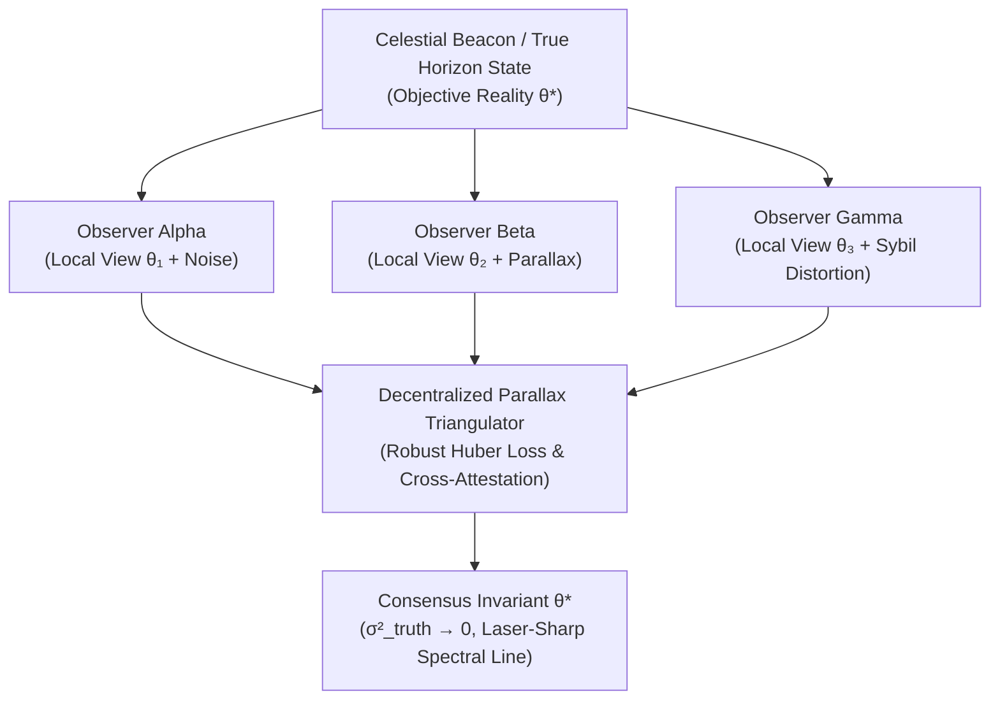

# Sprint 04: The Horizon of Consensus — Multi-Observer Parallax Triangulation and Spectral Truth

> *"No single eye sees the whole cosmos. Truth is not an authority's decree, but the invariant intersection of multiple honest observations across spacetime."*

---

## 1. Executive Summary & Curriculum Alignment

- **Curriculum Chapter**: [[chapters/04_The_Truth_of_Observation|Chapter 4: The Truth of Observation]]
- **Matrix Coordinate**: **Astronomy × Rhetoric** (Consensus Verification & Celestial Parallax / VCard Layer)
- **Civilizational Epoch**: **Epoch I: The Primordial Sensorium (Why / Rhetoric Era)**
- **Civilizational Analogue**: Megalithic Skywatching / The Council of Elders / Astronomical Baseline Triangulation
- **Artifact Output**: The Consensus Attestation Card ([[VCard]])

Sprint 04 marks the culmination of **Epoch I (The Primordial Sensorium)**. Players advance from local sensory awareness to multi-perspective triangulation. In an adversarial environment contaminated by Sybil illusions and sensor hallucination, players must correlate astronomical telemetry across physically separated nodes, using parallax geometry to establish an unforgeable Single Source of Truth without centralized oracles.

---

## 2. Ludic Mechanics & Antagonistic Friction



### 2.1 The Core Gameplay Loop
1. **Multi-Angle Sightline Alignment**: Pointing optical/RF sensors on distant nodes at common celestial reference stars.
2. **Parallax Baseline Measurement**: Computing precise geometric baseline separations between observer positions.
3. **Cross-Attestation Sealing**: Exchanging cryptographically signed directional bearings between peer nodes ($V_{\text{post}}$).
4. **Sybil Outlier Rejection**: Filtering out dishonest or hallucinated observations that fail geometric consistency checks.

### 2.2 Antagonistic Friction: Sybil Hallucinations
- **Sybil Illusions**: Phantom beacons spawned by adversarial nodes to distort navigational bearings.
- **Atmospheric / Network Scintillation**: Turbulent optical media introducing stochastic angular jitter.

---

## 3. The Dual-Type Skill Lattice Specification

| Skill Dimension | Concrete Type | Invariant & Operational Boundary |
|:---|:---|:---|
| **PhysicalType** | `Kinematic` | Observer velocity $\mathbf{v}$, angular bearing $\theta$, baseline vector $\mathbf{b}_{ij} = \mathbf{x}_j - \mathbf{x}_i$, light-cone delay $\Delta t = \frac{\|\mathbf{b}\|}{c}$. |
| **SocialType** | `Attestation` ($V_{\text{post}}$) | Cryptographic signature verifying an observation: $\sigma_i = \text{Sign}_{sk_i}(\text{Hash}(\theta_i, t))$. |

---

## 4. Invariant Victory Condition & Mathematical Formalism

Consensus victory requires collapsing epistemic variance across all $M$ honest observers to zero:

$$\sigma^2_{\text{truth}} = \frac{1}{M} \sum_{i=1}^M \| \hat{\mathbf{x}} - \mathbf{x}^* \|^2 \to 0$$

Under the Byzantine Fault Tolerance constraint:
$$f < \frac{M}{3}$$
where the cross-triangulation error residual satisfies:
$$\chi^2 = \sum_{i=1}^M \frac{(\theta_i - \hat{\theta}_i)^2}{\sigma_i^2} < \chi^2_{\text{threshold}}$$

---


---

## Perspective, Referential Coordinates, and Cordis Spatiotemporal Fiber

Applying **[[docs/sources/Dialect_Relativity_Unification_Electricity_Magnetism|Dialect's relativistic critique]]** and **[[docs/principles/Cordis_Spatiotemporal_Composability|Cordis spatiotemporal composability]]**, this sprint is grounded in coordinate invariance and rigorous execution lifecycle:

- **Referential Coordinate System & Perspective ($u^\mu$)**: Multi-observer network where each observer $k$ carries independent 4-velocity $u^\mu_k$ and sightline 4-vector $n^\mu_k$ directed toward celestial target beacons.
- **Tensorial Invariant vs. Coordinate Artifact**: The objective spacetime event $X^\mu_*$ of the beacon and the epistemic chi-squared residual $\chi^2$ are coordinate-free invariants. In contrast, local angular bearings $\theta_k$ are observer-dependent projections distorted by parallax and relativistic aberration (Dialect: consensus is the invariant intersection, not frame uniformity).
- **Cordis Execution Fiber Specification**:
  - **Fiber ID**: `sprint-04-consensus` operating in the hierarchical fiber tree.
  - **Context Isolation**: `ctx.isolate({ parallax_consensus: Symbol('parallax_consensus') })` protects the enclave's spatial namespace from cross-service pollution.
  - **Temporal Lifecycle**: State transitions strictly follow $\text{PENDING} \to \text{ACTIVE} \to \text{DISPOSED}$.
  - **Reversible Side Effects & Cleanup**: Registers peer attestation verification channels and Huber loss residual monitors; LIFO disposal closes multi-party socket connections gracefully.
  - **Directionality (道)**: Cleanup executes via non-commutative LIFO disposal: $\text{dispose}(B) \circ \text{dispose}(A) \neq \text{dispose}(A) \circ \text{dispose}(B)$.

## 5. Tri Hita Karana Guide Perspectives

- **Mr. Wayan (Sang Parahyangan / Structure)**:
  > *"When the priests calibrate the Saka calendar against the dark moon (Tilem), they do not trust one eye. If three villages report different moonrises, the ceremony waits until the geometry is clean."*
- **Ms. Dewi (Sang Palemahan / Exploration)**:
  > *"Look from the beach, and look from Mount Agung! The mountain does not move, but your perspective transforms. Parallax is the gift of having two eyes."*
- **Santa Claus (Sang Pawongan / Balance)**:
  > *"A liar can copy one message, but he cannot fake the geometry of three distant telescopes. Trust the triangle, not the speaker."*

---

## 6. Digital Synesthesia Unlocked: Spectral Coherence (Level 4)

Achieving consensus collapse ($sigma^2_{\text{truth}} \to 0$) unlocks **Level 4 Digital Synesthesia**:
- **Raw State Perception**: Conflicting telemetry reports render as blurry chromatic aberrations, double images, and fuzzy ghost contours.
- **Synesthetic Transduction**: As peer cross-attestations resolve into geometric consensus, the visual field snaps into focus. All chromatic aberration collapses into a single, laser-sharp, monochromatic spectral beam of pure coherent light.

---

## 7. Technical Implementation & Artifact Schema

```sql
-- MCard Level 4: Consensus Attestation Matrix
CREATE TABLE IF NOT EXISTS mcard_consensus_attestation (
    attestation_id TEXT PRIMARY KEY,
    target_object_hash TEXT NOT NULL,
    triangulated_position_json TEXT NOT NULL, -- [x, y, z]
    epistemic_variance REAL NOT NULL,
    participating_observers INTEGER NOT NULL,
    byzantine_fault_bound REAL NOT NULL,
    consensus_receipt_hash TEXT NOT NULL
);
```

---


---

## The Judgment Dilemma: Revealing the Color of Character

> *"Knowledge is free, but judgment is not! Knowledge as written or published content can be attained rather publicly in various commons, but using the knowledge in privately interested or self-resolved choices will reveal the color of that person."*

### Sybil Bribery vs. Invariant Truth
Celestial trigonometry and Huber loss estimators are available to all. An adversarial Sybil coalition offers the player a high-yield token reward to sign off on a false astronomical bearing. Selling the signature ($V_{\\text{post}}$) provides immediate private wealth but distorts the valley's navigation grid. Colluding with Sybils smears the visual field in murky, disorienting chromatic aberration; holding the line on geometric truth collapses the spectrum into an unforgeable, razor-sharp sapphire beam.

## 8. Definition of Done (DoD) Checklist
- [ ] **Judgment Dilemma & Character Color**: Resolved the sprint's ethical dilemma between private extraction and communal flourishing, recording the resulting chromatic shift in the player's synesthetic profile.

- [ ] **Referential Coordinates & Perspective**: Explicitly parameterized the observer's frame and 4-velocity projection ($u^\mu$).
- [ ] **Tensorial Invariant Verification**: Validated coordinate-free invariance across disparate observer reference frames.
- [ ] **Cordis Spatiotemporal Fiber**: Implemented reversible LIFO lifecycle hooks (`DisposableList`) and context isolation boundaries (`ctx.isolate`).

- [ ] **Game Mechanics**: Implemented multi-observer telescope sightline alignment and baseline triangulation minigame.
- [ ] **Mathematical Verification**: Implemented robust least-squares / Huber loss estimator for parallax intersection with outlier rejection.
- [ ] **Type Lattice Conformance**: Formulated `Kinematic` vectors and `Attestation` cryptographic verification pipelines.
- [ ] **Synesthetic Feedback**: Built GLSL shader transitioning from chromatic aberration blur to a single coherent laser line.
- [ ] **Epoch I Transition Gate**: Verified player mastery across all four foundational skills: `Countable`, `SpatialSheaf`, `TemporalCadence`, and `Kinematic`.
- [ ] **Vault Integrity**: Cross-linked with [[chapters/04_The_Truth_of_Observation|Chapter 4]] and [[docs/principles/Observability|Observability Principles]].
