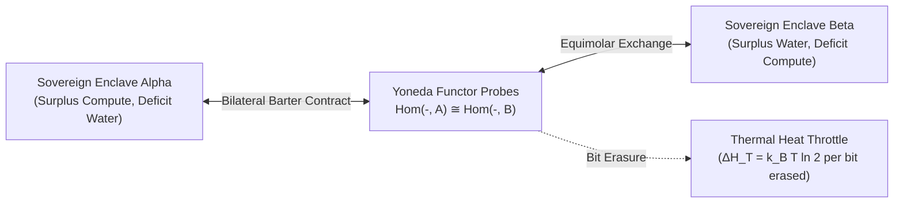

# Sprint 05: The Yoneda Bazaar — Dual-Category Resource Allocation and Thermodynamic Barter

> *"An object is entirely known by the network of its relationships. In the marketplace of reality, value is not an intrinsic property, but the universal functor of all possible exchanges."*

---

## 1. Executive Summary & Curriculum Alignment

- **Curriculum Chapter**: [[chapters/05_Resource_Allocation|Chapter 5: Resource Allocation]] (The Calculus of Options)
- **Matrix Coordinate**: **Arithmetic × Logic** (Algorithmic Exchange & Process / PCard Layer)
- **Civilizational Epoch**: **Epoch II: The Sovereign Tribal Mesh (What / Logic Era)**
- **Civilizational Analogue**: Tribal Barter / The Emergence of Currencies & Double-Entry Ledgers
- **Artifact Output**: The Resource Exchange Functor Card ([[PCard]])

Entering **Epoch II (The Sovereign Tribal Mesh)**, players encounter other sovereign enclaves. Compute, water, bandwidth, and memory are scarce. Instead of naive centralized pricing, players implement categorical barter grounded in the **Yoneda Lemma**: evaluating any resource $A$ through the collection of all relational probes $\text{Hom}(-, A)$. Crucially, players must manage the physical cost of computation—every irreversible ledger mutation dissipates Landauer heat ($k_B T \ln 2$), forcing players to optimize for reversible, zero-dissipation transaction channels.

---

## 2. Ludic Mechanics & Antagonistic Friction



### 2.1 The Core Gameplay Loop
1. **Relational Probing**: Probing external enclaves using typed query functors $\text{Hom}(X, A)$ to map multi-party compatibility.
2. **Equimolar Barter Matching**: Negotiating non-currency reciprocal trades (e.g., 100 GFLOPS compute $\leftrightarrow$ 50 $m^3$ irrigation flow).
3. **Reversible Ledger Commit**: Recording transactions using reversible optical lenses without erasing intermediate state bits.
4. **Thermal Throttling Management**: Balancing transaction throughput against heat accumulation to prevent thermal shutdowns.

### 2.2 Antagonistic Friction: The Landauer Heat Throttle
- **Thermal Dissipation Drag**: High-frequency irreversible transactions heat the local core ($Q = N \cdot k_B T \ln 2$), reducing processing speed.
- **Deadweight Loss**: Asymmetric trades generate systemic drag and unallocated inventory bottlenecks.

---

## 3. The Dual-Type Skill Lattice Specification

| Skill Dimension | Concrete Type | Invariant & Operational Boundary |
|:---|:---|:---|
| **PhysicalType** | `Thermodynamic` | Entropy dissipation $\Delta S = \frac{\Delta Q}{T} \ge k_B \ln 2 \cdot \Delta I_{\text{erased}}$; maximum power budget $P \le P_{\text{thermal\_ceiling}}$. |
| **SocialType** | `Precondition` & `SpeechAct` | Bilateral barter contract formulation and reciprocal commitment: $\text{Contract}(A, B) \implies \text{Commit}(A) \land \text{Commit}(B)$. |

---

## 4. Invariant Victory Condition & Mathematical Formalism

Victory is achieved when all multi-party resource flows satisfy the **Yoneda Invariance** and **Dual Conservation Law** with zero deadweight loss:

$$h^A(X) = \text{Hom}_{\mathcal{C}}(X, A) \cong h^B(X)$$

Under thermodynamic conservation:
$$\sum_{k} \text{Inflow}_k = \sum_{k} \text{Outflow}_k \quad \text{and} \quad \Delta H_{\text{erasure}} = 0 \quad (\text{Reversible Zone})$$

---


---

## Perspective, Referential Coordinates, and Cordis Spatiotemporal Fiber

Applying **[[docs/sources/Dialect_Relativity_Unification_Electricity_Magnetism|Dialect's relativistic critique]]** and **[[docs/principles/Cordis_Spatiotemporal_Composability|Cordis spatiotemporal composability]]**, this sprint is grounded in coordinate invariance and rigorous execution lifecycle:

- **Referential Coordinate System & Perspective ($u^\mu$)**: Dual economic ledger coordinates (Inflow vs. Outflow) in the rest frame of the local enclave trading post with thermodynamic temperature $T$.
- **Tensorial Invariant vs. Coordinate Artifact**: Net Landauer entropy dissipation $\Delta S = \Delta Q / T$ and the Yoneda natural isomorphism $h^A \cong h^B$ are frame-independent invariants. Spot commodity prices and exchange ratios are coordinate projections dependent on local enclave supply/demand frames.
- **Vibration, Perturbation & Free Will vs. Energy Cost of Coherence**: Erratic bid-ask spread fluctuations, speculative volume spikes, and local liquidity shocks represent market agents attempting to "jump between different physical realities" (arbitrary valuation regimes, speculative asset bubbles, and price dislocations). The chance of coming back into a consistent, order-preserving entry (Yoneda market-clearing equilibrium $\sum \text{Inflow} = \sum \text{Outflow}$) is the liquidity reserves and settlement fees that the exchange must pay as "energy". See [[docs/concepts/Vibration_Perturbation_and_the_Energy_Cost_of_Coherence|Vibration, Perturbation, and the Energy Cost of Coherence]].
- **Cordis Execution Fiber Specification**:
  - **Fiber ID**: `sprint-05-bazaar` operating in the hierarchical fiber tree.
  - **Context Isolation**: `ctx.isolate({ yoneda_barter: Symbol('yoneda_barter') })` protects the enclave's spatial namespace from cross-service pollution.
  - **Temporal Lifecycle**: State transitions strictly follow $\text{PENDING} \to \text{ACTIVE} \to \text{DISPOSED}$.
  - **Reversible Side Effects & Cleanup**: Registers bilateral escrow locks and Landauer heat monitors; LIFO disposal unwinds uncommitted barter transactions and frees reserved compute/water capacity.
  - **Directionality (道)**: Cleanup executes via non-commutative LIFO disposal: $\text{dispose}(B) \circ \text{dispose}(A) \neq \text{dispose}(A) \circ \text{dispose}(B)$.

## 5. Tri Hita Karana Guide Perspectives

- **Mr. Wayan (Sang Parahyangan / Structure)**:
  > *"Every transaction must preserve cosmic balance. If you take without offering an equivalent measure of value, you incur 'Rna' (debt) that warps your ledger."*
- **Ms. Dewi (Sang Palemahan / Exploration)**:
  > *"Do not cling to one commodity! Look at what your neighbor has in abundance. An exchange is like water finding a lower terrace—it should flow naturally."*
- **Santa Claus (Sang Pawongan / Balance)**:
  > *"The secret of gift exchange is reciprocity. When both sides feel enriched, transaction costs drop to zero."*

---

## 6. Digital Synesthesia Unlocked: Thermal Haptic Feedback (Level 5)

Achieving balanced exchange unlocks **Level 5 Digital Synesthesia**:
- **Raw State Perception**: Numerical resource balances are displayed in tabular spreadsheets.
- **Synesthetic Transduction**: The UI interface develops tactile resistance and thermal drag. Inefficient, lossy allocations produce a burning, sluggish drag on the cursor and controls; when a transaction is perfectly balanced and reversible, the controls turn ice-smooth, cool, and frictionless.

---

## 7. Technical Implementation & Artifact Schema

```sql
-- MCard Level 5: Yoneda Bilateral Barter Receipt
CREATE TABLE IF NOT EXISTS mcard_yoneda_exchange (
    exchange_id TEXT PRIMARY KEY,
    party_a_hash TEXT NOT NULL,
    party_b_hash TEXT NOT NULL,
    resource_a_spec TEXT NOT NULL,
    resource_b_spec TEXT NOT NULL,
    landauer_dissipation_joules REAL NOT NULL,
    net_deadweight_loss REAL NOT NULL,
    contract_signature_a TEXT NOT NULL,
    contract_signature_b TEXT NOT NULL
);
```

---


---

## The Judgment Dilemma: Revealing the Color of Character

> *"Knowledge is free, but judgment is not! Knowledge as written or published content can be attained rather publicly in various commons, but using the knowledge in privately interested or self-resolved choices will reveal the color of that person."*

### Extractive Monopoly vs. Reversible Equimolar Barter
The Yoneda Lemma and dual-ledger mathematics are public knowledge. When a neighboring enclave suffers a compute freeze during an algorithmic drought, does the player exploit their desperation with usurious price spikes, or establish a fair, reciprocal exchange that preserves mutual survival with zero Landauer heat dissipation? Predatory pricing induces burning, sticky haptic drag; cooperative barter renders controls cool, frictionless, and ice-smooth.

## 8. Definition of Done (DoD) Checklist
- [ ] **Vibration & Coherence Energy Balance**: Verified that entity fluctuations (free will to explore alternate realities) and the collective energetic cost to restore order-preserving coherence are explicitly modeled and balanced.
- [ ] **Judgment Dilemma & Character Color**: Resolved the sprint's ethical dilemma between private extraction and communal flourishing, recording the resulting chromatic shift in the player's synesthetic profile.

- [ ] **Referential Coordinates & Perspective**: Explicitly parameterized the observer's frame and 4-velocity projection ($u^\mu$).
- [ ] **Tensorial Invariant Verification**: Validated coordinate-free invariance across disparate observer reference frames.
- [ ] **Cordis Spatiotemporal Fiber**: Implemented reversible LIFO lifecycle hooks (`DisposableList`) and context isolation boundaries (`ctx.isolate`).

- [ ] **Game Mechanics**: Implemented bilateral barter puzzle with dynamic supply-demand vectors.
- [ ] **Mathematical Verification**: Formulated Yoneda embedding test matrix and zero-deadweight loss solver.
- [ ] **Type Lattice Conformance**: Formulated `Thermodynamic` energy budget and `SpeechAct` contract negotiation state machines.
- [ ] **Synesthetic Feedback**: Implemented haptic cursor resistance / visual thermal glow shader responsive to Landauer dissipation.
- [ ] **Vault Integrity**: Linked with [[chapters/05_Resource_Allocation|Chapter 5]] and [[docs/concepts/Calculus_of_Options|Calculus of Options]].
