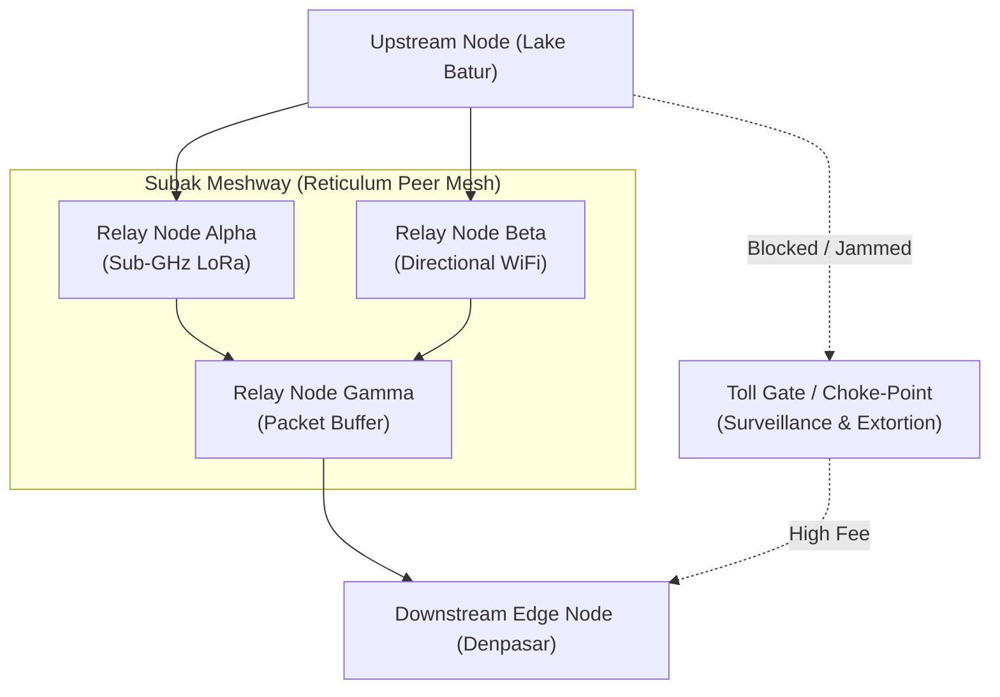

# Sprint 06: The Subak Meshway — Topological Reticulum Routing and Fluidic Packet Vectoring

> *"A network that depends on a king's highway is already enslaved. True freedom is an irrigation canal that distributes life through every channel without a master gatekeeper."*

---

## 1. Executive Summary & Curriculum Alignment

- **Curriculum Chapter**: [[chapters/06_Network_Pathfinding|Chapter 6: Network Pathfinding]] (The Boundary of Form)
- **Matrix Coordinate**: **Geometry × Logic** (Spatial Routing & Dynamic Topologies / PCard Layer)
- **Civilizational Epoch**: **Epoch II: The Sovereign Tribal Mesh (What / Logic Era)**
- **Civilizational Analogue**: Balinese Subak Irrigation Canals / The Ancient Silk Road Meshway
- **Artifact Output**: The Reticulum Mesh Routing Functor Card ([[PCard]])

In Sprint 06, tribal enclaves must communicate across rugged geographic terrain (mountains, ravines, and ocean straits). Monopolistic actors (Landlord ISP towers) attempt to enforce toll choke-points and surveillance. Players implement decentralized mesh routing over **[[Reticulum Network|Reticulum]]**, treating packet propagation as fluid dynamics over topological elevation gradients. By calculating sub-GHz RF link budgets and dynamic hop vectors, players guarantee zero packet starvation across edge nodes without central routing tables.

---

## 2. Ludic Mechanics & Antagonistic Friction



### 2.1 The Core Gameplay Loop
1. **Topographic Surveying**: Analyzing line-of-sight elevation profiles between nodes to predict RF attenuation.
2. **Frequency & Link Budget Optimization**: Selecting optimal modulation rates (LoRa SF7-SF12, Packet Radio) to bridge difficult terrain.
3. **Multi-Path Fluidic Routing**: Splitting packet streams across redundant independent paths like water through terrace dikes.
4. **Choke-Point Circumvention**: Routing packets around congested or hostile toll nodes dynamically.

### 2.2 Antagonistic Friction: Landlord Toll Choke-points
- **RF Jamming & Surveillance**: Centralized towers inject RF noise and monitor unencrypted headers.
- **Buffer Starvation**: High-latency links induce queue congestion if packet flows exceed link capacity.

---

## 3. The Dual-Type Skill Lattice Specification

| Skill Dimension | Concrete Type | Invariant & Operational Boundary |
|:---|:---|:---|
| **PhysicalType** | `SpatialSheaf` | Geographic coordinates $\mathbf{x} \in \mathbb{R}^3$; sub-GHz RF link budget $P_{\text{rx}} = P_{\text{tx}} + G_{\text{tx}} + G_{\text{rx}} - \text{FSPL} \ge \text{Sensitivity}$; hop limit $\le H_{\max}$. |
| **SocialType** | `AgencyResidual` ($\text{己志}$) | Path selection algorithm strictly preserving cryptographic anonymity and rejecting unverified surveillance relays. |

---

## 4. Invariant Victory Condition & Mathematical Formalism

Victory is achieved when packet delivery across the mesh satisfies the **Zero-Starvation Invariant** under dynamic link failures:

$$\forall v \in V_{\text{mesh}}, \quad \lim_{t \to \infty} P(\text{PacketArrival} \mid t) = 1.0$$

with an end-to-end max-flow min-cut capacity satisfying:
$$C_{\text{mesh}}(s, t) = \min_{S, T} \sum_{u \in S, v \in T} c(u, v) \ge \Lambda_{\text{demand}}$$
and zero packets routed through blacklisted extortion toll nodes.

---


---

## Perspective, Referential Coordinates, and Cordis Spatiotemporal Fiber

Applying **[[docs/sources/Dialect_Relativity_Unification_Electricity_Magnetism|Dialect's relativistic critique]]** and **[[docs/principles/Cordis_Spatiotemporal_Composability|Cordis spatiotemporal composability]]**, this sprint is grounded in coordinate invariance and rigorous execution lifecycle:

- **Referential Coordinate System & Perspective ($u^\mu$)**: 3D topographic terrain coordinates $(x, y, z)$ over the Balinese volcanic landscape; packet propagation parameterized by 4-momentum $p^\mu = (E/c, \mathbf{p})$.
- **Tensorial Invariant vs. Coordinate Artifact**: The max-flow min-cut network capacity $C(s, t)$ and 4-divergence continuity $\nabla_\mu J^\mu = 0$ are geometric invariants. Per-hop transit latencies and instantaneous packet velocities are coordinate-dependent projections.
- **Cordis Execution Fiber Specification**:
  - **Fiber ID**: `sprint-06-meshway` operating in the hierarchical fiber tree.
  - **Context Isolation**: `ctx.isolate({ reticulum_routing: Symbol('reticulum_routing') })` protects the enclave's spatial namespace from cross-service pollution.
  - **Temporal Lifecycle**: State transitions strictly follow $\text{PENDING} \to \text{ACTIVE} \to \text{DISPOSED}$.
  - **Reversible Side Effects & Cleanup**: Registers Reticulum sub-GHz packet interfaces and dynamic hop-table listeners; LIFO disposal unbinds radio hardware interfaces and drains relay buffers.
  - **Directionality (道)**: Cleanup executes via non-commutative LIFO disposal: $\text{dispose}(B) \circ \text{dispose}(A) \neq \text{dispose}(A) \circ \text{dispose}(B)$.

## 5. Tri Hita Karana Guide Perspectives

- **Mr. Wayan (Sang Parahyangan / Structure)**:
  > *"Look at how the Subak allocates water during drought. No village steals from another; the water flows by exact mathematical proportion down the carved stone sluices (temuku)."*
- **Ms. Dewi (Sang Palemahan / Exploration)**:
  > *"Radio waves love the contours of the earth. A relay on the ridge line can whisper to the entire valley below. Use the landscape as your amplifier!"*
- **Santa Claus (Sang Pawongan / Balance)**:
  > *"When you build a mesh, every receiver is also a transmitter. The gift you receive is the gift you forward."*

---

## 6. Digital Synesthesia Unlocked: Fluidic Vector Streams (Level 6)

Upon achieving zero packet starvation, the player unlocks **Level 6 Digital Synesthesia**:
- **Raw State Perception**: Network topology appears as a static graph of labeled nodes and edges.
- **Synesthetic Transduction**: The topography transforms into an animated fluidic landscape. Packets render as luminous streams of water flowing through channels; congested nodes create visible bubbling vortices, while healthy links glow with smooth, laminar neon currents.

---

## 7. Technical Implementation & Artifact Schema

```sql
-- MCard Level 6: Reticulum Route Matrix
CREATE TABLE IF NOT EXISTS mcard_reticulum_routes (
    route_hash TEXT PRIMARY KEY,
    destination_hash TEXT NOT NULL,
    next_hop_interface TEXT NOT NULL,
    link_budget_dbm REAL NOT NULL,
    hop_count INTEGER NOT NULL,
    max_flow_capacity REAL NOT NULL,
    sovereignty_score REAL NOT NULL
);
```

---


---

## The Judgment Dilemma: Revealing the Color of Character

> *"Knowledge is free, but judgment is not! Knowledge as written or published content can be attained rather publicly in various commons, but using the knowledge in privately interested or self-resolved choices will reveal the color of that person."*

### Landlord Toll Submission vs. Sovereign Mesh Stewardship
Reticulum network protocols and RF propagation models are free for anyone to inspect. Monopolistic landlord towers offer fast private transit for those who pay exorbitant tolls and accept surveillance logging. Does the player abandon the commons for private speed, or allocate local battery and antenna power to relay encrypted traffic for their peers? Toll submission darkens packets with tracking grime; mesh stewardship lights up the mountain ridges with fluidic neon streamlines.

## 8. Definition of Done (DoD) Checklist
- [ ] **Judgment Dilemma & Character Color**: Resolved the sprint's ethical dilemma between private extraction and communal flourishing, recording the resulting chromatic shift in the player's synesthetic profile.

- [ ] **Referential Coordinates & Perspective**: Explicitly parameterized the observer's frame and 4-velocity projection ($u^\mu$).
- [ ] **Tensorial Invariant Verification**: Validated coordinate-free invariance across disparate observer reference frames.
- [ ] **Cordis Spatiotemporal Fiber**: Implemented reversible LIFO lifecycle hooks (`DisposableList`) and context isolation boundaries (`ctx.isolate`).

- [ ] **Game Mechanics**: Implemented RF line-of-sight elevation map with draggable relay nodes.
- [ ] **Mathematical Verification**: Verified max-flow min-cut Ford-Fulkerson algorithm for mesh routing.
- [ ] **Type Lattice Conformance**: Formulated `SpatialSheaf` link budget calculators and sovereign path filters.
- [ ] **Synesthetic Feedback**: Implemented particle-based fluid vector stream visualizer using WebGL.
- [ ] **Vault Integrity**: Linked with [[chapters/06_Network_Pathfinding|Chapter 6]] and [[docs/principles/Local-First|Local-First Principles]].
