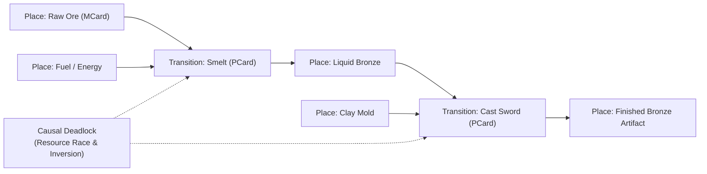

# Sprint 07: The Causal Monad Forge — Petri Net Place-Transitions and Non-Commutative Causality

> *"Time is not a clock on the wall; it is the irreversible firing of state transitions. What is done cannot be undone; causality is an arrow forged in bronze."*

---

## 1. Executive Summary & Curriculum Alignment

- **Curriculum Chapter**: [[chapters/07_Temporal_Causality|Chapter 7: Temporal Causality]] (The Rhythm of Process)
- **Matrix Coordinate**: **Music × Logic** (Temporal Invariance & Causal Order / PCard Layer)
- **Civilizational Epoch**: **Epoch II: The Sovereign Tribal Mesh (What / Logic Era)**
- **Civilizational Analogue**: Bronze Age Metallurgy / The Invention of Written Law & Precedence
- **Artifact Output**: The Causal Petri Net Monad Card ([[PCard]])

Sprint 07 introduces players to **temporal non-commutativity** ($A \circ B \neq B \circ A$). In complex distributed workflows, concurrent processes can experience race conditions and deadlocks if causal order is violated. Players model workflow transitions as formal **Petri Nets** (Place-Transition systems), ensuring that tokens can only fire when preconditions are physically satisfied. By forging immutable monads, players construct race-condition-free assembly lines where state transitions are provably deterministic and irreversible.

---

## 2. Ludic Mechanics & Antagonistic Friction



### 2.1 The Core Gameplay Loop
1. **Place-Transition Graph Design**: Wiring input places, transitions, and output places in a Petri Net canvas.
2. **Token Marking Execution**: Tracking discrete token distribution $M = (m_1, m_2, \dots, m_n)$ as transitions fire.
3. **Non-Commutative Sequencing**: Ordering operations where order matters (e.g., verify before spending; smelt before casting).
4. **Deadlock Resolution**: Introducing siphon and trap invariants to prevent system freezing.

### 2.2 Antagonistic Friction: Causal Race Deadlocks
- **Race Hazards**: Parallel processes attempting to consume the same token simultaneously.
- **Deadlock Siphons**: Token starvation causing all downstream transitions to halt indefinitely.

---

## 3. The Dual-Type Skill Lattice Specification

| Skill Dimension | Concrete Type | Invariant & Operational Boundary |
|:---|:---|:---|
| **PhysicalType** | `TemporalCadence` | Discrete transition timestamp vector $\mathbf{t} \in \mathbb{R}^k$; transition duration $\delta t_j > 0$; causal ordering $t_{\text{pre}} < t_{\text{fire}} < t_{\text{post}}$. |
| **SocialType** | `DialecticalTurn` | Serializing multi-agent debates into linear historical ledgers without revisionist history. |

---

## 4. Invariant Victory Condition & Mathematical Formalism

Victory requires establishing a **Live and Bounded Petri Net** that guarantees termination without deadlock:

$$M_0 \xrightarrow{\sigma} M_{\text{final}}, \quad \text{where } M_{k+1} = M_k + C^T \mathbf{u}_k$$

where $C$ is the incidence matrix, $\mathbf{u}_k$ is the firing vector, satisfying the **Conservation Invariant**:
$$\mathbf{y}^T M_k = \mathbf{y}^T M_0 = \text{Constant} \quad (\mathbf{y} > 0)$$
and Liveness:
$$\forall t \in T, \quad \exists M' \in [M_0\rangle : M' \xrightarrow{t}$$

---


---

## Perspective, Referential Coordinates, and Cordis Spatiotemporal Fiber

Applying **[[docs/sources/Dialect_Relativity_Unification_Electricity_Magnetism|Dialect's relativistic critique]]** and **[[docs/principles/Cordis_Spatiotemporal_Composability|Cordis spatiotemporal composability]]**, this sprint is grounded in coordinate invariance and rigorous execution lifecycle:

- **Referential Coordinate System & Perspective ($u^\mu$)**: Causal poset coordinates $(P, \prec)$ parameterized along relativistic light-cone coordinates $u = t - x/c$ and $v = t + x/c$.
- **Tensorial Invariant vs. Coordinate Artifact**: Petri net liveness, boundedness, and the S-invariant conservation equation $\mathbf{y}^T M_k = \mathbf{y}^T M_0$ are frame-independent topological markings. The specific chronological interleaving order of concurrent space-like separated transitions is a coordinate artifact.
- **Vibration, Perturbation & Free Will vs. Energy Cost of Coherence**: Asynchronous thread scheduling jitter and concurrent Petri net race conditions represent transition firings attempting to "jump between different physical realities" (divergent, non-deterministic causal execution posets). The chance of coming back into a consistent, order-preserving entry (linearized monadic state sequencing) is the memory-barrier cycles, lock-free CAS retries, and cache invalidation that the processor must pay as "energy". See [[docs/concepts/Vibration_Perturbation_and_the_Energy_Cost_of_Coherence|Vibration, Perturbation, and the Energy Cost of Coherence]].
- **Cordis Execution Fiber Specification**:
  - **Fiber ID**: `sprint-07-forge` operating in the hierarchical fiber tree.
  - **Context Isolation**: `ctx.isolate({ causal_petri_net: Symbol('causal_petri_net') })` protects the enclave's spatial namespace from cross-service pollution.
  - **Temporal Lifecycle**: State transitions strictly follow $\text{PENDING} \to \text{ACTIVE} \to \text{DISPOSED}$.
  - **Reversible Side Effects & Cleanup**: Registers place-transition firing listeners and deadlock siphon guards; LIFO disposal terminates transition monitors without leaving orphaned state tokens.
  - **Directionality (道)**: Cleanup executes via non-commutative LIFO disposal: $\text{dispose}(B) \circ \text{dispose}(A) \neq \text{dispose}(A) \circ \text{dispose}(B)$.

## 5. Tri Hita Karana Guide Perspectives

- **Mr. Wayan (Sang Parahyangan / Structure)**:
  > *"A ritual cannot begin with the blessing before the purification offering. The order of rites is unbending; skip a step, and the ceremony dissolves into discord."*
- **Ms. Dewi (Sang Palemahan / Exploration)**:
  > *"Watch the rice lifecycle: seed, seedling, flood, harvest, burn. You cannot harvest what you have not planted, nor flood what has not sprouted."*
- **Santa Claus (Sang Pawongan / Balance)**:
  > *"When many workers share one forge, agree on the queue! First come, first served; no queue jumping, no deadlocks."*

---

## 6. Digital Synesthesia Unlocked: Phosphorescent Causal Trails (Level 7)

Satisfying Petri net liveness unlocks **Level 7 Digital Synesthesia**:
- **Raw State Perception**: Process logs appear as scrolling walls of debug timestamps and stack traces.
- **Synesthetic Transduction**: The 3D viewport renders time as space. Past state transitions leave glowing phosphorescent light-cones trailing behind active agents; valid causal paths shimmer with bright green trajectories, while race conditions and deadlocks appear as smoldering red fracture points.

---

## 7. Technical Implementation & Artifact Schema

```sql
-- MCard Level 7: Petri Net Transition Monad
CREATE TABLE IF NOT EXISTS mcard_petri_transitions (
    transition_id TEXT PRIMARY KEY,
    net_id TEXT NOT NULL,
    input_places_json TEXT NOT NULL,
    output_places_json TEXT NOT NULL,
    firing_vector_json TEXT NOT NULL,
    causal_signature TEXT NOT NULL,
    is_live_and_bounded BOOLEAN NOT NULL
);
```

---


---

## The Judgment Dilemma: Revealing the Color of Character

> *"Knowledge is free, but judgment is not! Knowledge as written or published content can be attained rather publicly in various commons, but using the knowledge in privately interested or self-resolved choices will reveal the color of that person."*

### Front-Running Exploitation vs. Causal Integrity
Petri net incidence matrices and transition firing rules are open to all. The player discovers a race hazard allowing them to inject their own transaction ahead of communal trade queues (front-running). Exploiting the race yields quick private tokens but induces deadlock siphons in community workflows. Front-running tears smoldering scars into the causal poset; strict chronological honesty leaves luminous, phosphorescent green light-cones of permanent honor.

## 8. Definition of Done (DoD) Checklist
- [ ] **Vibration & Coherence Energy Balance**: Verified that entity fluctuations (free will to explore alternate realities) and the collective energetic cost to restore order-preserving coherence are explicitly modeled and balanced.
- [ ] **Judgment Dilemma & Character Color**: Resolved the sprint's ethical dilemma between private extraction and communal flourishing, recording the resulting chromatic shift in the player's synesthetic profile.

- [ ] **Referential Coordinates & Perspective**: Explicitly parameterized the observer's frame and 4-velocity projection ($u^\mu$).
- [ ] **Tensorial Invariant Verification**: Validated coordinate-free invariance across disparate observer reference frames.
- [ ] **Cordis Spatiotemporal Fiber**: Implemented reversible LIFO lifecycle hooks (`DisposableList`) and context isolation boundaries (`ctx.isolate`).

- [ ] **Game Mechanics**: Built interactive Petri Net visual editor with draggable places, transitions, and token firing.
- [ ] **Mathematical Verification**: Implemented incidence matrix $C$ calculation, S-invariant conservation solver, and deadlock siphon detector.
- [ ] **Type Lattice Conformance**: Formulated `TemporalCadence` transition vectors and `DialecticalTurn` linearizer.
- [ ] **Synesthetic Feedback**: Implemented 3D WebGL phosphorescent light-cone trajectory renderer.
- [ ] **Vault Integrity**: Cross-linked with [[chapters/07_Temporal_Causality|Chapter 7]] and [[docs/principles/Observability|Observability Principles]].
