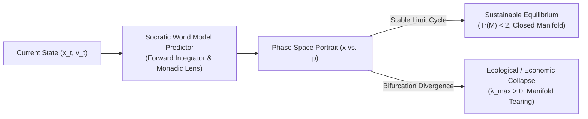

# Sprint 08: The Astrodynamic Nexus — Socratic Predictive Forward-Simulation and Phase Portraits

> *"To know where you will be tomorrow, you must measure your acceleration today. The future is an attractor in phase space, shaped by the curvature of present choices."*

---

## 1. Executive Summary & Curriculum Alignment

- **Curriculum Chapter**: [[chapters/08_Orbit_Prediction|Chapter 8: Orbit Prediction]] (The Law of Gravity)
- **Matrix Coordinate**: **Astronomy × Logic** (Scale-Invariant Prediction & Orbits / PCard Layer)
- **Civilizational Epoch**: **Epoch II: The Sovereign Tribal Mesh (What / Logic Era)**
- **Civilizational Analogue**: Classical Oceanic Navigation / Astrolabe Chronometry / World Model Simulation
- **Artifact Output**: The Astrodynamic Predictor Functor Card ([[PCard]])

Concluding **Epoch II (The Sovereign Tribal Mesh)**, players graduate from immediate local coordination to long-horizon planetary forecasting. Complex social, ecological, and computational networks frequently suffer sudden systemic collapse (tragedy of the commons, resource depletion) due to unperceived non-linear feedback. Players deploy **Socratic forward simulation loops**, projecting state trajectories across high-dimensional phase space. By calculating **Lyapunov exponents** and mapping attractor manifolds, players foresee crises before they materialize.

---

## 2. Ludic Mechanics & Antagonistic Friction



### 2.1 The Core Gameplay Loop
1. **State Vector Telemetry Aggregation**: Collecting current resource reserves, population rates, and network loads into state vector $\mathbf{x}(t)$.
2. **Forward Integration**: Propagating system dynamics through non-linear differential/difference equations into the future ($t + \Delta T$).
3. **Lyapunov Stability Analysis**: Measuring divergence between adjacent trajectories to identify chaos thresholds.
4. **Socratic Course Correction**: Applying micro-steering interventions to warp phase trajectories back into stable limit cycles.

### 2.2 Antagonistic Friction: Non-linear Phase Space Collapses
- **Ecological Bifurcation**: Small resource extraction overages triggering exponential collapse cascades.
- **Horizon Drift**: Numerical integration errors accumulating over long projection windows.

---

## 3. The Dual-Type Skill Lattice Specification

| Skill Dimension | Concrete Type | Invariant & Operational Boundary |
|:---|:---|:---|
| **PhysicalType** | `Kinematic` | Phase space coordinate $(\mathbf{x}, \mathbf{p}) \in \mathbb{R}^{2n}$; phase velocity $\dot{\mathbf{x}} = f(\mathbf{x})$; maximum Lyapunov exponent $\lambda_{\max} = \lim_{t \to \infty} \frac{1}{t} \ln \frac{\|\delta \mathbf{x}(t)\|}{\|\delta \mathbf{x}_0\|}$. |
| **SocialType** | `DialecticalTurn` (Aporia & Maieutics) | Cross-examining assumptions through Socratic interrogation to discard non-viable long-term policies. |

---

## 4. Invariant Victory Condition & Mathematical Formalism

Victory requires steering the system into a **Closed Stable Limit Cycle** in phase space, satisfying orbital stability:

$$\text{Tr}(\mathcal{M}) < 2 \quad \text{and} \quad \lambda_{\max} \le 0$$

where $\mathcal{M}$ is the monodromy matrix around the periodic orbit $\gamma(t) = \gamma(t + T)$:
$$\frac{d}{dt} \delta \mathbf{x} = J(t) \delta \mathbf{x}$$
ensuring zero trajectories cross the ecological extinction boundary $\mathcal{B}_{\text{collapse}}$.

---


---

## Perspective, Referential Coordinates, and Cordis Spatiotemporal Fiber

Applying **[[docs/sources/Dialect_Relativity_Unification_Electricity_Magnetism|Dialect's relativistic critique]]** and **[[docs/principles/Cordis_Spatiotemporal_Composability|Cordis spatiotemporal composability]]**, this sprint is grounded in coordinate invariance and rigorous execution lifecycle:

- **Referential Coordinate System & Perspective ($u^\mu$)**: Symplectic phase space coordinates $(\mathbf{q}, \mathbf{p}) \in T^* Q$ with canonical symplectic 2-form $\omega = \sum dq_i \wedge dp_i$. Observer worldline parameterized by proper time $\tau$.
- **Tensorial Invariant vs. Coordinate Artifact**: Symplectic 2-form conservation $\mathcal{L}_X \omega = 0$ (Liouville theorem), the trace of the monodromy matrix $\text{Tr}(\mathcal{M})$, and the maximum Lyapunov exponent $\lambda_{\max}$ are coordinate-free orbital invariants. Instantaneous phase positions $\mathbf{q}(t)$ are frame projections.
- **Cordis Execution Fiber Specification**:
  - **Fiber ID**: `sprint-08-nexus` operating in the hierarchical fiber tree.
  - **Context Isolation**: `ctx.isolate({ astrodynamic_orbit: Symbol('astrodynamic_orbit') })` protects the enclave's spatial namespace from cross-service pollution.
  - **Temporal Lifecycle**: State transitions strictly follow $\text{PENDING} \to \text{ACTIVE} \to \text{DISPOSED}$.
  - **Reversible Side Effects & Cleanup**: Registers Runge-Kutta numerical integration workers and limit-cycle validators; LIFO disposal terminates simulation worker threads cleanly.
  - **Directionality (道)**: Cleanup executes via non-commutative LIFO disposal: $\text{dispose}(B) \circ \text{dispose}(A) \neq \text{dispose}(A) \circ \text{dispose}(B)$.

## 5. Tri Hita Karana Guide Perspectives

- **Mr. Wayan (Sang Parahyangan / Structure)**:
  > *"When the navigators sailed across the Java Sea by the Southern Cross, they did not look at the waves; they looked at the immutable geometry of the stars. Keep your eyes on the invariant."*
- **Ms. Dewi (Sang Palemahan / Exploration)**:
  > *"Observe how the water in Lake Batur rises in the wet season and falls in the dry season. It is a breathing cycle; respect the rhythm, and the lake will never dry."*
- **Santa Claus (Sang Pawongan / Balance)**:
  > *"If your forward forecast shows your grandchildren have no trees left to build boats, your policy is wrong today, no matter how rich you feel this morning."*

---

## 6. Digital Synesthesia Unlocked: Attractor Manifold Holography (Level 8)

Achieving stable limit cycles unlocks **Level 8 Digital Synesthesia**:
- **Raw State Perception**: Predictive models produce overwhelming multidimensional tables of future values.
- **Synesthetic Transduction**: The system's future states hover in the player's peripheral vision as an iridescent, three-dimensional geometric attractor (e.g., a shimmering torus or Lorenz ribbon). A healthy future gleams with stable, harmonious geometric loops; impending instability causes the attractor to visibly vibrate, fray, and tear.

---

## 7. Technical Implementation & Artifact Schema

```sql
-- MCard Level 8: Astrodynamic Forward Predictor
CREATE TABLE IF NOT EXISTS mcard_astrodynamic_orbits (
    orbit_id TEXT PRIMARY KEY,
    state_vector_json TEXT NOT NULL,
    monodromy_trace REAL NOT NULL,
    max_lyapunov_exponent REAL NOT NULL,
    projected_horizon_seconds REAL NOT NULL,
    is_stable_limit_cycle BOOLEAN NOT NULL,
    socratic_attestation_hash TEXT NOT NULL
);
```

---


---

## The Judgment Dilemma: Revealing the Color of Character

> *"Knowledge is free, but judgment is not! Knowledge as written or published content can be attained rather publicly in various commons, but using the knowledge in privately interested or self-resolved choices will reveal the color of that person."*

### Boom-and-Bust Extraction vs. Generational Limit Cycles
Runge-Kutta integration and Lyapunov phase portrait formulas are public tools. Forward simulation reveals an economic policy that generates massive 10x resource yields immediately, but triggers an irreversible 80% ecological collapse ten cycles later. Cashing out for short-term glory reveals an insatiable, parasitic red core that tears the attractor manifold; choosing generational equilibrium preserves the closed Lyapunov orbit in shimmering, eternal golden harmony.

## 8. Definition of Done (DoD) Checklist
- [ ] **Judgment Dilemma & Character Color**: Resolved the sprint's ethical dilemma between private extraction and communal flourishing, recording the resulting chromatic shift in the player's synesthetic profile.

- [ ] **Referential Coordinates & Perspective**: Explicitly parameterized the observer's frame and 4-velocity projection ($u^\mu$).
- [ ] **Tensorial Invariant Verification**: Validated coordinate-free invariance across disparate observer reference frames.
- [ ] **Cordis Spatiotemporal Fiber**: Implemented reversible LIFO lifecycle hooks (`DisposableList`) and context isolation boundaries (`ctx.isolate`).

- [ ] **Game Mechanics**: Built interactive phase-space trajectory forward-simulation sandbox.
- [ ] **Mathematical Verification**: Implemented 4th-order Runge-Kutta numerical integrator and Lyapunov exponent estimator.
- [ ] **Type Lattice Conformance**: Formulated `Kinematic` phase space structs and `DialecticalTurn` aporia validators.
- [ ] **Synesthetic Feedback**: Implemented 3D holographic attractor manifold renderer using Three.js/WebGL.
- [ ] **Epoch II Graduation Gate**: Validated mastery of `Thermodynamic`, `SpatialSheaf` routing, `TemporalCadence` monads, and `Kinematic` orbits.
- [ ] **Vault Integrity**: Linked with [[chapters/08_Orbit_Prediction|Chapter 8]] and [[docs/concepts/World_Models|World Models Concept]].
