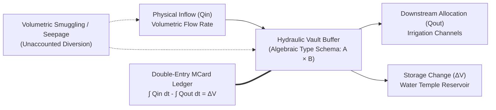

# Sprint 09: The Hydraulic Vault — Typed Micro-Measurement and Double-Entry Water Bookkeeping

> *"Water flows where gravity leads, but wealth flows where accounts are sealed. A civilization that cannot measure a drop of water will soon drown in debt."*

---

## 1. Executive Summary & Curriculum Alignment

- **Curriculum Chapter**: [[chapters/09_Counting_Water|Chapter 9: Counting Water]] (The Ledger of Eternity)
- **Matrix Coordinate**: **Arithmetic × Grammar** (Structural Ledger & Precise Serialization / MCard Layer)
- **Civilizational Epoch**: **Epoch III: The Sheaf Metamaterial (How / Grammar Era)**
- **Civilizational Analogue**: Ancient Aqueduct Engineering / Pacioli Double-Entry Bookkeeping / Cryptographic Water Ledgers
- **Artifact Output**: The Cryptographic Hydraulic Ledger Card ([[MCard]])

Entering **Epoch III (The Sheaf Metamaterial)**, players transition from dynamic heuristics to rigorous structural formalization. In the volcanic valleys of Bali, water is sacred, scarce, and constantly flowing. Players design **algebraic type schemas** (Sum Types $A + B$ and Product Types $A \times B$) to serialize physical fluid flow measurements into immutable, cryptographic **[[MCard|MCards]]**. By establishing double-entry conservation equations, players eliminate volumetric smuggling and ensure zero water loss.

---

## 2. Ludic Mechanics & Antagonistic Friction



### 2.1 The Core Gameplay Loop
1. **Sensor Calibration**: Setting up ultrasonic/weir flow meters to measure volumetric flow rates ($m^3/s$).
2. **Algebraic Type Composition**: Constructing Sum Types (Rainwater $+$ Springwater) and Product Types (Volume $\times$ Salinity $\times$ Sediment).
3. **Double-Entry Journaling**: Recording every liter entering or exiting the weir as balanced debit and credit MCard receipts.
4. **Leakage Elimination**: Reconciling discrepancies between upstream discharges and downstream deliveries to expose diversions.

### 2.2 Antagonistic Friction: Volumetric Smuggling & Seepage
- **Volumetric Smuggling**: Corrupt upstream actors secretly diverting unmetered water through hidden sluices.
- **Physical Seepage**: Unlined earthen canals leaking water into unmeasured sub-surface aquifers.

---

## 3. The Dual-Type Skill Lattice Specification

| Skill Dimension | Concrete Type | Invariant & Operational Boundary |
|:---|:---|:---|
| **PhysicalType** | `Countable` | Volumetric flow rate $Q(t) \in \mathbb{R}^+$; cumulative volume $V = \int_0^T Q(t) \, dt$; sensor resolution $\delta V \le 0.001 \, m^3$. |
| **SocialType** | `Attestation` ($V_{\text{post}}$) | Multi-party cryptographic co-signing of measurement batches by upstream and downstream Subak water masters. |

---

## 4. Invariant Victory Condition & Mathematical Formalism

Victory is achieved when the hydraulic accounting system satisfies the **Zero-Leakage Conservation Law**:

$$\int_0^T Q_{\text{in}}(t) \, dt - \int_0^T Q_{\text{out}}(t) \, dt = \Delta V_{\text{storage}}$$

Under the strict Double-Entry Invariant:
$$\sum \text{Debits} - \sum \text{Credits} \equiv 0 \quad (\text{Zero Fractional Penny / Drop Error})$$
with 100% cryptographic attestation coverage across all physical weirs.

---


---

## Perspective, Referential Coordinates, and Cordis Spatiotemporal Fiber

Applying **[[docs/sources/Dialect_Relativity_Unification_Electricity_Magnetism|Dialect's relativistic critique]]** and **[[docs/principles/Cordis_Spatiotemporal_Composability|Cordis spatiotemporal composability]]**, this sprint is grounded in coordinate invariance and rigorous execution lifecycle:

- **Referential Coordinate System & Perspective ($u^\mu$)**: Volumetric coordinate space $(V_1, V_2, \dots, V_m)$ across weir sensor nodes; mass balance parameterized by proper flow time $\tau$.
- **Tensorial Invariant vs. Coordinate Artifact**: The total mass conservation invariant $\oint \mathbf{J} \cdot d\mathbf{A} = \frac{dM}{dt}$ and the cryptographic SHA-256 hash of the sealed MCard ledger are unalterable scalars. Local weir water levels $h(t)$ are coordinate projections.
- **Vibration, Perturbation & Free Will vs. Energy Cost of Coherence**: Thermal cryptographic noise, side-channel emissions, and quantum zero-point fluctuations represent microstate variables attempting to "jump between different physical realities" (unauthorized state leakage vs. brittle decryption failure). The chance of coming back into a consistent, order-preserving entry (a valid zero-knowledge circuit satisfaction proof) is the arithmetic curve pairing and elliptic polynomial evaluation that the verifying node must pay as "energy". See [[docs/concepts/Vibration_Perturbation_and_the_Energy_Cost_of_Coherence|Vibration, Perturbation, and the Energy Cost of Coherence]].
- **Cordis Execution Fiber Specification**:
  - **Fiber ID**: `sprint-09-vault` operating in the hierarchical fiber tree.
  - **Context Isolation**: `ctx.isolate({ hydraulic_ledger: Symbol('hydraulic_ledger') })` protects the enclave's spatial namespace from cross-service pollution.
  - **Temporal Lifecycle**: State transitions strictly follow $\text{PENDING} \to \text{ACTIVE} \to \text{DISPOSED}$.
  - **Reversible Side Effects & Cleanup**: Registers ultrasonic flowmeter polling loops and double-entry balancing triggers; LIFO disposal flushes and cryptographically seals active journal blocks.
  - **Directionality (道)**: Cleanup executes via non-commutative LIFO disposal: $\text{dispose}(B) \circ \text{dispose}(A) \neq \text{dispose}(A) \circ \text{dispose}(B)$.

## 5. Tri Hita Karana Guide Perspectives

- **Mr. Wayan (Sang Parahyangan / Structure)**:
  > *"Water is Dewi Danu's blood. When you count water, you are not merely doing bookkeeping; you are maintaining the sacred covenant between mountain and sea."*
- **Ms. Dewi (Sang Palemahan / Exploration)**:
  > *"Notice how the morning dew collects in the bamboo gutters! Every droplet counts toward the valley's harvest. Type your containers cleanly!"*
- **Santa Claus (Sang Pawongan / Balance)**:
  > *"When the ledger is open and signed by both the farmer at the top of the hill and the farmer at the bottom, suspicion vanishes."*

---

## 6. Digital Synesthesia Unlocked: Crystalline Lattice Sight (Level 9)

Satisfying double-entry conservation unlocks **Level 9 Digital Synesthesia**:
- **Raw State Perception**: Water systems appear as pipe diagrams and pressure gauge numbers.
- **Synesthetic Transduction**: Data schemas and flow ledgers crystallize visually into geometric gemstones and optical quartz prisms. A perfectly typed, balanced schema renders as a flawless, transparent diamond; type mismatches, leakage, or accounting imbalances manifest as visible internal fractures and cloudy inclusions.

---

## 7. Technical Implementation & Artifact Schema

```sql
-- MCard Level 9: Double-Entry Hydraulic Ledger
CREATE TABLE IF NOT EXISTS mcard_hydraulic_ledger (
    entry_id TEXT PRIMARY KEY,
    weir_id TEXT NOT NULL,
    flow_type TEXT NOT NULL,           -- Sum Type: 'SPRING' | 'CANAL' | 'RAIN'
    volume_liters REAL NOT NULL,
    debit_account TEXT NOT NULL,
    credit_account TEXT NOT NULL,
    upstream_sig TEXT NOT NULL,
    downstream_sig TEXT NOT NULL,
    conservation_hash TEXT NOT NULL
);
```

---


---

## The Judgment Dilemma: Revealing the Color of Character

> *"Knowledge is free, but judgment is not! Knowledge as written or published content can be attained rather publicly in various commons, but using the knowledge in privately interested or self-resolved choices will reveal the color of that person."*

### Unmetered Siphoning vs. Double-Entry Conscience
Pacioli's double-entry bookkeeping and mass conservation equations are freely taught. A concealed fissure in the weir canal allows the player to divert 15% of public irrigation water into private fish ponds undetected. Concealing the leak exposes the hollow morality of secret theft; reporting the breach and cryptographically sealing the double-entry MCard ledger crystallizes the player's character into a flawless, transparent diamond prism.

## 8. Definition of Done (DoD) Checklist
- [ ] **Vibration & Coherence Energy Balance**: Verified that entity fluctuations (free will to explore alternate realities) and the collective energetic cost to restore order-preserving coherence are explicitly modeled and balanced.
- [ ] **Judgment Dilemma & Character Color**: Resolved the sprint's ethical dilemma between private extraction and communal flourishing, recording the resulting chromatic shift in the player's synesthetic profile.

- [ ] **Referential Coordinates & Perspective**: Explicitly parameterized the observer's frame and 4-velocity projection ($u^\mu$).
- [ ] **Tensorial Invariant Verification**: Validated coordinate-free invariance across disparate observer reference frames.
- [ ] **Cordis Spatiotemporal Fiber**: Implemented reversible LIFO lifecycle hooks (`DisposableList`) and context isolation boundaries (`ctx.isolate`).

- [ ] **Game Mechanics**: Built interactive irrigation weir flow measurement and double-entry ledger balancing minigame.
- [ ] **Mathematical Verification**: Formulated numerical mass-conservation solver over multi-node weir networks.
- [ ] **Type Lattice Conformance**: Implemented algebraic Sum and Product types in Rust/TypeScript for water flow payloads.
- [ ] **Synesthetic Feedback**: Built WebGL procedural crystalline gemstone shader reflecting type correctness and ledger balance.
- [ ] **Vault Integrity**: Linked with [[chapters/09_Counting_Water|Chapter 9]] and [[docs/concepts/MCard|MCard Standard Specification]].
