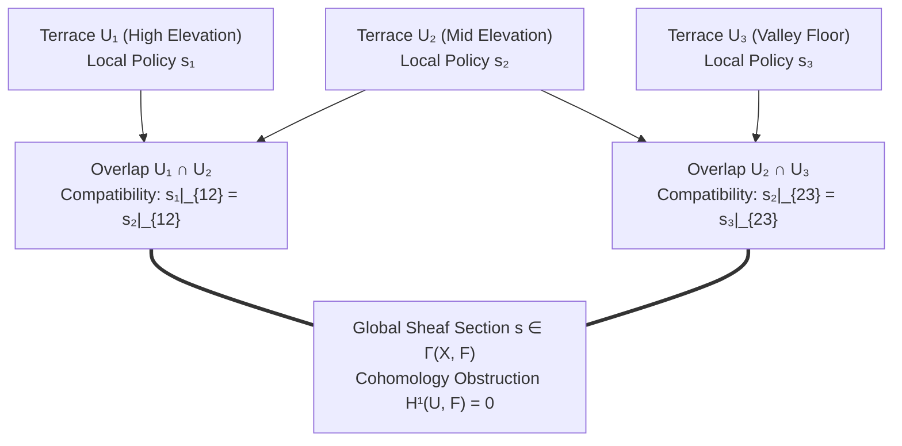

# Sprint 10: The Rice Terrace Sheaf — Topographic Sheaf Gluing and Vanishing Obstructions

> *"A mountain is not a collection of private fields, but a continuous sheaf of life. What is true on the high terrace must glue seamlessly with the terrace below, until the entire watershed sings as one."*

---

## 1. Executive Summary & Curriculum Alignment

- **Curriculum Chapter**: [[chapters/10_Rice_Terrace_Topology|Chapter 10: Rice Terrace Topology]] (The Metamaterial of Space)
- **Matrix Coordinate**: **Geometry × Grammar** (Topological Sheaves & Structural Continuity / MCard Layer)
- **Civilizational Epoch**: **Epoch III: The Sheaf Metamaterial (How / Grammar Era)**
- **Civilizational Analogue**: Terraced Rice Agriculture / City-State Sheaf Federations / Subak Water Temple Democracy
- **Artifact Output**: The Sheaf Gluing Functor Card ([[MCard]])

In Sprint 10, players tackle one of the most sophisticated self-organizing systems on Earth: the Balinese **Subak** rice terrace federation. Hundreds of autonomous farmers manage individual terraces on steep volcanic ridges. If each farmer acts independently, water is wasted and pests thrive; if a centralized dictator commands the valley, local nuances are ignored. Players formulate water allocation as a **Topological Sheaf** $\mathcal{F}$ over the open cover $\mathcal{U} = \{U_i\}$ of terraces. By enforcing local section compatibility on terrace overlaps ($U_i \cap U_j$), players demonstrate that global valley-wide harmony emerges when the first cohomology obstruction vanishes ($H^1(\mathcal{U}, \mathcal{F}) = 0$).

---

## 2. Ludic Mechanics & Antagonistic Friction



### 2.1 The Core Gameplay Loop
1. **Terrace Boundary Surveying**: Mapping terrace elevations, water drop heights, and soil percolation coefficients.
2. **Local Section Definition**: Defining local cropping and flooding schedules $s_i \in \mathcal{F}(U_i)$ for individual farming sub-units.
3. **Restriction & Gluing Verification**: Computing restriction maps $\rho_{U_i, U_i \cap U_j}(s_i)$ across terrace dikes to test boundary compatibility.
4. **Cocycle Obstruction Elimination**: Modulating local water release timings until boundary tensions and dispute tensors vanish ($T_{ij} \equiv 0$).

### 2.2 Antagonistic Friction: Inter-Terrace Shear Tensions
- **Upstream-Downstream Conflict**: Upstream farmers flooding early, depriving downstream terraces during planting.
- **Pest Wave Infestations**: Asynchronous planting schedules allowing brown planthopper swarms to hop continuously from terrace to terrace.

---

## 3. The Dual-Type Skill Lattice Specification

| Skill Dimension | Concrete Type | Invariant & Operational Boundary |
|:---|:---|:---|
| **PhysicalType** | `SpatialSheaf` | Open cover $\mathcal{U} = \{U_i\}$; hydraulic boundary condition $Q_{i \to j} = K \sqrt{h_i - h_j}$; open-channel Navier-Stokes constraints. |
| **SocialType** | `AgencyResidual` & `Attestation` | Autonomous Subak water temple pacts agreed upon by customary village consensus (Awig-Awig). |

---

## 4. Invariant Victory Condition & Mathematical Formalism

Victory is achieved when the local policies glue into a unique global section without topological obstruction, certified by the **Vanishing First Čech Cohomology Group**:

$$\check{H}^1(\mathcal{U}, \mathcal{F}) = 0$$

where for every pair of overlapping terraces $U_i, U_j$:
$$s_i |_{U_i \cap U_j} - s_j |_{U_i \cap U_j} = 0 \quad \text{in } \mathcal{F}(U_i \cap U_j)$$
and the inter-terrace shear stress tensor vanishes identically:
$$T_{ij} \equiv 0 \quad \forall i, j$$

---


---

## Perspective, Referential Coordinates, and Cordis Spatiotemporal Fiber

Applying **[[docs/sources/Dialect_Relativity_Unification_Electricity_Magnetism|Dialect's relativistic critique]]** and **[[docs/principles/Cordis_Spatiotemporal_Composability|Cordis spatiotemporal composability]]**, this sprint is grounded in coordinate invariance and rigorous execution lifecycle:

- **Referential Coordinate System & Perspective ($u^\mu$)**: Topological open cover $\mathcal{U} = \{U_i\}$ of terrace charts with transition homeomorphisms $\psi_{ij} = \phi_j \circ \phi_i^{-1}$ between adjacent elevations.
- **Tensorial Invariant vs. Coordinate Artifact**: The vanishing first Čech cohomology group $\check{H}^1(\mathcal{U}, \mathcal{F}) = 0$ and the zero-shear tensor norm $T_{ij} \equiv 0$ are coordinate-free sheaf invariants. Individual terrace water schedules $s_i$ are local coordinate sections.
- **Cordis Execution Fiber Specification**:
  - **Fiber ID**: `sprint-10-sheaf` operating in the hierarchical fiber tree.
  - **Context Isolation**: `ctx.isolate({ subak_terrace_sheaf: Symbol('subak_terrace_sheaf') })` protects the enclave's spatial namespace from cross-service pollution.
  - **Temporal Lifecycle**: State transitions strictly follow $\text{PENDING} \to \text{ACTIVE} \to \text{DISPOSED}$.
  - **Reversible Side Effects & Cleanup**: Registers inter-terrace restriction functors and Awig-Awig agreement monitors; LIFO disposal gracefully detaches restriction mappings without orphaned disputes.
  - **Directionality (道)**: Cleanup executes via non-commutative LIFO disposal: $\text{dispose}(B) \circ \text{dispose}(A) \neq \text{dispose}(A) \circ \text{dispose}(B)$.

## 5. Tri Hita Karana Guide Perspectives

- **Mr. Wayan (Sang Parahyangan / Structure)**:
  > *"The water temple at the top of the lake (Pura Ulun Danu Batur) does not tell each farmer when to plant. The temple coordinates the calendar so that all terraces in the valley plant in unison, starving the pests without poison."*
- **Ms. Dewi (Sang Palemahan / Exploration)**:
  > *"Look at how the emerald terraces step down into the ravine like green stairways for the gods. Each terrace is unique, yet together they hold the mountain from sliding into the sea."*
- **Santa Claus (Sang Pawongan / Balance)**:
  > *"When an upstream farmer shares his surplus water with the terrace below, the downstream farmer shares his duck flock to eat the weeds. Mutual aid is the sheaf that glues the world."*

---

## 6. Digital Synesthesia Unlocked: Zero-Shear Manifold Vision (Level 10)

Vanishing cohomology ($H^1 = 0$) unlocks **Level 10 Digital Synesthesia**:
- **Raw State Perception**: The landscape appears as fragmented property parcels separated by fences.
- **Synesthetic Transduction**: The entire mountainous terrain transforms into an interconnected, glowing metamaterial manifold. Boundary disputes and policy friction appear as jagged, red, shear-stress fault lines; when the sheaf glues cleanly, terrace borders dissolve into harmonious, luminous green zero-friction streamlines, radiating laminar tranquility.

---

## 7. Technical Implementation & Artifact Schema

```sql
-- MCard Level 10: Sheaf Section & Gluing Attestation
CREATE TABLE IF NOT EXISTS mcard_terrace_sheaf (
    sheaf_section_id TEXT PRIMARY KEY,
    valley_id TEXT NOT NULL,
    open_cover_manifest_hash TEXT NOT NULL,
    cohomology_h1_norm REAL NOT NULL, -- Must be 0.0
    shear_tensor_norm REAL NOT NULL,   -- Must be 0.0
    awig_awig_consensus_hash TEXT NOT NULL,
    global_section_hash TEXT NOT NULL
);
```

---


---

## The Judgment Dilemma: Revealing the Color of Character

> *"Knowledge is free, but judgment is not! Knowledge as written or published content can be attained rather publicly in various commons, but using the knowledge in privately interested or self-resolved choices will reveal the color of that person."*

### Upstream Water Hoarding vs. Awig-Awig Solidarity
Sheaf cohomology and restriction functors are accessible in the library. During an unexpected drought, upstream terraces can hold water to guarantee their own rich crop while lower terraces desiccate. Does the upstream player hoard water, or honor ancient Balinese Awig-Awig customary law by releasing water downstream so the entire valley starves the planthopper pests together? Hoarding creates jagged, bleeding shear lines across the hillsides; solidarity transforms the watershed into a zero-shear, radiant emerald metamaterial.

## 8. Definition of Done (DoD) Checklist
- [ ] **Judgment Dilemma & Character Color**: Resolved the sprint's ethical dilemma between private extraction and communal flourishing, recording the resulting chromatic shift in the player's synesthetic profile.

- [ ] **Referential Coordinates & Perspective**: Explicitly parameterized the observer's frame and 4-velocity projection ($u^\mu$).
- [ ] **Tensorial Invariant Verification**: Validated coordinate-free invariance across disparate observer reference frames.
- [ ] **Cordis Spatiotemporal Fiber**: Implemented reversible LIFO lifecycle hooks (`DisposableList`) and context isolation boundaries (`ctx.isolate`).

- [ ] **Game Mechanics**: Built multi-terrace watershed puzzle with interactive water gate scheduling.
- [ ] **Mathematical Verification**: Implemented Čech cohomology matrix solver computing $\dim \check{H}^1(\mathcal{U}, \mathcal{F})$.
- [ ] **Type Lattice Conformance**: Formulated `SpatialSheaf` topological data structures with restriction functors.
- [ ] **Synesthetic Feedback**: Built WebGL continuous surface deformation shader depicting inter-terrace shear and laminar relaxation.
- [ ] **Vault Integrity**: Linked with [[chapters/10_Rice_Terrace_Topology|Chapter 10]] and [[docs/concepts/Representation_Engine|Representation Engine]].
