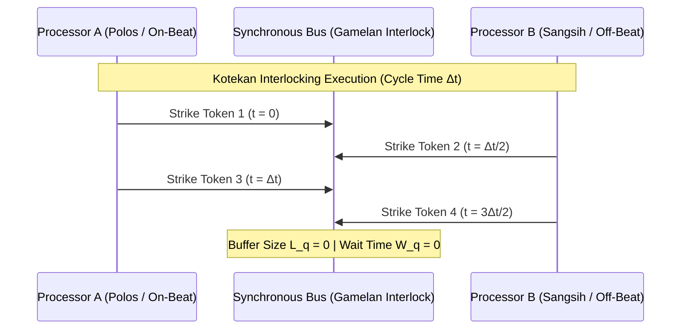

# Sprint 11: The Zero-Queue Ceremony — Kotekan Interlocking Rhythms and Latency Annihilation

> *"A queue is an admission of failure in choreography. In the sacred dance of the Gamelan, no mallet waits for another; two players strike alternating beats so swiftly that they sound like one god playing with four hands."*

---

## 1. Executive Summary & Curriculum Alignment

- **Curriculum Chapter**: [[chapters/11_Ceremonial_Beats|Chapter 11: Ceremonial Beats]] (The Music of the Spheres)
- **Matrix Coordinate**: **Music × Grammar** (Structural Rhythm & Distributed Pipelining / MCard Layer)
- **Civilizational Epoch**: **Epoch III: The Sheaf Metamaterial (How / Grammar Era)**
- **Civilizational Analogue**: Industrial Automation / Cerebras-Style Uniform Execution / Balinese Gamelan Gong Kebyar
- **Artifact Output**: The Zero-Queue Pipeline Orchestration Card ([[MCard]])

In Sprint 11, players confront the plague of modern computing and bureaucracy: **queue bloat** ($W_q > 0$). In traditional systems, messages pile up in buffers, wasting energy, inducing latency, and risking out-of-memory crashes. Players look to the master musicians of the Balinese Gamelan, who achieve superhuman tempos through **Kotekan**—interlocking two distinct rhythmic parts (*Polos*, the on-beat, and *Sangsih*, the off-beat). By weaving concurrent execution threads into a perfectly synchronized rhythmic pipeline, players collapse queue waiting times to absolute zero ($W_q \equiv 0$) at 100% throughput.

---

## 2. Ludic Mechanics & Antagonistic Friction



### 2.1 The Core Gameplay Loop
1. **Clock Skew Elimination**: Harmonizing physical oscillator frequencies across distributed compute nodes.
2. **Kotekan Part Partitioning**: Splitting heavy data processing pipelines into alternating *Polos* and *Sangsih* micro-stages.
3. **Interlocking Stride Alignment**: Aligning instruction issue cycles so that receiving units accept tokens immediately upon production without intermediate buffering.
4. **Buffer Bloat Drainage**: Dynamically modulating packet dispatch rates to force queue lengths to zero.

### 2.2 Antagonistic Friction: Buffer Bloat & Jitter Cascades
- **Queue Accumulation**: Uncoordinated bursty traffic creating latency spikes that break real-time deadlines.
- **Clock Jitter**: Thermal variations causing execution beats to stumble, introducing buffer stalls.

---

## 3. The Dual-Type Skill Lattice Specification

| Skill Dimension | Concrete Type | Invariant & Operational Boundary |
|:---|:---|:---|
| **PhysicalType** | `TemporalCadence` | Uniform cycle period $T_{\text{cycle}}$; phase jitter $\sigma_\tau < 0.001 T_{\text{cycle}}$; queue length $L_q = 0$; wait time $W_q = 0$. |
| **SocialType** | `DialecticalTurn` | Strict ceremonial turn-taking protocols enforcing zero buffer bloat and zero conversational preemption. |

---

## 4. Invariant Victory Condition & Mathematical Formalism

Victory is achieved through the total collapse of queue waiting time under **Little's Law**:

$$L_q = \lambda W_q \equiv 0 \quad \text{at } \lambda = \lambda_{\max} = \frac{1}{T_{\text{cycle}}}$$

with pipeline throughput efficiency:
$$\eta_{\text{pipeline}} = \frac{N_{\text{ops}}}{N_{\text{cycles}} \cdot N_{\text{units}}} = 1.0$$
and zero dropped tokens across all execution stages.

---


---

## Perspective, Referential Coordinates, and Cordis Spatiotemporal Fiber

Applying **[[docs/sources/Dialect_Relativity_Unification_Electricity_Magnetism|Dialect's relativistic critique]]** and **[[docs/principles/Cordis_Spatiotemporal_Composability|Cordis spatiotemporal composability]]**, this sprint is grounded in coordinate invariance and rigorous execution lifecycle:

- **Referential Coordinate System & Perspective ($u^\mu$)**: High-frequency cycle phase $\phi \in [0, 2\pi)$; alternating reference frames $S_{\text{polos}}$ and $S_{\text{sangsih}}$ offset by half-cycle $\pi$.
- **Tensorial Invariant vs. Coordinate Artifact**: Little's Law zero-wait invariant $W_q \equiv 0$ and pipeline execution efficiency $\eta = 1.0$ are frame-independent invariants. Local processor clock delays and arrival phases are coordinate projections.
- **Cordis Execution Fiber Specification**:
  - **Fiber ID**: `sprint-11-ceremony` operating in the hierarchical fiber tree.
  - **Context Isolation**: `ctx.isolate({ kotekan_pipeline: Symbol('kotekan_pipeline') })` protects the enclave's spatial namespace from cross-service pollution.
  - **Temporal Lifecycle**: State transitions strictly follow $\text{PENDING} \to \text{ACTIVE} \to \text{DISPOSED}$.
  - **Reversible Side Effects & Cleanup**: Registers high-precision microsecond chime timers and instruction dispatchers; LIFO disposal clears pipeline registers in reverse order of initialization.
  - **Directionality (道)**: Cleanup executes via non-commutative LIFO disposal: $\text{dispose}(B) \circ \text{dispose}(A) \neq \text{dispose}(A) \circ \text{dispose}(B)$.

## 5. Tri Hita Karana Guide Perspectives

- **Mr. Wayan (Sang Parahyangan / Structure)**:
  > *"Listen to the Reyong kettles! Twelve bronze pots played by four musicians. If one musician pauses to look at his notes, the sacred tempo breaks. Perfection is memory turned into reflex."*
- **Ms. Dewi (Sang Palemahan / Exploration)**:
  > *"Feel the waterwheel in the stream! It does not store the water; it catches the flow and immediately transforms it into grain-grinding power. A moving stream has no stagnant pools."*
- **Santa Claus (Sang Pawongan / Balance)**:
  > *"Waiting in line is the thief of human life. When we synchronize our arrival with the host's preparation, the table is set the moment the guest knocks."*

---

## 6. Digital Synesthesia Unlocked: Acoustic Strobe Resonance (Level 11)

Achieving zero-queue operation unlocks **Level 11 Digital Synesthesia**:
- **Raw State Perception**: System metrics appear as CPU utilization percentages and queue depth line charts.
- **Synesthetic Transduction**: The distributed processing pipeline sings as an acoustic bronze chime array. Misalignments and buffer stalls sound like jarring, uneven clangs and clattering echoes; when the system reaches pure Kotekan zero-queue synchrony, the cacophony disappears into a breathtaking, ringing **harmonic silence**—a resonant stillness where immense speed feels completely stationary.

---

## 7. Technical Implementation & Artifact Schema

```sql
-- MCard Level 11: Kotekan Pipeline Synchronization
CREATE TABLE IF NOT EXISTS mcard_kotekan_pipeline (
    pipeline_id TEXT PRIMARY KEY,
    cycle_period_nanoseconds INTEGER NOT NULL,
    polos_node_hash TEXT NOT NULL,
    sangsih_node_hash TEXT NOT NULL,
    measured_queue_depth INTEGER NOT NULL, -- Must be 0
    measured_wait_time_ns INTEGER NOT NULL, -- Must be 0
    jitter_variance REAL NOT NULL,
    orchestration_manifest_hash TEXT NOT NULL
);
```

---


---

## The Judgment Dilemma: Revealing the Color of Character

> *"Knowledge is free, but judgment is not! Knowledge as written or published content can be attained rather publicly in various commons, but using the knowledge in privately interested or self-resolved choices will reveal the color of that person."*

### Speculative Buffer Spam vs. Ceremonial Kotekan Humility
Little's Law and pipelined scheduling mathematics are common property. The player can spam the shared execution bus with speculative, greedy requests to monopolize compute bandwidth, forcing peer nodes into queue bloat ($W_q > 0$). Spamming the bus fills the environment with grating, cacophonous bronze clatter; waiting for the assigned Kotekan interlocking beat (*Polos* or *Sangsih*) collapses queue latency to absolute zero, ringing in the sublime peace of harmonic silence.

## 8. Definition of Done (DoD) Checklist
- [ ] **Judgment Dilemma & Character Color**: Resolved the sprint's ethical dilemma between private extraction and communal flourishing, recording the resulting chromatic shift in the player's synesthetic profile.

- [ ] **Referential Coordinates & Perspective**: Explicitly parameterized the observer's frame and 4-velocity projection ($u^\mu$).
- [ ] **Tensorial Invariant Verification**: Validated coordinate-free invariance across disparate observer reference frames.
- [ ] **Cordis Spatiotemporal Fiber**: Implemented reversible LIFO lifecycle hooks (`DisposableList`) and context isolation boundaries (`ctx.isolate`).

- [ ] **Game Mechanics**: Built interactive Kotekan interlocking rhythm simulator with adjustable phase offsets.
- [ ] **Mathematical Verification**: Verified Little's Law collapse ($L_q = W_q = 0$) in continuous multi-node packet dispatch.
- [ ] **Type Lattice Conformance**: Formulated `TemporalCadence` high-precision clock structs and zero-preemption turn-taking rules.
- [ ] **Synesthetic Feedback**: Implemented dynamic WebAudio Gamelan synthesizer shifting from asynchronous clatter to resonant chime silence.
- [ ] **Vault Integrity**: Linked with [[chapters/11_Ceremonial_Beats|Chapter 11]] and [[docs/principles/Observability|Observability Principles]].
