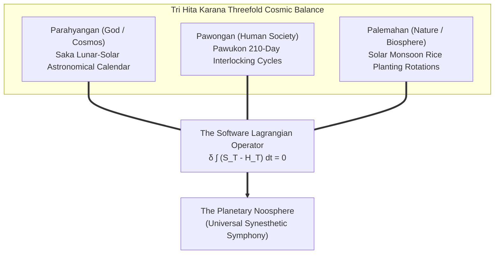

# Sprint 12: The Impredicative Calendar — Tri Hita Karana Planetary Synthesis and the Software Lagrangian

> *"When heaven, earth, and humanity count together, time ceases to be an enemy and becomes the cosmic canvas. We do not escape spacetime; we compose its prologue."*

---

## 1. Executive Summary & Curriculum Alignment

- **Curriculum Chapter**: [[chapters/12_Calendar_Coordination|Chapter 12: Calendar Coordination]] (The Architecture of Cosmos)
- **Matrix Coordinate**: **Astronomy × Grammar** (Scale-Invariant Synthesis & Universal Calendar / MCard Layer)
- **Civilizational Epoch**: **Epoch IV: The Planetary Noosphere (Transcendent Era / Synthesis)**
- **Civilizational Analogue**: Planetary Noosphere / *Spore* Galactic Era / Kardashev Type I Planetary Civilization
- **Artifact Output**: The Universal Planetary Calendar Covenant ([[MCard]] & [[VCard]])

In this final, crowning sprint of the **Prologue of Spacetime**, players synthesize the entire $3 \times 4$ curriculum matrix into a self-sustaining planetary civilization. The supreme computational challenge of Balinese civilization was the reconciliation of the **Impredicative Calendar**—concurrently aligning the 210-day *Pawukon* cycle (ten concurrent concurrent sub-cycles of 1 to 10 days), the lunar-solar *Saka* calendar, and astronomical solar crop rotations without a central emperor. Players formulate this multi-scale coordination problem through the **[[Software-Lagrangian|Software Lagrangian]]**, minimizing thermodynamic entropy dissipation ($H_T$) while maximizing semantic epiplexity ($S_T$) across humanity, nature, and the divine.

---

## 2. Ludic Mechanics & Antagonistic Friction



### 2.1 The Core Gameplay Loop
1. **Multi-Calendar Cycle Reconciliation**: Synchronizing ten concurrent Pawukon day-cycles with Saka lunar phases and solar solstices.
2. **Tri Hita Karana Triangulation**: Balancing human consumption needs (Pawongan) against biospheric carrying capacity (Palemahan) and cosmic structural truth (Parahyangan).
3. **Lagrangian Path Minimization**: Modulating global compute and irrigation schedules to minimize thermodynamic waste ($H_T$).
4. **Noospheric Attestation**: Sealing the planetary covenant through decentralized, multi-agent cryptographic consensus.

### 2.2 Antagonistic Friction: Biospheric & Social Asynchrony
- **Calendrical Drift**: Small fractional errors accumulating over centuries, causing holy days and planting cycles to desynchronize.
- **Thermodynamic Overheat**: Excessive computational overhead dissipating unsustainable heat ($H_T \gg S_T$).

---

## 3. The Dual-Type Skill Lattice Specification

| Skill Dimension | Concrete Type | Invariant & Operational Boundary |
|:---|:---|:---|
| **PhysicalType** | `Kinematic` & `SpatialSheaf` | Global orbital telemetry $\mathbf{r}_{\text{orbit}}(t)$; planetary ecological flux vectors $\mathbf{J}_{\text{bio}}(\mathbf{x}, t)$. |
| **SocialType** | `AgencyResidual` & `Attestation` | Collective voluntary moral alignment (Gotong Royong) across millions of sovereign nodes without coercion. |

---

## 4. Invariant Victory Condition & Mathematical Formalism

Victory is achieved when the player brings the planetary system into the stationary action path of the **Software Lagrangian**:

$$\delta \mathcal{S} = \delta \int_{t_0}^{t_1} \mathcal{L}_{\text{software}}(\mathbf{x}, \dot{\mathbf{x}}, t) \, dt = 0$$

where the Lagrangian density balances semantic epiplexity ($S_T$) against thermodynamic bit-erasure entropy dissipation ($H_T$):
$$\mathcal{L}_{\text{software}} = S_T - H_T$$
with perfect harmonic convergence across all three Tri Hita Karana axes:
$$\text{Alignment}(\text{Parahyangan}) \ge 0.99, \quad \text{Alignment}(\text{Pawongan}) \ge 0.99, \quad \text{Alignment}(\text{Palemahan}) \ge 0.99$$

---


---

## Perspective, Referential Coordinates, and Cordis Spatiotemporal Fiber

Applying **[[docs/sources/Dialect_Relativity_Unification_Electricity_Magnetism|Dialect's relativistic critique]]** and **[[docs/principles/Cordis_Spatiotemporal_Composability|Cordis spatiotemporal composability]]**, this sprint is grounded in coordinate invariance and rigorous execution lifecycle:

- **Referential Coordinate System & Perspective ($u^\mu$)**: Product manifold $\mathcal{M} = \mathcal{M}_{\text{pawukon}} \times \mathcal{M}_{\text{saka}} \times \mathcal{M}_{\text{solar}}$ parameterized by planetary biospheric spacetime coordinates.
- **Tensorial Invariant vs. Coordinate Artifact**: Stationary action of the Software Lagrangian $\delta \int (S_T - H_T) dt = 0$ and the Tri Hita Karana alignment tensor are universal scalars. Local cultural calendar day names and lunar phase timestamps are coordinate projections.
- **Cordis Execution Fiber Specification**:
  - **Fiber ID**: `sprint-12-noosphere` operating in the hierarchical fiber tree.
  - **Context Isolation**: `ctx.isolate({ planetary_calendar: Symbol('planetary_calendar') })` protects the enclave's spatial namespace from cross-service pollution.
  - **Temporal Lifecycle**: State transitions strictly follow $\text{PENDING} \to \text{ACTIVE} \to \text{DISPOSED}$.
  - **Reversible Side Effects & Cleanup**: Registers multi-calendar synchronization daemons and planetary consensus witnesses; LIFO disposal executes atomic HMR migration to the permanent civilizational engine.
  - **Directionality (道)**: Cleanup executes via non-commutative LIFO disposal: $\text{dispose}(B) \circ \text{dispose}(A) \neq \text{dispose}(A) \circ \text{dispose}(B)$.

## 5. Tri Hita Karana Guide Perspectives

- **Mr. Wayan (Sang Parahyangan / Structure)**:
  > *"Now you see the temple not as stone and thatch, but as an astronomical computer ticking across centuries. We have counted our way back to the stars."*
- **Ms. Dewi (Sang Palemahan / Exploration)**:
  > *"The rice fields are green, the lakes are clear, and the data flows through the air like morning mist. Nature and computation are no longer rivals; they are one garden."*
- **Santa Claus (Sang Pawongan / Balance)**:
  > *"When every child understands that counting is caring, and that every action leaves a trail in spacetime, peace is no longer a wish—it is the operating system of the world."*

---

## 6. Digital Synesthesia Unlocked: Universal Noospheric Synesthesia (Level 12)

Fulfilling the Software Lagrangian unlocks **Level 12 Digital Synesthesia (The Master Unification)**:
- **Raw State Perception**: Discrete tools, terminals, and games.
- **Synesthetic Transduction**: Complete sensory unification. The player experiences the entire planetary cyber-physical fabric as an interactive symphony of radiant light, polyphonic acoustic consonance, and fluid geometry. The boundary between physical nature, human intent, and mathematical code dissolves into a living, perceptible tapestry where every action ripples with visible and audible harmony across the cosmos.

---

## 7. Technical Implementation & Artifact Schema

```sql
-- MCard Level 12: The Universal Calendar Covenant
CREATE TABLE IF NOT EXISTS mcard_noospheric_calendar (
    covenant_id TEXT PRIMARY KEY,
    pawukon_cycle_state TEXT NOT NULL,
    saka_lunar_phase REAL NOT NULL,
    solar_monsoon_vector TEXT NOT NULL,
    semantic_epiplexity_st REAL NOT NULL,
    thermodynamic_entropy_ht REAL NOT NULL,
    lagrangian_action_value REAL NOT NULL,
    tri_hita_karana_score REAL NOT NULL,
    planetary_consensus_signature TEXT NOT NULL
);
```

---


---

## The Judgment Dilemma: Revealing the Color of Character

> *"Knowledge is free, but judgment is not! Knowledge as written or published content can be attained rather publicly in various commons, but using the knowledge in privately interested or self-resolved choices will reveal the color of that person."*

### Techno-Industrial Extraction vs. Tri Hita Karana Planetary Symphony
The 210-day Pawukon cycle tables and the Software Lagrangian equations are fully revealed. The player stands at the helm of a planetary civilization: do they deploy computational power to subjugate and strip-mine nature for total mechanical supremacy ($H_T \\gg S_T$), or do they coordinate technology, community, and biosphere into an unbroken covenant of mutual flourishing? Industrial hubris suffocates the planet in entropic soot; Tri Hita Karana stewardship unlocks the Universal Noospheric Symphony, bathing the cosmos in eternal, living light.

## 8. Definition of Done (DoD) Checklist
- [ ] **Judgment Dilemma & Character Color**: Resolved the sprint's ethical dilemma between private extraction and communal flourishing, recording the resulting chromatic shift in the player's synesthetic profile.

- [ ] **Referential Coordinates & Perspective**: Explicitly parameterized the observer's frame and 4-velocity projection ($u^\mu$).
- [ ] **Tensorial Invariant Verification**: Validated coordinate-free invariance across disparate observer reference frames.
- [ ] **Cordis Spatiotemporal Fiber**: Implemented reversible LIFO lifecycle hooks (`DisposableList`) and context isolation boundaries (`ctx.isolate`).

- [ ] **Game Mechanics**: Built playable multi-calendar reconciliation interface integrating Pawukon and Saka cycles.
- [ ] **Mathematical Verification**: Formulated Euler-Lagrange variational equations for $\delta \int (S_T - H_T) dt = 0$.
- [ ] **Type Lattice Conformance**: Complete unification of all five `PhysicalType` and five `SocialType` primitives across the lattice.
- [ ] **Synesthetic Feedback**: Implemented full-screen WebGL / WebAudio synesthetic symphony reacting to planetary equilibrium metrics.
- [ ] **Grand Meta-Game Victory Gate**: Verified end-to-end playability from Sprint 01 (Tidepool) to Sprint 12 (Noosphere).
- [ ] **Vault Integrity**: Linked with [[chapters/12_Calendar_Coordination|Chapter 12]] and [[docs/narrative/Prologue_of_Spacetime_Master_Document|Master Document]].
