# Sprint 01: Content Inventory & Topic Taxonomy — Systems as Manifolds, Multi-Scale Decisions, and Heterogeneous Types

> **Operational Scope & Illocutionary Mandate (Paige & Winston)**: This document establishes the **Locutionary Baseline** (the exhaustive factual and propositional inventory) and issues the **Illocutionary Work Orders** across all vault documents relating to the **Algebra of Systems (AoS)**, **Systems as Manifolds**, **Maxwell's Demonic Gatekeepers**, **Yu Deng's Three Scales of Kinetic Transport**, **Jev's Machine-Native Typed Decisions**, and **The Calculus of Options as a Function Refinement Process**.
>
> **The Unifying Master Thesis of Computational Arithmetization**:
> Moving beyond passive listing, this sprint structures the inventory around a single architectural thesis: **All computational tasks can be and must be arithmetized into well-defined function composition operators**, whose calculational mechanisms are **well-documented across Category Theory literature** (such as **Span**, **Cospan**, **Pushout**, **Pullback**, **Operad**, **Currying**, **Lens**, **Set**, and **Get**). Through the ontological convergence of recognizing that **functions themselves are simultaneously both the operators and the operands** for composing functions, this set of sprints coordinates these standardized compositional mechanisms over the **standardized, content-addressed namespace of [[Hub/Theory/MVP/MCard/MCard|MCard]]**, deploying the expressive power of **relational calculus and categorical algebra** to **maximize the reuse of compositional mechanisms and conserve computational resources for the same tasks** at scale. It primes the entire knowledge base for the continuous, living practice of **[[Hub/Theory/Sciences/Computer Science/Programming Model/Conversational programming|Conversational Programming]] at scale**, establishing the clean, non-overlapping conceptual scaffolding required to continuously evolve **[[Hub/Theory/Integration/Prologue of Spacetime - From Interactive Web and Sovereign Overlay VPNs to Generative Hypermedia, CDIO-CICD, and Digital Synesthesia in Collective Consciousness|Prologue of Spacetime]]**.

> **Document Purpose**: This sprint file is an **executable inventory order**, not a catalog essay. Every row in §1 is an edit directive: open the named article, apply the stated alignment focus, and record the result so Sprint 05 can verify it.

---

## 1. Comprehensive Inventory of Target Vault Notes

An exhaustive sweep of the vault establishes a **22-row inventory spanning 29 vault files** — all verified to exist and resolve — covering differential geometry, statistical physics, category theory, formal semantics, and machine-native intelligence. Each row is an **edit order**: the executor opens the named file, applies the stated "Reorganization & Integration Focus," and preserves all pre-existing content under Sprint 05's zero-loss protocol:

| Document Path | Current Role & Scope | Core Concepts Present | Reorganization & Integration Focus |
| :--- | :--- | :--- | :--- |
| **`Hub/Theory/Category Theory/Algebra of Systems.md`** | **Primary Foundational Theory** | Many-sorted algebra ($\mathcal{D}_P, \mathcal{D}_B, \mathcal{D}_C$), Kantian Space $[L]$ & Time $[T]$, OPN, Software Factory. | Reframe as **Systems as Manifolds** $(\mathcal{M}, g, \partial\mathcal{M})$; establish **Algebraic Closure** under manifold surgery/composition. |
| **`Hub/Theory/Integration/Software-Lagrangian.md`** | **Generalized Action Assessor** | Variational principle $\mathcal{L} = S_T - H_T$, Parikh-Keränen abelian square-freeness, least-action path. | Formulate as the **Action Assessor on the Knowledge Manifold** to determine which geodesic action to execute. |
| **`Hub/Theory/CLM/PTR/PTR.md`** | **Operational Execution Kernel** | Polynomial Type Runtime, Place-Transition-Refinement, Calculational Abstract Interpretation, Galois connections. | Reveal **The Calculus of Options** as an alternative, economically grounded framing of PTR evaluating arithmetized function composition operators. |
| **`Hub/Theory/Category Theory/Logic/Type Theory/Type Lattice.md`** | **Discrete Function Space** | Space of Functions $\mathcal{F}^* \subset \mathcal{L}_{\text{CLM}}$, Curry-Howard-Lambek isomorphism, MISU pruning to $\bot$. | Ground calculational activities of PTR/Calculus of Options upon the Type Lattice. |
| **`Hub/Tech/Harness Engineering.md`** | **Operational Constraint Framework** | Invariant testing, scaffolding, evaluation suites, preventing agent drift. | Formalize as **Calculational Steering over the Type Lattice**; harness bounds model divergence. |
| **`Hub/Theory/MVP/MCard/MCard.md` & `MVP Cards Design Rationale.md`** | **Universal Data/System Abstraction** | "Everything is an MCard", content-addressable storage, triple-table schema, $[L]$ Space. | Abstract files, functions, plug-ins, systems into MCards; establish MCard as the **Standardized Universal Namespace** for functions-as-operands and functions-as-operators across PKC-OS. |
| **`Hub/Theory/Sciences/Computer Science/Loop Engineering.md`** | **Iterative Refinement Engine** | Feedback loops, OODA cycles, test-driven red-green-refactor, fixed-point convergence. | Provide the operating system mechanics to emulate continuous iterative refinements on MCards. |
| **`Hub/Theory/Integration/Generative Hypermedia.md`** | **Living Knowledge Repository** | Directional hyperlinks as content-addressed functions, 5E framework, sovereign knowledge mesh. | Act as the active repository substrate in PKC Mesh Networks upon which agents operate. |
| **`Hub/Theory/Sciences/Computer Science/Digital Synesthesia.md`** | **Epistemic Culmination** | Multi-modal sensory unification, audio/visual/symbolic/tactile convergence, flow state. | Vision attained when the Knowledge Production Workflow unifies representations under the Type Lattice. |
| **`Hub/Theory/CLM/Foundations/Cubical Logic Model.md`** | **Triadic Reality Compiler** | $A$ (Spec) $\otimes B$ (Expectations) $\otimes C$ (Impl), constructive homotopy, proof sandwiches. | Serve as the formal language to **program reality** across the PKC mesh network. |
| **`Hub/Theory/Sciences/Maxwell's Demon.md`** | **Thermodynamic Gatekeeper Master** | Universal local operator, symmetry-breaking, Lebesgue coverage, Landauer dissipation, Demonic Bridge. | Formalize decisions as demonic sorting operations at manifold bifurcations with zero heat ($\Delta H_T = 0$) in TFZs. |
| **`Literature/People/Yu Deng.md`** | **Multiscale Kinetic Master** | 2025 Clay Research Award, Hilbert's Sixth Problem, Boltzmann to Navier-Stokes, Feynman diagram cutting. | Ground decision-making across **Three Scales (Macro, Meso, Micro)** and eliminate recollision loops via kinetic cutting. |
| **`Hub/Tech/AI/Tools/Jev.md`** | **Machine-Native Decision Master** | System One Model, Diogo Almeida, RLCD calibration, sub-100ms inference, MISU type safety. | Formulate decision output as **Heterogeneous Typed Projections** (enums, splats, proofs, torques), breaking text-only limits. |
| **`Hub/Theory/Integration/The Calculus of Options...`** | **Option Space Valuation Engine** | Demonic gatekeepers, Real Options valuation ($\mathcal{V} = \text{ROV} - \alpha I - \beta \Delta Q$), function space. | Reformulate from static equation into an iterative **generative Function Refinement Process** navigating and pricing options over the arithmetized function manifold $\mathcal{F}$. |
| **`Hub/Tech/JEPA.md`** | **Architecture Profile** | Yann LeCun's Joint Embedding Predictive Architecture, predictive representation learning, avoiding pixel reconstruction. | Connect latent space to AoS quotient manifold $\mathcal{M}^* = \mathcal{W}/\sim_{\text{AoS}}$; prove homomorphic commutation. |
| **`Hub/Tech/LeWorldModel.md`** | **Embodied Model Profile** | March 2026 open-source JEPA (AMI Labs/NYU), SIGReg spherical Gaussian regularization, 15M params, 48x planning. | Ground SIGReg in spherical metric concentration ($S^{D-1}$) and flat manifold ($R = 0$) linear Jacobi deviation. |
| **`Hub/Tech/Atlas.md` & `World Labs.md`** | **Spatial Intelligence Profile** | Fei-Fei Li's omni world model, 3D Gaussian Splatting, 6-DoF camera trajectories, Real-to-Sim. | Frame 3DGS as continuous spatial coordinate charts mapping into AoS Object/Place MCards and Jev multi-modal outputs. |
| **`Hub/Theory/Integration/Knowledge Manifold.md`** | **Continuous Geometry Master** | Simplicial complexes, persistent homology Betti numbers ($\beta_0, \beta_1$), heat-kernel attention, geodesic retrieval. | Serve as the continuous Spacetime Possibility Manifold through which multi-scale decision trajectories propagate. |
| **`Hub/Theory/Sciences/Mathematics/Geodesic.md`** | **Mathematical Geodesic Core** | Geodesic equation, Christoffel symbols, Jacobi field deviation, Wheeler's geometrodynamics in LLMs. | Form the mathematical substrate for least-action geodesic steering of decision paths. |
| **`Hub/Theory/Sciences/Computer Science/Programming Model/Axiomatic Design.md`** | **Decoupled Architecture** | Suh's Independence Axiom, Information Axiom, Ben Koo entropic correction, lower-triangular design matrix $[A]$. | Eliminate recollision curvature ($R = 0$) in the possibility manifold. |
| **`Literature/People/Li-yao Xia.md`**, **`Permanent/Projects/PKC Kernel/Interaction Trees.md`**, **`Literature/Reading notes/@ExecutableDenotationalSemantics2022.md`**, **`Hub/Theory/Sciences/Computer Science/Logic/Bidirectional Demand Semantics.md`**, **`Hub/Theory/Sciences/Computer Science/Logic/The Reverse Physicist's Method.md`** | **Executable Denotational Semantics & Mechanized Cost Analysis** | Coinductive ITrees (`Ret`/`Tau`/`Vis`), weak bisimulation, free monads, bidirectional demand semantics, mechanized amortized cost bounds (POPL/PLDI). | Supply PTR's **denotational** semantics — `Ret`↔`post`↔MCard, `Tau`↔`exec`↔PCard, `Vis`↔`prep`↔VCard — and the proof technique that *verifies* this suite's latency/Landauer bounds instead of asserting them. |
| **`Hub/Theory/Sciences/Reverse Physics.md`**, **`Hub/Theory/Integration/Reverse Methods - From Physics to Computer Science.md`** | **Methodological Umbrella** | Carcassi–Aidala reverse-engineering of minimal physical assumptions; reducibility↔irreducibility spectrum; Galois connection between assumptions and theories; cross-domain "reverse" pattern. | Frame "Systems as Manifolds" as Reverse Physics for computation: AoS's three domains are the *minimal generative assumptions* from which system structure is derived. |

---

### 1.1 Vault-Wide Reference Compliance Baseline (Measured 2026-09-24)

The full Category Theory hub was audited on 2026-09-24, producing the first *measured* corpus baseline that this sprint's edit orders can trust:

| Metric | Measured Value | Audit Method |
| :--- | :--- | :--- |
| Notes with `# References` + dataview block (Category Theory hub) | **312** — zero remaining gaps after this epoch | Per-file sweep: H1 heading check ∧ ```dataview fence |
| Gap notes repaired this epoch | **15** (6 subject-keyed blocks appended; 9 title/file.name-keyed for frontmatter-less stubs) | Batch script + spot verification (`Fexpr`, `Coxeter Group`) |
| Operator subset verified compliant | **33 notes** spanning composition operators, universal constructions, recursion schemes, ends/optics | Roster re-check post-promotion |
| Heading drift (`## References` → `# References`) in CT hub | **0 remaining** (13 recursion-scheme files promoted; 5 unrelated stragglers identified for Sprint 06 queue) | `rg '^##\s+References'` |
| No-References stub pool (~150 notes, mostly sub-stub duplicates) | **Queued, untouched** — requires dedup policy before mass reference-seeding | Cross-referenced against sibling conventions |

**Inventory consequence for this sprint's 22-row table**: each row's named article now carries a rules.md-conformant terminal References section or is an intentional transclusion stub (composition, push out, pull back, parr, DOTS, coend) whose NODV/NOREFS signature is expected and correct. Sprint 05's wiki-link resolution checks should treat stub-hood as valid, not as drift.

---

## 2. Semantic Boundary & Collision Analysis

A rigorous inspection reveals seven critical theoretical collisions across the vault:

```mermaid
flowchart TD
    subgraph Collision_1 ["Gap 1: The 'World Model' Disconnect"]
        W_TECH["Hub/Tech/JEPA.md & LeWorldModel.md<br/>Treated as purely empirical Deep Learning models"]
        W_THEORY["Hub/Theory/Category Theory/Algebra of Systems.md<br/>Treated as MIT systems architecture / GovTech"]
        W_MISSING["<b>Bridge:</b> JEPA is an empirical approximation of AoS Quotient Manifolds!"]
        W_TECH -.-> W_MISSING
        W_THEORY -.-> W_MISSING
    end

    subgraph Collision_2 ["Gap 2: Continuous Manifold vs. Discrete System Duality"]
        M_CONT["Hub/Theory/Integration/Knowledge Manifold.md<br/>Continuous Riemannian geometry & Betti loops"]
        M_DISC["Hub/Theory/Category Theory/Algebra of Systems.md<br/>Discrete Object-Process Networks & Many-Sorted Algebra"]
        M_BRIDGE["<b>Bridge:</b> Systems are Manifolds! AoS OPNs are discrete triangulations of the continuous Knowledge Manifold."]
        M_CONT -.-> M_BRIDGE
        M_DISC -.-> M_BRIDGE
    end

    subgraph Collision_3 ["Gap 3: Multi-Scale Decision Blindness"]
        D_FLAT["Decisions treated as flat, single-scale scalar branches"]
        D_DENG["Yu Deng's 3 Scales: Micro (Particles) -> Meso (Kinetic) -> Macro (Continuum)"]
        D_BRIDGE["<b>Bridge:</b> Decisions operate across 3 scales: Macro Policy -> Meso Kinetic Ensembles in TFZs -> Micro Demonic Gating!"]
        D_FLAT -.-> D_BRIDGE
        D_DENG -.-> D_BRIDGE
    end

    subgraph Collision_4 ["Gap 4: Decision Calculus as Static Formula vs. Dynamic Refinement"]
        C_STATIC["The Calculus of Options (formerly 'Calculus of Decisions') formulated as static algebraic valuation V = ROV - αI - βΔQ"]
        C_LLM["PTR / Loop Engineering: Iterative calculational activities over Type Lattice"]
        C_BRIDGE["<b>Bridge:</b> The Calculus of Options is an alternative framing of PTR performing Harness Engineering on the Type Lattice!"]
        C_STATIC -.-> C_BRIDGE
        C_LLM -.-> C_BRIDGE
    end

    subgraph Collision_5 ["Gap 5: The Conversational Text-Only Deadlock"]
        T_TEXT["LLMs locked into serial natural language token generation (T -> T, high latency)"]
        T_JEV["Jev (System One Model): State In -> Typed Discrete Projection Out"]
        T_BRIDGE["<b>Bridge:</b> Function refinement produces Heterogeneous Machine-Native Types (enums, splats, proofs, torques)!"]
        T_TEXT -.-> T_BRIDGE
        T_JEV -.-> T_BRIDGE
    end

    subgraph Collision_6 ["Gap 6: The Static File vs. Universal MCard Loop Disconnect"]
        F_STATIC["Files and functions treated as passive static text on disk"]
        F_MCARD["MVP Cards Design Rationale: Everything is an MCard in PKC-OS"]
        F_BRIDGE["<b>Bridge:</b> MCard abstraction provides the OS substrate for continuous Loop Engineering refinement!"]
        F_STATIC -.-> F_BRIDGE
        F_MCARD -.-> F_BRIDGE
    end

    subgraph Collision_7 ["Gap 7: Sensory Fragmentation vs. Digital Synesthesia"]
        S_FRAG["Multi-modal models treating audio, 3D, code, and text as fragmented separate modalities"]
        S_CLM["Cubical Logic Model & Generative Hypermedia in PKC Mesh"]
        S_BRIDGE["<b>Bridge:</b> Programming reality via CLM on Generative Hypermedia produces Digital Synesthesia across the Type Lattice!"]
        S_FRAG -.-> S_BRIDGE
        S_CLM -.-> S_BRIDGE
    end

    subgraph Collision_8 ["Gap 8: Code vs. Data Schism vs. Categorical Composition in MCard Namespace"]
        CD_SCHISM["Imperative code separated from passive data; bespoke glue code wasting compute"]
        CD_MCARD["Category Theory Compositional Operators (Spans, Cospans, Pushouts, Pullbacks, Operads, Currying, Lenses)"]
        CD_BRIDGE["<b>Bridge:</b> Functions converge as Operator and Operand in MCard namespace; coordinating Category Theory compositional operators maximizes reuse and conserves compute!"]
        CD_SCHISM -.-> CD_BRIDGE
        CD_MCARD -.-> CD_BRIDGE
    end
```


*Diagram: The eight core theoretical gaps resolved by the enriched AoS sprint pipeline.*

---

## 3. MECE Target Allocation Matrix Across Three Scales

To establish strict mathematical orthogonality, each document is assigned a definitive functional boundary across the **Macro**, **Meso**, and **Micro** scales:

| Scale Layer | Document | Primary Invariant (What It OWNS) | Prohibited Overlaps (What It DELEGATES) |
| :--- | :--- | :--- | :--- |
| **Macro Scale**<br/>*(Thermodynamic & Policy)* | **`Algebra of Systems.md`** | **The Closed Manifold Engine**: Systems as Manifolds $(\mathcal{M}, g, \partial\mathcal{M})$, Kantian Space/Time duality, and the Quotient Manifold Homomorphism ($W / \sim_{\text{AoS}}$). | Delegates continuous differential geometry to `Knowledge Manifold.md`; delegates hardware cache dynamics to `The Energetic Spacetime...`. |
| **Macro Scale** | **`Software-Lagrangian.md`** & **`Knowledge Manifold.md`** | **Generalized Action Assessor**: Variational metric $g_{\mu\nu} = 2(S_T - H_T)\delta_{\mu\nu}$, least-action geodesic filtering on possibility manifolds. | Delegates discrete operational execution to `PTR.md`; delegates modular operators to `Axiomatic Design.md`. |
| **Macro Scale** | **`Cubical Logic Model.md`** | **Triadic Reality Compiler**: Programming reality via $A$ (Spec) $\otimes B$ (Expectations) $\otimes C$ (Implementation) across PKC mesh networks. | Delegates microkernel storage to `MCard.md`. |
| **Meso Scale**<br/>*(Kinetic Flow & Ensembles)* | **`Yu Deng.md`** & **`Axiomatic Design.md`** | **Kinetic Transport & Recollision Cutting**: Boltzmann distribution $f(x, v, t)$ on $T\mathcal{M}$, Feynman diagram cutting of recollision histories ($R=0$). | Delegates macro policy to `Algebra of Systems.md`; delegates hardware gate commits to `Maxwell's Demon.md`. |
| **Meso Scale** | **`The Calculus of Options...`** & **`PTR.md`** | **Generative Function Refinement & Harnessing**: Calculational abstract interpretation over the Type Lattice, Galois connections, Harness Engineering. | Delegates single-pass typed output projection to `Jev.md`. |
| **Meso Scale** | **`Loop Engineering.md`** & **`MCard.md`** | **Iterative Refinement Operating System**: Continuous OODA loops and red-green-refactor cycles emulated over content-addressed MCards in PKC-OS. | Delegates formal category proofs to `Algebra of Systems.md`. |
| **Micro Scale**<br/>*(Discrete Demonic Actions)* | **`Maxwell's Demon.md`** | **Demonic Gatekeepers & Symmetry-Breaking**: Zero-heat sorting in TFZs ($\Delta H_T = 0$), Landauer bit-erasure dissipation bounds ($\Delta Q \ge k_B T \ln 2$). | Delegates macroscopic options valuation to `Real Options.md`. |
| **Micro Scale** | **`Jev.md`** | **Machine-Native Heterogeneous Output Projections**: Sub-100ms single-pass typed decision execution (enums, torques, 3D splats, Coq proofs), MISU type safety. | Delegates multi-step deliberative planning to `The Calculus of Options...`. |
| **Continuous Epistemic Culmination** | **`Generative Hypermedia.md`** & **`Digital Synesthesia.md`** | **Living Knowledge Repository & Synesthetic Perception**: Directional hyperlinks as functions in PKC mesh, producing unified multi-modal awareness. | Delegates lower-level storage to `MCard.md`. |

### 3.1 Article Disposition: Extend Existing, Create Only on MECE Grounds

Every row in §1 names an **existing** vault article. The eight collision bridges of §2 are **not automatically new articles** — executors (human or LLM) must apply the following disposition before authoring anything:

- **Section-level bridges (the common case):** Each gap's bridge lands *inside* the existing articles it connects. Gap 1's "JEPA is an empirical approximation of AoS quotient manifolds" becomes a section in [[Hub/Tech/JEPA]] / [[Hub/Tech/LeWorldModel]] plus a forward reference in [[Hub/Theory/Category Theory/Algebra of Systems]]; Gap 6's MCard-loop bridge lands in [[Hub/Theory/MVP/MCard/MCard]] and [[Hub/Theory/Sciences/Computer Science/Loop Engineering]]. A section with a stable anchor is always preferred over a new file.
- **Article-level bridges (the exception):** A new note is created only when a synthesis owns a distinct invariant that no existing article can carry without violating the MECE matrix. Registered candidates:

| To-Be-Created Candidate | Trigger Condition | Owning Invariant | Mandatory Backlink |
| :--- | :--- | :--- | :--- |
| `Hub/Theory/Integration/The Knowledge Production Workflow` | The four-stage workflow outgrows section status in [[Hub/Theory/Integration/Generative Hypermedia]] / [[Hub/Theory/Integration/Prologue of Spacetime - From Interactive Web and Sovereign Overlay VPNs to Generative Hypermedia, CDIO-CICD, and Digital Synesthesia in Collective Consciousness]] | The closed-loop knowledge-production operator itself | [[Hub/Theory/Integration/Generative Hypermedia]] |

Any additional creation requires a new row in this table plus a Sprint 06 candidate MCard; unregistered articles fail Sprint 05's bidirectional-resolution gate.

---

## 4. Illocutionary Work Orders & BDD User Stories

To transform this inventory from passive locution into active illocutionary force, the following BDD specifications and agent-bound Work Orders govern this phase:

### 4.1 User Story 1: Comprehensive Multi-Scale Inventory Audit
- **Role**: *Paige (Technical Writer)*
- **User Story**: As a technical writer, I want to execute an exhaustive sweep of the full inventory roster (**22 rows spanning 29 vault files**, per §1), so that all citations, manifolds, and scale invariants are cataloged without information loss.
- **BDD Scenario**:
  ```gherkin
  Given the baseline vault corpus spanning category theory, statistical physics, and world models
  When Paige conducts the line-by-line inventory across all 22 roster rows (29 files)
  Then every occurrence of AoS, Maxwell's Demon, Yu Deng, Jev, and Software Lagrangian is indexed
  And the 8 critical collision gaps are mapped into an actionable reconciliation plan.
  ```

### 4.2 User Story 2: MECE Boundary Partitioning
- **Role**: *Winston (System Architect)*
- **User Story**: As system architect, I want to establish formal boundary contracts across Macro, Meso, and Micro scales, so that downstream sprints operate with zero architectural cross-talk.
- **BDD Scenario**:
  ```gherkin
  Given the disparate mathematical formalisms across the target notes
  When Winston applies the MECE allocation matrix
  Then each note is assigned exactly one primary invariant domain (Macro Policy, Meso Kinetic, Micro Demonic)
  And forbidden overlapping responsibilities are formally delegated via directional hyperlinks.
  ```

---

## 5. Sprint 01 Definition of Done (DoD) Checklist

- [x] Complete inventory of the full roster — **22 rows spanning 29 vault files** (§1) — incorporating Software Lagrangian, PTR, Type Lattice, Harness Engineering, MCard, Loop Engineering, Generative Hypermedia, and Digital Synesthesia.
- [x] Articulate Master Thesis: Arithmetization of computational tasks into Category Theory compositional operators (Span, Cospan, Pushout, Pullback, Operad, Currying, Lens, Set, Get) over standardized MCard namespaces, maximizing mechanism reuse and conserving computational resources.
- [x] Identification of the eight core theoretical collisions and missing architectural bridges.
- [x] Formulation of the MECE boundary contracts across the Three Scales (Macro, Meso, Micro).
- [x] Formal mapping of Calculus of Options as PTR calculational interpretation on the Type Lattice (Harness Engineering).
- [x] Formulation of universal MCard abstraction enabling Loop Engineering operating system.
- [x] Theoretical definition of the Knowledge Production Workflow attaining Digital Synesthesia in PKC Mesh Networks.
- [x] Structure all deliverables as illocutionary work orders with Given-When-Then acceptance criteria.
- **Handoff to Sprint 02**: Proceed to pure mathematical formalization of System Manifolds, the Lagrangian action metric, Yu Deng's multiscale kinetic hierarchy, PTR Galois connections, and Jev typed projections in `SPRINT-02-MATHEMATICAL-FORMALIZATION.md`.


