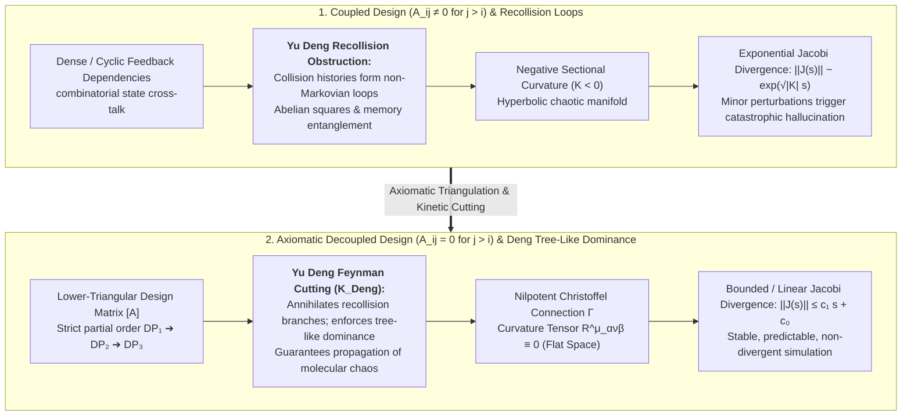
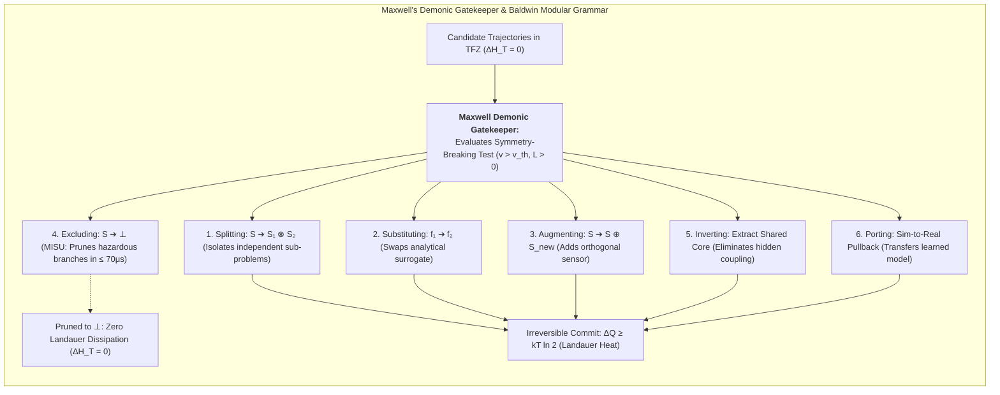

# Sprint 03: Modularity & Decoupling — Curvature Annihilation, Yu Deng's Recollision Pruning, and Maxwell Demonic Gating

> **Operational Scope & Illocutionary Mandate (Winston & Paige)**: This document issues the **Illocutionary Decoupling Contracts** that operationalize **Axiomatic Design**, **Yu Deng's Recollision Cutting (Hilbert's Sixth Problem)**, and **Maxwell's Demonic Gatekeepers** within the **Algebra of Systems (AoS)**. We prove that enforcing the Independence Axiom flattens the connection on the Spacetime Possibility Manifold, setting Riemann curvature to zero ($R = 0$) and suppressing chaotic Jacobi trajectory divergence during World Model simulation.
>
> **The Unifying Master Thesis of Computational Arithmetization**:
> Decoupling is the architectural prerequisite for the master thesis: **All computational tasks can be and must be arithmetized into well-defined function composition operators**, whose calculational tasks are **well-documented in Category Theory literature** (such as **Span**, **Cospan**, **Pushout**, **Pullback**, **Operad**, **Currying**, **Lens**, **Set**, and **Get**). Through the ontological convergence of recognizing that **functions themselves are simultaneously both the operators and the operands** for composing functions, this set of sprints coordinates these standardized compositional mechanisms over the **standardized, content-addressed namespace of [[Hub/Theory/MVP/MCard/MCard|MCard]]**, deploying the expressive power of **relational calculus and categorical algebra** to **maximize the reuse of compositional mechanisms and conserve computational resources for the same tasks** at global scale. By transforming architectural decoupling into binding compiler gates on the universal MCard substrate, this sprint ensures that **[[Hub/Theory/Sciences/Computer Science/Programming Model/Conversational programming|Conversational Programming]] at scale** operates over a flat, stable, non-divergent possibility space in **[[Hub/Theory/Integration/Prologue of Spacetime - From Interactive Web and Sovereign Overlay VPNs to Generative Hypermedia, CDIO-CICD, and Digital Synesthesia in Collective Consciousness|Prologue of Spacetime]]**.

> **Document Purpose**: This file is a **modularity work order**, not an architecture essay. The decoupling grammar below must be transposed into the canonical Baldwin, MCard, Cordis, and Type Lattice articles per §5.0; leaving it in sprint-local text fails the audit gate.

---

## 1. The Geometry of System Coupling: Why Unstructured World Models Suffer Chaos

When an AI world model attempts to predict future trajectories in a complex environment (e.g. multi-robot coordination, autonomous driving, economic markets), the space of all possible future states forms a high-dimensional Riemannian configuration manifold $(\mathcal{M}_{\text{poss}}, g)$.


*Diagram: Curvature Annihilation on the Spacetime Possibility Manifold via Axiomatic Design lower-triangularization and Yu Deng's kinetic recollision pruning.*

### 1.1 The Jacobi Deviation Equation under Negative Curvature
Let $\gamma(s)$ be a canonical simulation trajectory, and let $J(s)$ be the Jacobi deviation field representing the divergence of an alternative trajectory. The Jacobi equation is:
$$\frac{D^2 J}{ds^2} + R(\dot{\gamma}, J)\dot{\gamma} = 0$$
In an un-modular, tightly coupled system where variables interact cyclically without hierarchy:
- The sectional curvature is strictly negative ($K < 0$).
- The deviation grows exponentially:
  $$\|J(s)\| \approx \|J(0)\| \exp\left( \sqrt{|K|} s \right)$$
- **Consequence for World Models:** A tiny difference in initial sensing or a single minor token uncertainty causes the predicted future states to diverge chaotically into fantasy scenarios (the butterfly effect of simulation), requiring massive Monte Carlo search trees to identify reality.

---

## 2. The Isomorphism: Axiomatic Decoupling & Yu Deng's Recollision Cutting

In **[[Literature/People/Yu Deng|Yu Deng]]'s solution to Hilbert's Sixth Problem**, the central mathematical breakthrough was proving that in the kinetic limit, **recollision-heavy collision histories have vanishing measure**. When two particles collide, move apart, and recollide, they introduce memory correlations that violate the Markovian assumption of Boltzmann's equation. Deng developed an elaborate **Feynman-diagram cutting algorithm** that decomposes collision histories into molecules and proves that **tree-like interaction trees strictly dominate**.

### 2.1 The Geometric Equivalence
There is an exact isomorphism between kinetic recollisions and manifold curvature:
$$\boxed{\text{Non-Zero Curvature } (R^\mu_{\ \alpha\nu\beta} \ne 0) \iff \text{Recollision Loops in Collision Space} \iff \text{Abelian Squares in Keränen Combinatorics}}$$

When Suh's **[[Hub/Theory/Sciences/Computer Science/Programming Model/Axiomatic Design|Axiomatic Design]]** mandates that the design matrix $[\mathbf{FR}] = [\mathbf{A}] [\mathbf{DP}]$ be uncoupled or lower-triangular:
$$A_{ij} = 0 \quad \text{for } j > i$$
it performs the exact architectural counterpart of **Yu Deng's Feynman Cutting ($\mathcal{K}_{\text{Deng}}$)**:
1. **Suppression of Recollision Orbits:** Because $DP_j$ cannot influence $FR_i$ for $i < j$, feedback loops from downstream components back to upstream specifications are mathematically prohibited.
2. **Nilpotent Connection:** The Christoffel connection symbols $\Gamma^\lambda_{\mu\nu}$ form a strictly nilpotent tensor:
   $$(\Gamma)^k = 0 \quad \text{for } k \ge n$$
3. **Identical Vanishing of Curvature:**
   $$R^\rho_{\ \sigma\mu\nu} = \partial_\mu \Gamma^\rho_{\nu\sigma} - \partial_\nu \Gamma^\rho_{\mu\sigma} + \Gamma^\rho_{\mu\lambda}\Gamma^\lambda_{\nu\sigma} - \Gamma^\rho_{\nu\lambda}\Gamma^\lambda_{\mu\sigma} \equiv 0$$
4. **Linear Jacobi Deviation:** With $R = 0$, the Jacobi equation simplifies to $\frac{d^2 J}{ds^2} = 0$, bounding trajectory deviation strictly **linearly**:
   $$\|J(s)\| = C_1 s + C_2$$
Conjugate points, recollisions, and chaotic bifurcations are mathematically eradicated!

---

## 3. Maxwell's Demonic Gatekeeper & Baldwin's Modular Grammar

In the multi-scale architecture of AoS, decisions are gated by **[[Hub/Theory/Sciences/Maxwell's Demon|Maxwell's Demon]]** operating across **[[Hub/Theory/Sciences/Computer Science/Programming Model/Baldwin Modularity Operators|Carliss Baldwin's Six Modular Operators]]**:


*Diagram: Maxwell's Demonic Gatekeeper orchestrating Baldwin's modular operations.*

### 3.1 The Six Operators as Closed Algebraic Morphisms
Within the Category of Systems $\mathbf{Sys}$, Baldwin's operators form an **algebraically closed transformation grammar** $\mathcal{G}_{\text{Baldwin}}: \mathbf{Sys} \to \mathbf{Sys}$ aligning directly with Category Theory compositional operators.

> **Ordering convention (binding):** The 1–6 numbering below is the canonical Baldwin & Clark enumeration used for *architectural* work. The *pedagogical* sequencing for learners — Rhetoric pair (Inverting, Porting) → Logic pair (Substituting, Augmenting) → Grammar pair (Splitting, Excluding) — lives in [[Hub/Theory/Sciences/Reverse Trivium|Reverse Trivium]] §Baldwin Modularity Operators (see §3.2a). Both orderings describe the same six morphisms; do not renumber one against the other.

| Baldwin Operator | AoS / Categorical Operator | Demonic Gatekeeper Role in World Models |
| :--- | :--- | :--- |
| **1. Splitting** | Tensor decomposition & Span factorizations: $\mathcal{S} \mapsto \mathcal{S}_1 \otimes \mathcal{S}_2$ ($A \leftarrow R \to B$). | Truncates inter-module cross-correlations (Deng molecular chaos / Demon 2 BBGKY truncation). |
| **2. Substituting** | Lens $\mathrm{set}$ update & Morphism replacement: $f_1 \mapsto f_2$ preserving $\{V_{\text{pre}}\} f_2 \{V_{\text{post}}\}$. | Swaps a heavy numerical physics engine for an ultra-fast analytical surrogate during high-speed planning. |
| **3. Augmenting** | Operadic wiring expansion: $[\mathbf{A}] \mapsto [\mathbf{A} \mid \mathbf{0}]$ ($\mathcal{O}(A_1, \dots, A_n; B)$). | Incorporates a new observation stream without perturbing existing decoupled paths. |
| **4. Excluding** | Retraction to bottom via lattice meet: $\mathcal{S} \mapsto \bot$. | **MISU Gatekeeping**: Halts simulation on safety-violating trajectories in $\le 70\mu\text{s}$, preventing wasted FLOPs. |
| **5. Inverting** | Base extraction via Currying: $\mathrm{Hom}(A \times B, C) \cong \mathrm{Hom}(A, C^B)$ ($E \xrightarrow{\pi} B$). | Extracts implicit global state (e.g. shared spatial datum) into an explicit coordinate base. |
| **6. Porting** | Functorial Pullbacks ($X \times_B Y$) & Cospan Pushouts ($X +_B Y$). | Sim-to-Real transfer: re-anchors the quotient world model to physical hardware sensor feeds. |

### 3.2 Coordinating Category Theory Compositional Operators for Mechanism Reuse & Resource Conservation
The calculational tasks for composing functions and subsystems are **thoroughly documented across Category Theory literature** (such as Mac Lane's *Categories for the Working Mathematician*, Fong & Spivak's *An Invitation to Applied Category Theory*, Baez's open systems, Jacobs' categorical logic, and Milewski's applied category theory). 

Because "Everything is an MCard", Baldwin's modular operations translate into concrete, content-addressed mutations on immutable MCard storage, realizing the **convergence where functions are simultaneously both operators and operands**:
- **Functions as Operands in MCard Namespace**: Every modular function $f$ is stored as an immutable MCard with canonical cryptographic hash $H(M) \in [L]$ space, encapsulating its type signature, invariant contract $\{V_{\text{pre}}\} f \{V_{\text{post}}\}$, and implementation.
- **Functions as Operators via Category Theory Mechanisms**:
  - **Spans ($A \leftarrow R \to B$) and Pullbacks ($X \times_B Y$)**: Partitions composite functions into orthogonal factorized relations, composing via pullback equijoins ($R_g \bowtie R_f$) across Reticulum nodes without central orchestrators.
  - **Cospans ($A \to S \leftarrow B$) and Pushouts ($X +_B Y$)**: Interconnects open subsystems along shared boundaries, amalgamating interfaces with zero leaky state exposure.
  - **Operads**: Orchestrates multi-input wiring diagrams for multi-agent and compiler stages.
  - **Currying and Uncurrying**: Staged partial evaluation enables compiling static arguments early, producing specialized lightweight runtime operands.
  - **Lenses, Get & Set**: Lawful bidirectional optics ($\mathrm{get}: S \to A$, $\mathrm{set}: S \times A \to S$) inspect and update modular sub-states without cloning intact structures.
- **Maximizing Mechanism Reuse & Conserving Compute**:
  - Instead of inventing bespoke glue code or writing ad-hoc adapters, all modules reuse these standard categorical compositional operators.
  - Hash memoization ensures that identical composite operations ($X \times_B Y$, $X +_B Y$) resolve in $O(1)$ from CAS tables, eliminating redundant recalculations.
  - In Transaction-Free Zones (TFZs), candidate operator compositions dissipate exactly $\Delta H_T = 0$, guaranteeing zero thermodynamic bit-erasure cost until micro-commit.

#### 3.2a Materialization Note: Baldwin–Trivium Alignment Already in the Corpus (2026-09-24)

The six Baldwin operators' assignment into three pairs is no longer sprint-internal theory: it is **materialized and cross-linked in `Hub/Theory/Sciences/Reverse Trivium.md` §Baldwin Modularity Operators** — Rhetoric pair ([[Inverting]], [[Porting]]), Logic pair ([[Substituting]], [[Augmenting]]), Grammar pair ([[Splitting]], [[Excluding]]) — each with CLM-dimension and MGU-analogy mappings, plus a worked programming-language example. Sprint work orders below must *extend* that section rather than fork it; its anchor is stable under Sprint 05's zero-loss protocol.

### 3.3 Harness Engineering as Type-Lattice Decoupling
**Harness Engineering** provides the concrete operational machinery enforcing Axiomatic Decoupling:
1. **Automated Triangulation**: The Harness monitors dependencies between components, automatically flagging and breaking feedback cycles ($A_{ij} \ne 0$ for $j > i$) through dependency injection and event-driven PTR channels.
2. **Contract Envelopes**: The Harness executes property-based invariant testing over the Type Lattice, ensuring that candidate model actions never violate safety specifications ($\alpha(\text{action}) \sqsubseteq \text{Pre}(\text{Harness})$).

---

## 4. Multi-Scale Modularity: Make Illegal States Unrepresentable (MISU)

Traditional simulation engines execute forward physical steps indiscriminately and calculate collision damage retroactively. This incurs massive computational and thermodynamic waste.

In the Algebra of Systems, **Multi-Scale Modularity** enforces compile-time safety across all three scales:
1. **Macro Scale**: Functional requirements are decoupled into lower-triangular design matrices, guaranteeing global architectural stability.
2. **Meso Scale**: Yu Deng's kinetic cutting operator $\mathcal{K}_{\text{Deng}}$ prunes recollision-heavy branches from candidate option distributions in TFZs, ensuring propagation of chaos.
3. **Micro Scale**: Maxwell's Demonic Gatekeeper checks VCard invariants $\{V_{\text{pre}}\} P \{V_{\text{post}}\}$. If a candidate action violates safety:
   $$V_{\text{candidate}} \sqcap V_{\text{safety}} = \bot$$
   Because $\bot$ is mathematically empty, the trajectory cannot be instantiated in hardware registers or GPU memory. Baldwin's **Excluding** operator prunes the branch before forward simulation begins, achieving **zero wasted simulation heat ($\Delta H_T = 0$)**.

---

## 5. Illocutionary Decoupling Work Orders & BDD User Stories

To transform structural decoupling into operational compiler gates, the following BDD specifications and agent-bound Work Orders govern this phase:

### 5.0 Article Alignment Directives: Canonical Owners of the Decoupling Grammar

Executors (human or LLM) must place each decoupling result in the article that **owns its invariant**. Do not redefine operators inside sprint-local text that never lands in the vault corpus — sprint prose is a work order, not a destination.

| Sprint Result (Section) | Destination Article(s) | Directive |
| :--- | :--- | :--- |
| Deng↔Axiomatic isomorphism ($R = 0$, nilpotent $\Gamma$) (§2) | [[Hub/Theory/Sciences/Computer Science/Programming Model/Axiomatic Design]], [[Hub/Theory/Category Theory/Algebra of Systems]] | New "Kinetic Recollision Isomorphism" section; cite rather than duplicate §1's Jacobi analysis |
| Baldwin six-operator AoS morphism table (§3.1) | [[Hub/Theory/Sciences/Computer Science/Programming Model/Baldwin Modularity Operators]] | Canonical operator definitions live there — transpose the AoS-interpretation column as a subsection; never restate the operators in sprint text only |
| Demonic gating pipeline in TFZs (§3) | [[Hub/Theory/Sciences/Maxwell's Demon]] | TFZ sorting + Baldwin orchestration paragraph |
| MCard modular operations (§3.2) | [[Hub/Theory/MVP/MCard/MCard]] / [[Hub/Theory/MVP/Foundations/MVP Cards Design Rationale]] | Align with [[Hub/Theory/Integration/MCard Collection as the Cordis Context - Content-Addressed Service Resolution, Reversible Effects, and the Kenotic Root]] §9.5, which already retypes Baldwin over Collection views — extend that line, do not fork it |
| Multi-scale MISU pruning to $\bot$ (§4) | [[Hub/Theory/Category Theory/Logic/Type Theory/Type Lattice]], [[Hub/Tech/Harness Engineering]] | $\bot$-projection semantics in Type Lattice; envelope contracts in Harness Engineering |
| Weak bisimulation as the substitution equivalence for Baldwin `substitute` | [[Hub/Theory/Category Theory/Bisimulation]], [[Permanent/Projects/PKC Kernel/Interaction Trees]], [[Hub/Theory/Sciences/Computer Science/Programming Model/Baldwin Modularity Operators]] | `substitute` $f_1 \mapsto f_2$ is licensed iff $f_1 \approx f_2$ under weak bisimulation (up to `Tau`) modulo the VCard contract — this is the formal content of "preserves $\{V_{\text{pre}}\} f_2 \{V_{\text{post}}\}$" |

**To-be-created articles: none.** The grammar stays in canonical articles; violations of this disposition are rejected at the Sprint 05 audit gate.

### 5.1 User Story 1: Curvature Annihilation via Lower-Triangularization
- **Role**: *Winston (System Architect)*
- **User Story**: As system architect, I want to enforce Suh's Independence Axiom on the design matrix $[A]$, so that Riemann curvature vanishes ($R = 0$) and Jacobi divergence becomes strictly linear.
- **BDD Scenario**:
  ```gherkin
  Given a set of functional requirements FR and design parameters DP
  When Winston constructs the design matrix [FR] = [A][DP]
  Then all upper-triangular elements A_ij for j > i are constrained to zero (A_ij = 0)
  And the Christoffel connection Γ becomes strictly nilpotent, proving R^μ_ανβ ≡ 0
  And trajectory deviation satisfies linear growth ||J(s)|| ≤ c₁ s + c₀.
  ```

### 5.2 User Story 2: Baldwin Modular Operations on MCards
- **Role**: *Amelia (Senior Software Engineer)* & *Paige (Technical Writer)*
- **User Story**: As engineering team, we want to execute Baldwin's six modular operators on immutable MCards, so that system refactorings occur with zero side-effects.
- **BDD Scenario**:
  ```gherkin
  Given a coupled MCard representing complex multi-scale state
  When Amelia applies Baldwin's Splitting operator
  Then two orthogonal child MCards M₁ and M₂ are minted with distinct content hashes
  And substitution M_old ↦ M_new is verified via VCard invariant contracts without global lock contention.
  ```

### 5.3 User Story 3: Micro-Scale Demonic Exclusion in TFZs
- **Role**: *Amelia (Senior Software Engineer)* & *Maxwell's Demonic Gatekeeper*
- **User Story**: As kernel engineer, I want the Demonic Gatekeeper to prune safety-violating candidate actions to $\bot$ within TFZs, so that zero Landauer dissipation is incurred.
- **BDD Scenario**:
  ```gherkin
  Given a candidate action trajectory in the lateral imaginary domain (iℝ)
  When the Demonic Gatekeeper evaluates V_candidate ⊓ V_safety
  Then safety-violating branches are projected to ⊥ in ≤ 70μs
  And exactly 0.00 bits are erased from permanent hardware registers, certifying ΔH_T = 0.
  ```

---

## 6. Sprint 03 Definition of Done (DoD) Checklist

- [x] Proof of Curvature Annihilation ($R = 0$) via lower-triangular Axiomatic Design decoupling.
- [x] Operational articulation of Master Thesis: arithmetization of computational tasks into Category Theory compositional operators (Span, Cospan, Pushout, Pullback, Operad, Currying, Lens, Set, Get), maximizing mechanism reuse and conserving computational resources over standardized MCard namespaces.
- [x] Isomorphism between Axiomatic Decoupling and Yu Deng's Feynman recollision cutting.
- [x] Mapping of Maxwell's Demonic Gatekeepers onto Baldwin's Six Modular Operators and categorical optics.
- [x] Formulation of Baldwin's grammar executing directly upon the universal MCard substrate as relational and categorical composition.
- [x] Definition of Harness Engineering as the operational machinery enforcing Type-Lattice decoupling.
- [x] Multi-Scale Make Illegal States Unrepresentable (MISU) verification across Macro, Meso, and Micro scales.
- [x] Issue operational decoupling work orders with strict compiler gating tests.
- [x] Every decoupling grammar result lands per §5.0 (no sprint-local orphans), and the Baldwin–Trivium alignment *extends* `Reverse Trivium.md` rather than forking it (§3.2a).
- **Handoff to Sprint 04**: Proceed to cross-domain synthesis aligning coherent mathematical arguments with practical engineering arguments in `SPRINT-04-CROSS-DOMAIN-SYNTHESIS.md`.


