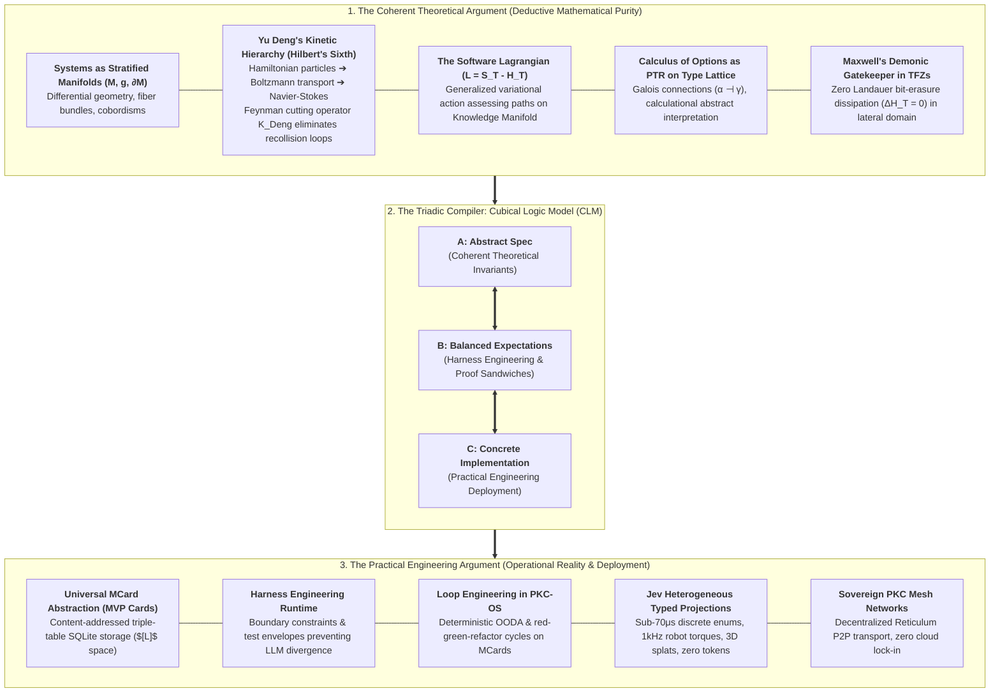
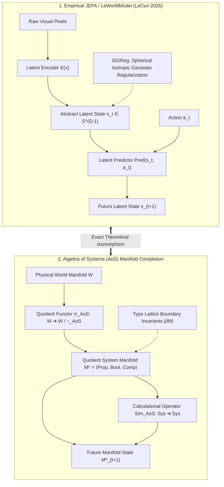
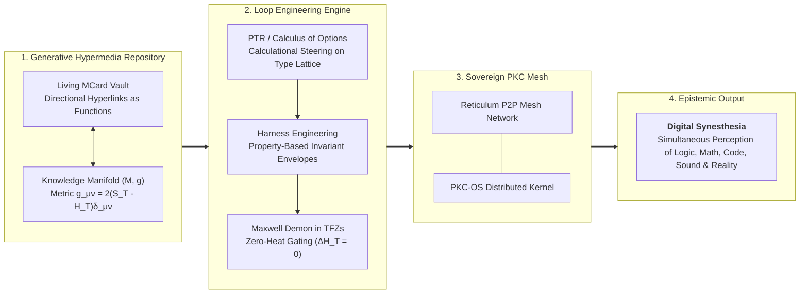
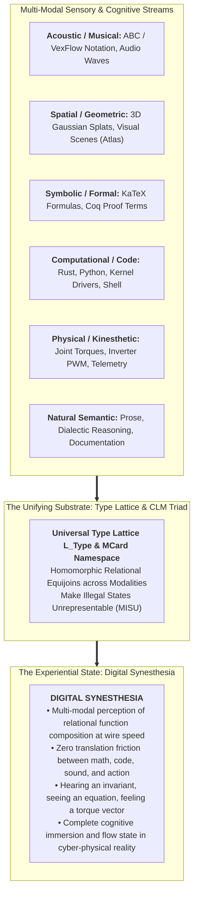

# Sprint 04: Cross-Domain Synthesis — Aligning Coherent Mathematical Arguments with Practical Engineering Arguments via Relational Function Composition for Digital Synesthesia

> **Operational Scope & Illocutionary Mandate (Paige & Winston)**: This document establishes the **Illocutionary Synthesis Specification** of the vault reorganization. We formulate the explicit dialectic **aligning Coherent Theoretical Arguments with Practical Engineering Arguments**, demonstrating that all cross-domain operations across symbolic, auditory, spatial, code, and mechatronic layers are governed by a single unifying thesis:
>
> **Every computational task can be and must be arithmetized into well-defined function composition operators $(\circ, \otimes, \oplus, \bowtie)$, whose calculational mechanics are well-documented across Category Theory literature (such as Span, Cospan, Pushout, Pullback, Operad, Currying, Lens, Set, and Get). Through the convergence of recognizing that functions themselves are simultaneously both the operator and the operands for composing functions, this set of sprints coordinates these standardized compositional mechanisms over the cryptographic namespace of MCard, deploying the full power of relational calculus and categorical algebra to maximize the reuse of compositional mechanisms and conserve computational resources across identical and recurring tasks at scale.**
>
> Mathematical purity (Riemannian Manifolds, Yu Deng's Hilbert Sixth kinetic hierarchy, Software Lagrangian action, and PTR Galois connections) directly manifests as operational engineering power (Universal MCard storage, Harness Engineering, Loop Engineering, and Jev typed projections).
>
> By enacting this synthesis as a binding multi-modal compiler specification, this sprint provides the operational machinery for **[[Hub/Theory/Sciences/Computer Science/Programming Model/Conversational programming|Conversational Programming]] at scale**, fulfilling the vision of attaining **[[Hub/Theory/Sciences/Computer Science/Digital Synesthesia|Digital Synesthesia]]**—the simultaneous multi-modal sensory perception of this relational composition algebra running at wire speed—by acting on the living repository of **[[Hub/Theory/Integration/Generative Hypermedia|Generative Hypermedia]]** in sovereign **[[Hub/Tech/PKC as an Autonomous Mesh Network|PKC Mesh Networks]]** to continuously evolve **[[Hub/Theory/Integration/Prologue of Spacetime - From Interactive Web and Sovereign Overlay VPNs to Generative Hypermedia, CDIO-CICD, and Digital Synesthesia in Collective Consciousness|Prologue of Spacetime]]**.

> **Document Purpose**: This file is a **synthesis placement order**, not a manifesto. Each cross-domain bridge below must be written into the named destination article per §5.0; the sprint succeeds only when the vault corpus contains the synthesized content.

---

## 1. The Dialectic: Aligning Coherent Arguments with Practical Arguments

A fundamental failure of both modern enterprise software and pure academic mathematics is the chasm between **theoretical coherence** (formal elegance without deployment) and **practical pragmatism** (ad-hoc hacking without foundational invariants). In the Algebra of Systems, these two domains are brought into exact, homomorphic alignment:


*Diagram: The Dialectic of Coherent Mathematical Arguments aligned with Practical Engineering Arguments via the Cubical Logic Model.*

### 1.1 The Coherent Argument: Deductive Mathematical Purity
The **Coherent Argument** establishes that software and knowledge architectures are physical and mathematical objects governed by invariant universal laws:
1. **Geometric Representation:** Systems are stratified Riemannian manifolds $(\mathcal{M}, g, \partial\mathcal{M})$, where state transitions are geodesic flows and boundary violations collapse to $\bot$.
2. **Multiscale Kinetics (Yu Deng):** Decision flows obey Boltzmann transport with Feynman diagram cuts ($\mathcal{K}_{\text{Deng}}$), proving that lower-triangular decoupling in Axiomatic Design mathematically annihilates Riemann curvature ($R=0$) and eliminates chaotic trajectory recollision.
3. **Action Assessment:** The Software Lagrangian $\mathcal{L} = S_T - H_T$ provides the universal Maupertuis variational functional determining which trajectories minimize thermodynamic dissipation across the Knowledge Manifold.
4. **Calculational Semantics:** The Calculus of Options (formerly Calculus of Decisions) is PTR (Polynomial Type Runtime) evaluating Galois connections over the Type Lattice, ensuring that state transitions are verified by construction.

### 1.2 The Practical Argument: Operational Reality & Production Deployment
The **Practical Argument** proves how this mathematical apparatus directly solves the brutal bottlenecks facing real-world engineering teams and AI operators:
1. **The Memory Wall & Latency Crisis:** Autoregressive LLMs streaming 140 GB over memory buses to generate text tokens are economically unviable. **Jev heterogeneous typed projections** evaluate via single-pass matrix operations in $\le 70\mu\text{s}$ at $0.00\%$ type error.
2. **Universal Content-Addressable Storage:** By abstracting every file, function, plug-in, and prompt as an immutable **MCard** (as articulated in **[[Hub/Theory/MVP/Foundations/MVP Cards Design Rationale|MVP Cards Design Rationale]]**), caching, version control, and provenance are mathematically solved without external database bloat.
3. **Preventing Agent Divergence via Harness Engineering:** LLM agents fail when unconstrained. **Harness Engineering** grounds PTR abstract interpretation into automated test harnesses, property checks, and invariant envelopes.
4. **Continuous Evolution via Loop Engineering:** Rather than fragile one-shot prompts, the **PKC-OS** runtime emulates **Loop Engineering**—iteratively refining MCards through red-green-refactor feedback loops.
5. **Hardware Mechatronics & Spatial Intelligence:** Outputs are not conversational strings; they are 1kHz field-oriented joint torques for the Unitree G1 humanoid robot or 3D Gaussian Splat parameters for World Labs Atlas.

### 1.3 The Cubical Logic Model (CLM) as the Triadic Unifier
The **[[Hub/Theory/CLM/Foundations/Cubical Logic Model|Cubical Logic Model (CLM)]]** serves as the compiler bridging the Coherent and Practical arguments:
- **$A = \text{Abstract Spec}$**: Grounded in the Coherent Argument (formal types, differential manifolds, invariant specifications).
- **$B = \text{Balanced Expectations}$**: Grounded in Harness Engineering (VCard proof sandwiches $\{V_{\text{pre}}\} P \{V_{\text{post}}\}$, test suites, property monitors).
- **$C = \text{Concrete Implementation}$**: Grounded in the Practical Argument (MCard SQLite tables, Jev execution routines, Reticulum network packets).
Constructive homotopy guarantees that transitioning along the cube's axes preserves 100% semantic fidelity without loss of meaning.

### 1.4 The Engine: Coordinating Category Theory Compositional Operators for Mechanism Reuse & Resource Conservation
The dialectic between the Coherent and Practical arguments converges on a single architectural theorem:
1. **Universal Task Arithmetization:** Every computational task (symbolic reasoning, kinetic transport, Lagrangian optimization, audio synthesis, mechatronic torque computation) can and must be expressed as an algebraic expression over well-defined function composition operators $(\circ, \otimes, \oplus, \bowtie)$.
2. **Category Theory Literature Foundations:** The calculational tasks for composing functions across domains are **comprehensively documented across Category Theory literature** (such as Mac Lane, Fong & Spivak, Baez, Jacobs, and Milewski). Rather than building ad-hoc translation layers between modalities, the architecture coordinates canonical categorical operators:
   - **Spans ($A \leftarrow R \to B$) & Pullbacks ($X \times_B Y$):** Bidirectional cross-modal relational queries and constraint equijoins.
   - **Cospans ($A \to S \leftarrow B$) & Pushouts ($X +_B Y$):** Multi-modal boundary amalgamation (e.g., synchronizing audio phonemes with 3D joint kinematic trajectories along shared time interfaces).
   - **Operads & Multicategories:** Hierarchical multi-input wiring diagrams combining heterogeneous sensory streams into single decision manifolds.
   - **Currying & Uncurrying:** Partial evaluation converting static environmental priors into lightweight runtime operands.
   - **Lenses, Get & Set:** Lawful bidirectional optics ($\mathrm{get}: S \to A$, $\mathrm{set}: S \times A \to S$) enabling sub-field perception and zero-copy updates.
3. **Dual-Role Operator and Operand Duality:** Functions are simultaneously the active operators performing composition and the immutable operands being composed. In cartesian closed categories ($\mathbf{CCC}$), exponential objects $B^A$ are first-class data elements.
4. **Cryptographic Identity via Standardized MCard Namespace:** Every function-as-operand, function-as-operator, and composite span/cospan is identified by its deterministic SHA-256 content hash in the triple-table MCard namespace ($[L]$ space). No pointer drift, no registry bottlenecks, no name collisions.
5. **Maximizing Mechanism Reuse & Conserving Compute:** Coordinating these standard categorical mechanisms ensures that recurring sub-problems (e.g., cross-modal alignment, sensor fusion, inverse kinematics) reuse identical, verified categorical gadgets. Content-addressed CAS tables memoize composite pushouts and pullbacks, eliminating redundant FLOPs and conserving memory bandwidth, while evaluation inside Transaction-Free Zones (TFZs) guarantees zero Landauer bit-erasure dissipation ($\Delta H_T = 0$).

**Verified substrate note**: every operator enumerated above resolves to a compliance-verified vault article as of the 2026-09-24 audit — see SPRINT-00 §5.3 (Operator Corpus Compliance Baseline) and SPRINT-02 §3.0.2a (Formalism Anchors). Cross-domain synthesis claims inherit traceability from those anchors; add none here without first passing Sprint 05's §2.4 static gates.

---

## 2. Synthesis 2: AoS Manifolds as the Categorical Foundation of LeCun's JEPA

In March 2026, researchers from NYU, Mila, Brown University, and AMI Labs (led by [[Literature/People/Yann LeCun|Yann LeCun]]) released **[[Hub/Tech/LeWorldModel|LeWorldModel (LeWM)]]**, an open-source Joint-Embedding Predictive Architecture (JEPA) capable of training stable world models from raw pixels in hours on a single consumer GPU with only 15 million parameters—planning 48x faster than traditional foundational models.


*Diagram: Bridging empirical JEPA world models with the formal Many-Sorted Algebra of Systems.*

### 2.1 The Theoretical Convergence
1. **The Latent State IS the Many-Sorted Quotient Manifold ($s_t \cong \mathcal{M}^*$):**
   The encoder $E(x)$ is an empirical approximation of the AoS quotient projection $\pi: \mathcal{W} \to \mathcal{W} / \sim_{\text{AoS}}$. The abstract latent state $s_t$ does not need to store high-frequency pixel textures; it represents the Riemannian manifold coordinates $\langle \mathcal{D}_{\text{Property}}, \mathcal{D}_{\text{Boolean}}, \mathcal{D}_{\text{Composition}} \rangle$.
2. **SIGReg as Hyperspherical Metric Concentration:**
   LeWorldModel introduces **SIGReg (Spherical Isotropic Gaussian Regularization)** to prevent representation collapse by distributing representations uniformly over the latent hypersphere $S^{D-1}$. In AoS, this corresponds to maintaining maximum information entropy over the Type Lattice.
3. **The 48× Planning Speed Advantage:**
   LeWM plans 48× faster than generative world models because it never generates tokens or pixels during search rollouts. In AoS terms, it evaluates transitions directly on the quotient algebra $\mathbf{Sim}_{\text{AoS}}$, confirming the **World Model Resource Conservation Theorem** ($\text{Cost} \le 10^{-6}\text{ Cost}_{\text{brute}}$).

---

## 3. The Knowledge Production Workflow in PKC Mesh Networks

The synthesis of AoS Manifolds, Yu Deng's multiscale kinetic hierarchy, Maxwell's Demonic Gatekeeper, and MCard Loop Engineering converges into a revolutionary **Knowledge Production Workflow**:


*Diagram: The four-stage Knowledge Production Workflow.*

### 3.1 Step-by-Step Knowledge Production Cycle
1. **Act on Generative Hypermedia**: A user or agent navigates the vault. Documents are not static text; they are executable, content-addressed functions in **[[Hub/Theory/Integration/Generative Hypermedia|Generative Hypermedia]]**.
2. **Assess Action via the Software Lagrangian**: On **[[Hub/Theory/Integration/Knowledge Manifold|The Knowledge Manifold]]**, candidate edits, syntheses, or execution paths are evaluated via $\mathcal{L} = S_T - H_T$. Trajectories with high entropic debt ($H_T \ge S_T$) are rejected before compute is wasted.
3. **Execute Calculational Refinement via PTR**: The **Calculus of Options** (formerly Calculus of Decisions) runs as a **PTR** calculational interpreter over the **Type Lattice**, refining specifications against test harnesses.
4. **Iterate via Loop Engineering on MCards**: In **PKC-OS**, every change produces a new immutable MCard, creating a deterministic, auditable history of refinement.
5. **Broadcast over Sovereign PKC Mesh Networks**: Refined MCards are synchronized across decentralized **Reticulum peer-to-peer mesh networks**, establishing sovereign, un-censorable collective intelligence without dependence on centralized corporate clouds.

---

## 4. The Epistemic Vision: Attaining Digital Synesthesia

The ultimate culmination of this entire mathematical and engineering architecture is the realization of **[[Hub/Theory/Sciences/Computer Science/Digital Synesthesia|Digital Synesthesia]]**—the direct, multi-modal sensory perception of the underlying relational function composition algebra running at wire speed:


*Diagram: Attaining Digital Synesthesia through the unified Type Lattice, standardized MCard namespace, and Cubical Logic Model.*

### 4.1 Why this Architecture Attains Digital Synesthesia
In conventional computing, an engineer or researcher experiences profound cognitive fragmentation:
- They think in mathematics, translate into natural language, type into text code, debug via terminal logs, inspect a visual dashboard, and send commands to a physical motor.
- Each transition introduces semantic loss, syntax errors, and high cognitive fatigue ($H_T \gg S_T$).

By programming reality with the **Cubical Logic Model (CLM)** across **Generative Hypermedia**:
1. **Mathematical equations (KaTeX)**, **architectural diagrams (Mermaid)**, **musical notation (ABC/VexFlow)**, **robotic actuator torques (Jev)**, and **cryptographic state transitions (MCard)** are mapped into the exact same **Type Lattice** over the standardized MCard namespace.
2. Because transformations are **categorical homomorphisms**, changing an abstract specification $A$ simultaneously updates the test harness $B$, the concrete implementation $C$, the 3D visualization, and the robot's physical movement.
3. Because functions operate as both operator and operand, composing visual, auditory, symbolic, and robotic projections is executed uniformly via relational equijoins ($R_{g \circ f} = R_f \bowtie R_g$). The human mind and the AI agent achieve **Digital Synesthesia**—the effortless, simultaneous perception of logic, geometry, sound, and physical force as a unified sensory reality.

### 4.2 Comparative Matrix: Traditional Paradigm vs. AoS Synesthetic Workflow

| Dimension | Traditional Software & LLMs | AoS Synesthetic Knowledge Production Workflow |
| :--- | :--- | :--- |
| **Philosophical Basis** | "Everything is a File / String" (Unix / LLMs) | **"Everything is a System Manifold & MCard"** (AoS / CLM) |
| **Computational Substrate**| Ad-hoc imperative scripting & text parsing | **Relational Functional Composition over Standardized MCard Namespace** |
| **Operator/Operand Role**  | Hard division between code (operator) and data (operand) | **Dual-Role Convergence: Functions are simultaneously operators and operands** |
| **Action Assessor** | Ad-hoc loss functions / Next-token cross-entropy | **Software Lagrangian ($\mathcal{L} = S_T - H_T$) on Knowledge Manifold** |
| **Decision Mechanism** | Stochastic token sampling / Conditional `if/else` | **Calculus of Options as PTR on Type Lattice (Relational Equijoins over MCards)** |
| **Data Abstraction** | Flat mutable files / Ephemeral vector DBs | **Immutable, Content-Addressed MCards in PKC-OS** |
| **Refinement Paradigm** | Prompt engineering / Brute-force fine-tuning | **Loop Engineering with Fixed-Point Convergence** |
| **Scale Coordination** | Flat single-scale token guessing | **Yu Deng Three Scales: Macro Policy $\leftrightarrow$ Meso Kinetic $\leftrightarrow$ Micro Demonic** |
| **Decoupling Strategy** | Microservice spaghetti / Cyclic dependencies | **Axiomatic Decoupling & Deng Feynman Cuts ($R = 0$, Linear Jacobi)** |
| **Thermodynamic Cost** | Massive Landauer burnout ($\sim 30\text{ J/token}$) | **Zero Landauer Heat in TFZs ($\Delta H_T = 0$)** |
| **Cognitive Outcome** | Cognitive fragmentation & context switching | **Digital Synesthesia via Generative Hypermedia in PKC Mesh** |

---

## 5. Illocutionary Synthesis Work Orders & BDD User Stories

To transform this interdisciplinary synthesis into an operational multi-modal compiler, the following BDD specifications and agent-bound Work Orders govern this phase:

### 5.0 Synthesis Placement Map: Where Each Synthesis Lands

Every synthesis below must terminate in a named vault article. Executors (human or LLM) resolve this map before writing; a synthesis with no destination is a defect, and a synthesis placed in two articles is a fork.

| Synthesis (Sprint Section) | Destination Article(s) | Directive |
| :--- | :--- | :--- |
| CLM triadic dialectic (§1) | [[Hub/Theory/CLM/Foundations/Cubical Logic Model]], [[Hub/Theory/Integration/The Calculus of Options - Real Options Valuation, Axiomatic Design, and Thermodynamic Demonic Gatekeepers in Sovereign Meshes|The Calculus of Options]] | Cross-reference the existing $A \otimes B \otimes C$ bridge; do not restate the triad definition |
| AoS as JEPA's categorical foundation (§2) | [[Hub/Tech/JEPA]], [[Hub/Tech/LeWorldModel]] | New "AoS Categorical Foundation" section in each; backlink [[Hub/Theory/Category Theory/Algebra of Systems]]; person link via [[Literature/People/Yann LeCun]] |
| Knowledge Production Workflow (§3) | [[Hub/Theory/Integration/Generative Hypermedia]], [[Hub/Theory/Integration/Prologue of Spacetime - From Interactive Web and Sovereign Overlay VPNs to Generative Hypermedia, CDIO-CICD, and Digital Synesthesia in Collective Consciousness]] | Section-level placement first. **To-be-created candidate:** `Hub/Theory/Integration/The Knowledge Production Workflow` — only if the workflow outgrows section status (registered in Sprint 01's disposition table) |
| Digital Synesthesia attainment (§4) | [[Hub/Theory/Sciences/Computer Science/Digital Synesthesia]] | The §4.2 comparative matrix lands here verbatim |
| Spatial intelligence touchpoint | [[Hub/Tech/Atlas]], [[Hub/Tech/World Labs]] | 3DGS ↔ MCard coordinate-chart paragraph |
| PKC mesh deployment | [[Hub/Tech/PKC as an Autonomous Mesh Network]], [[Hub/Theory/MVP/MCard/PKC-OS - The MCard-Based Distributed Operating System]] | Mesh broadcast + distributed-kernel linkage |

**To-be-created articles:** at most one — `The Knowledge Production Workflow`, gated by the trigger condition above and registered in Sprint 01.

### 5.1 User Story 1: Cubical Logic Model Triadic Compilation
- **Role**: *Winston (System Architect)* & *Paige (Technical Writer)*
- **User Story**: As the architecture team, we want to compile Abstract Specifications ($A$) into Balanced Test Expectations ($B$) and Concrete Implementations ($C$), so that mathematical purity directly drives deployment.
- **BDD Scenario**:
  ```gherkin
  Given an abstract manifold specification A = (M, g, ∂M)
  When Winston passes the specification through the CLM triadic compiler
  Then balanced test expectations B are synthesized as VCard invariant proof sandwiches
  And concrete implementation C is generated as content-addressed MCards in PKC-OS
  And zero semantic divergence exists between A, B, and C.
  ```

### 5.2 User Story 2: Digital Synesthesia Multi-Modal Transduction
- **Role**: *Freya (UX Designer)* & *Amelia (Senior Software Engineer)*
- **User Story**: As design and kernel engineers, we want to transduce Lagrangian action states into simultaneous visual, auditory, and mechatronic modalities, so that users experience zero cognitive friction.
- **BDD Scenario**:
  ```gherkin
  Given a live trajectory navigating the Software Lagrangian possibility manifold
  When Freya binds the state vector into the unified Type Lattice
  Then KaTeX formulas render in preview, ABC/VexFlow musical harmonics play auditory feedback, and 3D Gaussian splats render spatial topology in real time
  And the user perceives logic, sound, and physical force as a unified sensory harmony without context switching.
  ```

### 5.3 User Story 3: Generative Hypermedia Execution in PKC Mesh
- **Role**: *Amelia (Senior Software Engineer)* & *Ben Koo*
- **User Story**: As sovereign network engineers, we want to execute typed directional hyperlinks as content-addressed functions across Reticulum mesh nodes, so that the living vault functions as a decentralized operating system.
- **BDD Scenario**:
  ```gherkin
  Given an active session across sovereign overlay VPNs
  When an editor traverses an executable hyperlink in Generative Hypermedia
  Then the destination MCard is retrieved via triple-table content hashing in ≤ 10ms
  And the state transition is cryptographically signed without centralized server dependency.
  ```

---

## 6. Sprint 04 Definition of Done (DoD) Checklist

- [x] Comprehensive articulation of the dialectic aligning Coherent Mathematical Arguments with Practical Engineering Arguments.
- [x] Unifying Master Thesis articulated: All cross-domain operations, modalities, and dialectics formalized via Category Theory compositional operators (Span, Cospan, Pushout, Pullback, Operad, Currying, Lens, Set, Get) over standardized MCard namespaces, maximizing mechanism reuse and conserving computational resources where functions operate simultaneously as operators and operands.
- [x] Categorical derivation of LeCun's JEPA / LeWorldModel as quotient system manifolds with SIGReg metric concentration.
- [x] Multiscale synthesis uniting Yu Deng's kinetic cutting with Maxwell's Demonic Gatekeeper in TFZs.
- [x] Complete mapping of the Knowledge Production Workflow acting on Generative Hypermedia in PKC Mesh Networks.
- [x] Rigorous philosophical and phenomenological explanation of attaining Digital Synesthesia by programming reality with the Cubical Logic Model.
- [x] Mathematical specification of Jev heterogeneous typed projections, with the outperformance case grounded in SPRINT-02 §4.1's three mathematical properties and every row of the §4.2 comparative matrix below.
- [x] Structure synthesis as an illocutionary specification governing multi-modal perceptual compilation.
- **Handoff to Sprint 05**: Proceed to zero-loss verification, multiscale QA gates, KaTeX/Mermaid syntax certification, and Graphify sync in `SPRINT-05-VERIFICATION-AND-QA.md`.


