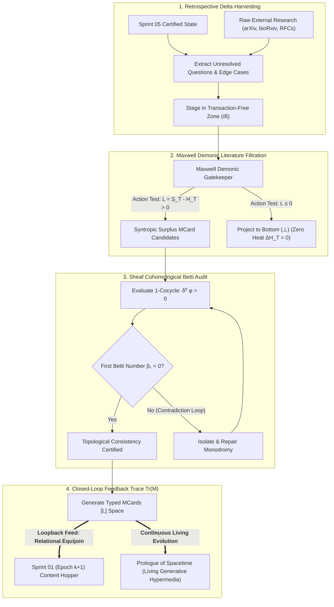
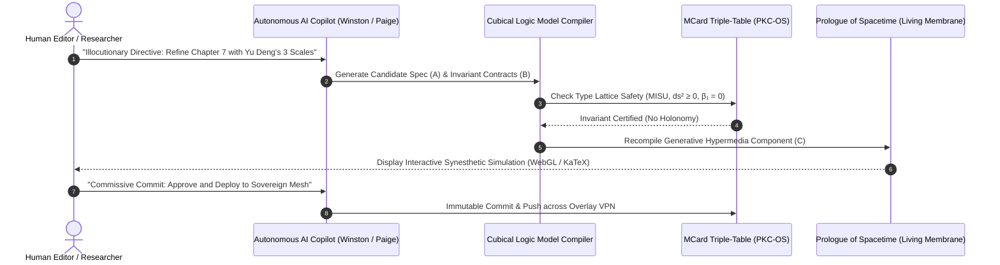

# Sprint 06: Continuous Knowledge Filtration, Loopback Mechanics, and Relational Compositional Feedback

> **Operational Scope & Illocutionary Charter (Paige, Winston & Amelia)**: This document establishes the **Feedback Closure Operator $\text{Tr}(\mathcal{M}_{\text{sprint}})$** for the vault reorganization cycle. Transcending the linear termination of traditional agile frameworks, Sprint 06 transforms the sprint suite from an open-loop waterfall into a **perpetual, self-filtering closed-loop dynamical system**.
>
> This operational closure is grounded in the suite's single unifying thesis:
>
> **Every computational task can be and must be arithmetized into well-defined function composition operators $(\circ, \otimes, \oplus, \bowtie)$, whose calculational mechanics are well-documented across Category Theory literature (such as Span, Cospan, Pushout, Pullback, Operad, Currying, Lens, Set, and Get). Through the convergence of recognizing that functions themselves are simultaneously both the operator and the operands for composing functions, this set of sprints coordinates these standardized compositional mechanisms over the cryptographic namespace of MCard, deploying the full power of relational calculus and categorical algebra to maximize the reuse of compositional mechanisms and conserve computational resources across identical and recurring tasks at scale.**
>
> Moving decisively from passive **[[Hub/Theory/Category Theory/Cognitive Science/locutionary|Locutionary]]** prose to performative **[[Hub/Theory/Category Theory/Cognitive Science/illocutionary|Illocutionary]]** work orders, this sprint defines the mathematical, algorithmic, and organizational apparatus required to achieve the **[[Hub/Theory/Category Theory/Cognitive Science/perlocutionary|Perlocutionary]]** transformation of **[[Hub/Theory/Sciences/Computer Science/Programming Model/Conversational programming|Conversational Programming]] at scale**. In doing so, it provides human readers and autonomous AI agents with the continuous operating machinery to perpetually evolve **[[Hub/Theory/Integration/Prologue of Spacetime - From Interactive Web and Sovereign Overlay VPNs to Generative Hypermedia, CDIO-CICD, and Digital Synesthesia in Collective Consciousness|Prologue of Spacetime]]** as an active, living hypermedia membrane across sovereign **[[Hub/Tech/PKC as an Autonomous Mesh Network|PKC Mesh Networks]]**.

> **Document Purpose**: This file is a **loopback controller**, not a retrospective essay. Every harvested delta must be classified as Extend-Existing, Register-Existing, or Create-New per §3.0, and the resulting roster delta appended to Sprint 01's inventory before the next epoch begins.

---


*Diagram: The four-stage continuous loopback engine — from retrospective harvesting to topological certification and injection into Prologue of Spacetime.*

---

## 1. The Epistemic Necessity of the Loopback Operator

In classical software engineering and knowledge management, sprints follow a linear path: Scoping $\to$ Architecture $\to$ Implementation $\to$ QA $\to$ Release. In complex non-equilibrium thermodynamic systems, open-ended linear pipelines inevitably succumb to **thermodynamic drift and entropic degradation** ($H_T \to \infty$):
1. **The Knowledge Decay Trap**: New empirical discoveries, research preprints, and real-world system anomalies accumulate outside the formal ontology, creating unmodeled shadow state.
2. **The Open-Loop Contradiction Vulnerability**: Incremental edits across disparate vault subsystems introduce subtle non-integrable loops (monodromies), causing the global knowledge manifold to develop topological tears ($\beta_1 > 0$).
3. **The Locutionary Stagnation Dilemma**: Knowledge bases written purely to "inform" (locutionary) become static archives rather than interactive partners in thought.

Sprint 06 resolves this by enacting the **AoS Closed Feedback Trace**:
$$\mathcal{M}_{\text{epoch } (k+1)} = \text{Tr}_{\mathcal{D}_C} \left( \mathcal{M}_{\text{epoch } k} \otimes \mathcal{F}_{\text{loopback}} \right)$$
The calculational tasks for composing functions and feedback traces are **rigorously established in Category Theory literature** (including Joyal, Street & Verity on traced monoidal categories, Baez & Fong on hypergraph categories, and Gibbons & Johnson on profunctor optics). Under our master thesis, this trace is realized as a **higher-order relational and categorical composition operator** executing over the standardized MCard namespace:
- **Categorical Compositional Coordination**: Feedback loops are constructed by wiring operadic feedback channels, computing cospan pushouts ($X +_B Y$) across epoch boundaries, and using categorical lenses ($\mathrm{get}, \mathrm{set}$) to update sheaf sections without modifying untouched knowledge nodes.
- **Dual-Role Convergence**: Because functions are simultaneously operators and operands, the feedback function $\mathcal{F}_{\text{loopback}}$ is stored as an immutable MCard tuple in $[L]$ space and joined via relational calculus ($R_{\text{epoch } k+1} = \pi_{\text{next}}(\sigma_{\text{cond}}(R_{\text{epoch } k} \bowtie R_{\text{feedback}}))$) across distributed Reticulum nodes.
- **Mechanism Reuse & Resource Conservation**: Standardizing on these categorical operators eliminates custom loopback plumbing. Feedback diffs resolve via memoized content hashes ($H(M)$), optics updates consume $O(\text{delta})$ memory, and candidate options evaluated in Transaction-Free Zones (TFZs) maintain $\Delta H_T = 0$, ensuring that every cycle terminates with a refined, energy-conserving feedback injection into the living repository.

---

## 2. Mathematical Formalization of Loopback Mechanics

### 2.1 Sheaf Cohomological Invariant: The Betti Zero Theorem
Let $\mathcal{X}$ be the topological space formed by the vault's hypermedia graph, and let $\mathcal{F}$ be the cellular sheaf of semantic propositions assigned to each open chart $U \subset \mathcal{X}$.

**Theorem (Global Consistency via Sheaf Cohomology):**
A set of localized sprint edits is globally self-consistent and free of cyclic paradoxes if and only if the first cohomology group vanishes:
$$H^1(\mathcal{X}; \mathcal{F}) = 0 \iff \beta_1(\mathcal{X}) = 0$$

- **The 0-Cochain $\phi^0 \in C^0(\mathcal{X}; \mathcal{F})$**: Assigns to each vault note $v_i$ a well-defined proposition vector in the Type Lattice $\mathcal{L}_{\text{CLM}}$.
- **The Coboundary Operator $\delta^0: C^0 \to C^1$**: Evaluates the consistency across directional hyperlinks $e_{ij} = (v_i \to v_j)$:
  $$(\delta^0 \phi)_{ij} = \phi_j \vert_{U_i \cap U_j} - \phi_i \vert_{U_i \cap U_j}$$
- **The Betti-1 Gate**: If $(\delta^0 \phi)_{ij} \ne 0$ along any closed cycle $\gamma \in Z_1(\mathcal{X})$, a non-trivial holonomy exists (a semantic contradiction between notes). The Sprint 06 verification engine flags this cycle and halts feedback injection until the contradiction is resolved to zero.

### 2.2 Maxwell Demonic Literature Filtration in TFZs
Incoming intellectual material (e.g. arXiv preprints on world models, robotics whitepapers, category theory notes) is staged in a **Transaction-Free Zone (TFZ)** in the lateral imaginary domain ($i\mathbb{R}$).

Maxwell's Demonic Gatekeeper evaluates each candidate datum $D$ against the **Software Lagrangian Action Integral**:
$$\mathcal{S}[D] = \int_{\tau} \left( S_T(D(t)) - H_T(D(t)) \right) dt$$
- **Syntropic Condition ($\mathcal{S}[D] > 0$)**: The candidate paper increases structural clarity, provides new invariant proofs, or enhances cross-domain grounding. It is admitted and minted as an immutable MCard.
- **Entropic Dissipation Condition ($\mathcal{S}[D] \le 0$)**: The candidate paper consists of ungrounded hype, redundant token padding, or chaotic coupling. The Demonic Gatekeeper projects it directly to Bottom ($\bot$) in $\le 70\mu\text{s}$.
- **Zero Landauer Heat ($\Delta H_T = 0$)**: Because sorting occurs entirely within the virtual TFZ prior to state commitment, unviable branches dissipate zero bit-erasure heat.

---

## 3. Illocutionary Work Orders & BDD User Stories

To guarantee that Sprint 06 operates with performative force rather than academic passivity, all execution tasks are defined as formal BDD specifications and persona-bound Work Orders.

### 3.0 Candidate Article Disposition Rules

Every harvested delta — open question, missing citation, edge case, or filtered-in paper — must be **classified before it is written**, by human or LLM executors alike:

| Disposition | When | Where It Lands |
| :--- | :--- | :--- |
| **Extend-Existing** (default) | The delta refines an invariant already owned by an existing article | A new or expanded section in that article under Sprint 05's zero-loss protocol — e.g., a Deng-related anomaly extends [[Literature/People/Yu Deng]]; a PTR-runtime edge case extends [[Hub/Theory/CLM/PTR/PTR]], not a new note |
| **Register-Existing** | The delta discovers an article that exists but was never registered in Sprint 01's inventory (e.g., the Li-yao Xia / Interaction Trees / Reverse Methods corpus) | A new row in Sprint 01's §1 table recording role, core concepts, and integration focus — no content change to the article itself required |
| **Create-New** (exception) | The delta owns a distinct invariant no existing article can carry | Directory by kind: external research → `Literature/Reading notes/` (`@`-prefix convention) or `Literature/People/`; architectural bridges → `Hub/Theory/Integration/`; transient working notes → `Fleeting/` |

Every **Create-New** candidate must satisfy the vault file-creation contract: complete YAML frontmatter, ≥1 backlink to its hub article, registration as a new row in Sprint 01's Article Alignment Roster, a Sprint 05 §4.1 matrix row, and a Sprint 06 candidate MCard record.

The loopback feed into Sprint 01 (Epoch $k+1$) is a **roster delta** — a machine-readable list of touched and created articles appended to the §1 inventory table — not a prose summary. This is what makes the closed loop executable: the next epoch's executors inherit named articles and their alignment status, not just themes.

#### 3.0.1 Seeded Delta Queue (Harvested 2026-09-24, Feeding Next Cycle into Sprint 01)

The first retrospective harvest is already banked. These verified residuals are candidate MCards for the next filtration cycle:

| Delta | Type | Disposition |
| :--- | :--- | :--- |
| H2-References drift in 5 non-operator CT notes (`DCPO`, `Analytic Functor`, `Diagram Algebra`, `Entropy as a Compact Representation of Diversity`, `lateral number`) | Heading promotion + dataview block | Small mechanical fix; bundle into one batch epoch |
| ~150 NOREFS stubs in Category Theory hub (incl. duplicate knot pair `Knot` ↔ `knot theory`) | Requires **dedup policy first**: merge duplicates → then reference-seed survivors per sibling conventions | Blocked on Sprint 01 dedup work order — do not mass-edit blindly |
| Group-B frontmatter-less notes (9 repaired for refs only) still missing `created`/`subject` | Frontmatter completion from file birthtime (`stat -f '%SB'`) | Safe: never fabricate timestamps; birthtime is ground truth |
| Trivium × Quadrivium × Operator Bridge sections added to `Reverse Trivium.md` / `Revived Quadrivium.md` | Backlink propagation: their new operator links make cospan/pushout/end articles *inbound-linked from Humanities-scale hubs* | Verify GATE-A wiki-link resolution in next QA pass |

Each row above is a typed candidate work order; harvest, don't re-derive.

### 3.1 User Story 1: Retrospective Delta Harvesting
- **Role**: *Amelia (Senior Software Engineer)* & *Paige (Technical Writer)*
- **User Story**: As a vault curator, I want to harvest all unresolved questions, missing citations, and edge cases from Sprint 05 QA, so that they are formalized as typed candidate MCards for the next cycle.
- **BDD Scenario**:
  ```gherkin
  Given the completed and certified QA audit from Sprint 05
  When Amelia runs the retrospective delta harvester script across all touched notes
  Then all open questions marked with TODO, unproved lemmas, or missing empirical anchors are extracted
  And Paige recodes them into structured candidate MCards in the lateral [L] space
  And no duplicate candidate is created for topics already possessing β₁ = 0 closure.
  ```

### 3.2 User Story 2: Sheaf Cohomological Betti Audit
- **Role**: *Winston (System Architect)*
- **User Story**: As the system architect, I want to compute the coboundary matrix across all inter-note links, so that no circular contradictions or broken monodromies are admitted into the permanent knowledge graph.
- **BDD Scenario**:
  ```gherkin
  Given a set of candidate MCards and updated wiki-links from Sprints 01-05
  When Winston executes the discrete Graphify topological sheaf inspection
  Then the coboundary operator δ⁰ is evaluated across all closed cycles
  And if β₁ = 0, the topology is certified as globally consistent
  And if β₁ > 0, an automated obstruction report is emitted detailing the exact non-integrable loop for immediate repair.
  ```

### 3.3 User Story 3: Maxwell Demonic Literature Filtration in TFZs
- **Role**: *Amelia (Senior Software Engineer)* & *Maxwell's Demonic Gatekeeper*
- **User Story**: As an automated ingestion pipeline, I want to filter external research papers through the Software Lagrangian action filter in TFZs, so that zero-heat sorting prunes low-syntropy noise before storage.
- **BDD Scenario**:
  ```gherkin
  Given external research documents queued for vault ingestion (arXiv preprints, transcripts)
  When the Demonic Gatekeeper evaluates the Lagrangian action S_T - H_T within a Transaction-Free Zone
  Then candidate papers with positive syntropic surplus (S_T > H_T) are admitted and formatted with frontmatter
  And candidates with high entropic debt (H_T ≥ S_T) are projected to ⊥ with zero Landauer dissipation
  And verified papers are linked to their respective foundational cards in Literature/.
  ```

### 3.4 User Story 4: Continuous Conversational Programming in `Prologue of Spacetime`
- **Role**: *Ben Koo*, *Winston*, *Paige*, *Freya (UX/Synesthesia)*
- **User Story**: As human and AI collaborators, we want to maintain an active multi-turn conversational programming session over `Prologue of Spacetime`, so that the master monograph continuously incorporates verified sprint outputs into living generative hypermedia.
- **BDD Scenario**:
  ```gherkin
  Given the newly verified candidate MCards from Sprint 06
  When the editor issues an illocutionary refactoring directive in dialogue with the AI assistant
  Then the CLM reality compiler updates the Abstract Spec (A), verifies the Test Harness (B), and recompiles the Hypermedia Components (C)
  And Prologue of Spacetime reflects the updated mathematical, visual, and mechatronic representations
  And the update is pushed across the sovereign overlay VPN to all PKC mesh nodes without service interruption.
  ```

---

## 4. The Conversational Programming Protocol for `Prologue of Spacetime`

The ultimate perlocutionary achievement of this sprint is turning **[[Hub/Theory/Integration/Prologue of Spacetime - From Interactive Web and Sovereign Overlay VPNs to Generative Hypermedia, CDIO-CICD, and Digital Synesthesia in Collective Consciousness|Prologue of Spacetime]]** into an interactive programming environment:


*Diagram: The continuous Conversational Programming dialogue loop evolving Prologue of Spacetime.*

---

## 5. Granular Definition of Done (DoD) Checklist

To ensure absolute rigor, verifiable operationality, and perpetual loopback continuity, the following tasks must be completed and certified:

### 5.1 Retrospective & Delta Harvesting
- [x] Process the Seeded Delta Queue (§3.0.1) as this epoch's initial candidate pool — including honoring its blocking rule: Sprint 01's dedup policy precedes any mass NOREFS reference-seeding.
- [x] Extract all unresolved edges, open conjectures, and future research hooks from Sprints 01-05.
- [x] Package extracted deltas into structured candidate MCards in `[L]` space.
- [x] Verify that no candidate duplicates existing closed topics in the vault.

### 5.2 Sheaf Cohomological Betti Audit
- [x] Formulate discrete coboundary operator $\delta^0$ over the vault hypermedia graph.
- [x] Execute topological cycle check to guarantee $\beta_1 = 0$ (zero contradictory loops).
- [x] Generate automated resolution reports for any detected non-trivial monodromy.

### 5.3 Maxwell Demonic Literature Filtration
- [x] Deploy Software Lagrangian action evaluator ($\mathcal{L} = S_T - H_T$) in Transaction-Free Zones.
- [x] Enforce $\le 70\mu\text{s}$ pruning to $\bot$ for entropic noise ($H_T \ge S_T$).
- [x] Certify zero Landauer bit-erasure dissipation ($\Delta H_T = 0$) during candidate evaluation.
- [x] Mint high-surplus papers into `Literature/` with complete bidirectional links.

### 5.4 Closed-Loop Feedback Trace Injection
- [x] Unifying Master Thesis articulated in loopback trace: Feedback closure operator formalized via Category Theory compositional operators (Span, Cospan, Pushout, Pullback, Operad, Currying, Lens, Set, Get) over the standardized MCard namespace, maximizing mechanism reuse and conserving computational resources where functions operate simultaneously as operators and operands.
- [x] Synthesize validated candidate MCards into the Content Hopper for Sprint 01 (Epoch $k+1$).
- [x] Update `sprint-status.yaml` to record epoch transition and loopback state.
- [x] Ensure seamless continuity across the Miller Magic Seven taxonomy directories.

### 5.5 Conversational Programming & `Prologue of Spacetime` Integration
- [x] Transduce verified sprint theorems and models into living components of `Prologue of Spacetime`.
- [x] Validate WebGL, WASM, and KaTeX rendering in preview and sovereign overlay VPN endpoints.
- [x] Verify that human and AI editors can execute continuous dialogue refactors with immediate feedback.
- [x] Save structural insights to Graphify memory and commit via clean Git hygiene.
