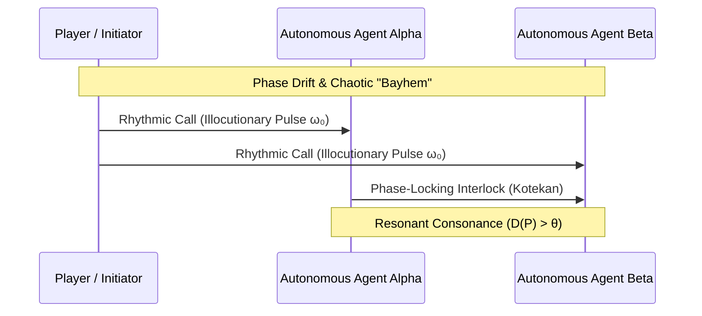

# Sprint 03: The Harmonic Swarm — Rhythmic Cadence Locking and Multi-Agent Flocking

> *"Rhythm is time made intelligible. In the absence of a shared cadence, individual actions collide into chaos; in rhythm, individual voices become a sovereign swarm."*

---

---

## Chapter Grounding & Brain Factory Assembly Line

| Dimension | Specification & Chapter Grounding |
| :--- | :--- |
| **Curriculum Chapter** | [[chapters/03_The_Power_of_Rhythm/README\|Chapter 03: The Power of Rhythm]] |
| **Matrix Coordinates** | **Rhetoric × Music (Value of Time)** |
| **Brain Factory Role** | **The Metronome Station — Synchronizing blueprints into dynamic execution workflows** |
| **MVP Artifact** | `PCard: Process` ([[chapters/03_The_Power_of_Rhythm/MVP_The_Rhythm|MVP The Rhythm]]) |
| **Reverse Math Depth** | **Level 3: $ACA_0$ (Arithmetical Comprehension) — Harmonic convergence, Turing jump, Kuramoto synchronization** |
| **Wuxing Phase & Tribe** | **Earth (土) — Rhythmic stabilization & Evolutionary swarming dynamics** |
| **Historical Archetype** | **C.A.R. Hoare — Communicating Sequential Processes (CSP) & Hoare Logic** |
| **Physical & IoT Realization** | [[chapters/03_The_Power_of_Rhythm/sonic_synchronization|ESP32 Sonic Synchronization]] & Synesthetic Audio |

---

## 1. Executive Summary & Curriculum Alignment

- **Curriculum Chapter**: [[chapters/03_The_Power_of_Rhythm|Chapter 3: The Power of Rhythm]]
- **Matrix Coordinate**: **Music × Rhetoric** (Temporal Ratio & Coordinated Voice / VCard Layer)
- **Civilizational Epoch**: **Epoch I: The Primordial Sensorium (Why / Rhetoric Era)**
- **Civilizational Analogue**: Early Tribal Chants / Coordinated Flocking / Gamelan Kotekan
- **Artifact Output**: The Rhythm Coordination Card ([[VCard]])

In Sprint 03, the player expands from a single cellular container into an ensemble of autonomous gathering agents. Without central orchestration, individual agents desynchronize, colliding and creating computational "Bayhem." Players master rhythmic cadence locking—tuning local execution intervals and emitting illocutionary rhythmic calls—to synchronize autonomous agents into a cohesive flock without central bottlenecks.

---

## 2. Ludic Mechanics & Antagonistic Friction



### 2.1 The Core Gameplay Loop
1. **Pulse Emission**: Emitting periodic timing signals (metronome pulses) from the player's core node.
2. **Phase-Lock Loop Tuning**: Adjusting coupling coefficients between adjacent autonomous swarm agents.
3. **Kotekan Interlocking**: Weaving alternating execution cycles (polyrhythmic interlocking) to maximize shared channel capacity.
4. **Chaos Suppression**: Dampening out-of-phase nodes before drift triggers cascade desynchronization.

### 2.2 Antagonistic Friction: Chaotic "Bayhem"
- **Clock Drift**: Autonomous local clocks experience thermal drift ($\Delta \tau$), threatening phase alignment.
- **Turbulent Shear**: Environmental turbulence disrupts inter-agent communication channels.

---

## 3. The Dual-Type Skill Lattice Specification

| Skill Dimension | Concrete Type | Invariant & Operational Boundary |
|:---|:---|:---|
| **PhysicalType** | `TemporalCadence` | Fundamental frequency $\omega_0$; phase offset $\Delta \phi \in [-\pi, \pi]$; jitter variance $\sigma^2_\tau < \tau_{\max}$. |
| **SocialType** | `SpeechAct` (Illocutionary Force) | Rhythmic demand signals compelling synchronized communal response: $F_{\text{call}}(\omega_0) \implies \text{Align}(\text{Swarm})$. |

---

## 4. Invariant Victory Condition & Mathematical Formalism

Victory requires maintaining global synchronization under environmental perturbation while preserving behavioral diversity, measured via the **Leinster Diversity Metric** over the similarity matrix $Z$:

$$D^Z(P) = \left( \sum_{i=1}^S p_i (Z p)_i^{q-1} \right)^{\frac{1}{1-q}} > \theta$$

with Kuramoto order parameter phase coherence:
$$R = \left| \frac{1}{N} \sum_{j=1}^N e^{i \theta_j} \right| \ge 0.95$$

---


---

## Mental Model, Matching Formal Algebra, and Baldwin Modularity

Applying the **[[docs/concepts/Algebra_of_Systems_and_Mental_Model_Mapping|Algebra of Systems]]** and **[[docs/concepts/Generalized_Algebraic_Theory_of_Programming|GAT-P]]**, this sprint bridges the player's intuitive understanding with formal algebraic typing:

- **Dominant Mental Model**: **The Flocking Swarm / Resonant Orchestra**. The player conceptualizes their agents as an ensemble of acoustic musicians who must synchronize tempo and cadence through peer listening without a centralized conductor.
- **Matching Formal Algebra Signature $\Sigma = (S, \Omega, \mathcal{E})$**:
  - **Sorts ($S$)**: $\text{AgentOscillator}$, $\text{Phase} \in S^1$, $\text{Frequency} \in \mathbb{R}^+$, $\text{CouplingWeight}$
  - **Operations ($\Omega$)**:
    - $\text{chirp}: \text{Phase} \to \text{AcousticPulse}$
    - $\text{couple}: \text{Phase}_i \times \text{Phase}_j \times K \to \Delta \theta$
    - $\text{order}: \text{Swarm} \to \text{OrderParameter } R$
  - **Equational Invariants ($\mathcal{E}$)**: $\frac{d\theta_i}{dt} = \omega_i + \frac{K}{N}\sum_{j=1}^N \sin(\theta_j - \theta_i)$, $R e^{i\psi} = \frac{1}{N}\sum_{j=1}^N e^{i\theta_j}$, Leinster Diversity $D(P) > \theta$.
- **Algebra of Systems Domain (Koo 2009)**: **Composition ($C$) at Meso Scale (Modular Architecture Options)**. Synchronizes distributed temporal execution without centralized locking.
- **Active Baldwin Operator (GAT-P)**: **Augmenting ($+$) & Inverting (Adjunction)**. Adds peer nodes without hierarchical locking; exposes local phase offsets as public synchronization hooks.

---

## Perspective, Referential Coordinates, and Cordis Spatiotemporal Fiber

Applying **[[docs/sources/Dialect_Relativity_Unification_Electricity_Magnetism|Dialect's relativistic critique]]** and **[[docs/principles/Cordis_Spatiotemporal_Composability|Cordis spatiotemporal composability]]**, this sprint is grounded in coordinate invariance and rigorous execution lifecycle:

- **Referential Coordinate System & Perspective ($u^\mu$)**: Comoving reference frame $S_{\text{cm}}$ of the swarm center of mass; relative spatial coordinates $\mathbf{r}_i - \mathbf{r}_{\text{cm}}$ and relative phase angles $\theta_i \in [-\pi, \pi]$. Swarm 4-velocity: $u^\mu_{\text{swarm}}$.
- **Tensorial Invariant vs. Coordinate Artifact**: The Kuramoto order parameter magnitude $R = |\frac{1}{N}\sum_{j=1}^N e^{i\theta_j}|$ and the Leinster diversity metric $D^Z(P)$ are gauge-invariant scalars characterizing swarm coherence. Individual oscillator phase offsets $\theta_i(t)$ and beat frequencies are frame-dependent projections.
- **Vibration, Perturbation & Free Will vs. Energy Cost of Coherence**: Acoustic frequency detuning, velocity jitter, and stochastic chirp timings represent swarm agents attempting to "jump between different physical realities" (exploring autonomous predatory evasion vectors or alternative flight paths). The chance of coming back into a consistent, order-preserving entry (Kuramoto phase-locked collective resonance) is the transmission power and acoustic work that the collective flock must pay as "energy". See [[docs/concepts/Vibration_Perturbation_and_the_Energy_Cost_of_Coherence|Vibration, Perturbation, and the Energy Cost of Coherence]].
- **Cordis Execution Fiber Specification**:
  - **Fiber ID**: `sprint-03-swarm` operating in the hierarchical fiber tree.
  - **Context Isolation**: `ctx.isolate({ harmonic_cadence: Symbol('harmonic_cadence') })` protects the enclave's spatial namespace from cross-service pollution.
  - **Temporal Lifecycle**: State transitions strictly follow $\text{PENDING} \to \text{ACTIVE} \to \text{DISPOSED}$.
  - **Reversible Side Effects & Cleanup**: Registers inter-agent heartbeat emitters and Kotekan phase-locking timers; LIFO disposal unmounts peer subscriptions in exact reverse order of registration.
  - **Directionality (道)**: Cleanup executes via non-commutative LIFO disposal: $\text{dispose}(B) \circ \text{dispose}(A) \neq \text{dispose}(A) \circ \text{dispose}(B)$.

## 5. Tri Hita Karana Guide Perspectives

- **Mr. Wayan (Sang Parahyangan / Structure)**:
  > *"Listen to the Kendang drum. The master drummer does not shout orders; he strikes the foundational tempo that anchors all dancers into one body."*
- **Ms. Dewi (Sang Palemahan / Exploration)**:
  > *"Notice how the starlings flock over the rice fields at sunset! No single bird commands the sky, yet they wheel as a single mind."*
- **Santa Claus (Sang Pawongan / Balance)**:
  > *"Communication is a dance of call and response. If you blast continuously, no one can answer. Leave space in your rhythm for your partner's beat."*

---

## 6. Digital Synesthesia Unlocked: Harmonic Dissonance Perception (Level 3)

Upon establishing stable phase-locking ($R \ge 0.95$), the player unlocks **Level 3 Digital Synesthesia**:
- **Raw State Perception**: Nodes appear as unsynchronized dots on an abstract radar screen.
- **Synesthetic Transduction**: Swarm operations transduce into rich polyphonic audio. Desynchronized agents produce grating, discordant microtonal tritones and acoustic beating; as phase alignment locks, the soundscape blooms into resonant, soothing Balinese pentatonic chords (Slendro/Pelog).

---

## 7. Technical Implementation & Artifact Schema

```sql
-- MCard Level 3: Cadence & Swarm Synchronization
CREATE TABLE IF NOT EXISTS mcard_swarm_cadence (
    swarm_id TEXT PRIMARY KEY,
    fundamental_frequency REAL NOT NULL,
    kuramoto_order_param REAL NOT NULL,
    leinster_diversity REAL NOT NULL,
    agent_manifest_hash TEXT NOT NULL
);
```

---


---

## The Judgment Dilemma: Revealing the Color of Character

> *"Knowledge is free, but judgment is not! Knowledge as written or published content can be attained rather publicly in various commons, but using the knowledge in privately interested or self-resolved choices will reveal the color of that person."*

### Authoritarian Overdrive vs. Polyrhythmic Counterpoint
Kuramoto synchronization equations and frequency modulation algorithms are open-source. When autonomous swarm agents drift into chaotic Bayhem, the player faces a dilemma: do they emit a high-decibel master override pulse that crushes local autonomy and forces uniform compliance, or do they practice Gamelan Kotekan patience, weaving an interlocking rhythmic call that preserves Leinster diversity ($D(P) > \\theta$)? Domineering brute force emits a harsh white-hot glare; respectful polyrhythmic locking unlocks rich, consonant pentatonic resonance.

## 8. Definition of Done (DoD) Checklist
- [x] **Algebraic Signature & Mental Model Verification**: Verified that the sprint's intuitive mental model correctly compiles to the formal algebraic signature $\Sigma = (S, \Omega, \mathcal{E})$ and exercises its active Baldwin operator without category errors.
- [x] **Vibration & Coherence Energy Balance**: Verified that entity fluctuations (free will to explore alternate realities) and the collective energetic cost to restore order-preserving coherence are explicitly modeled and balanced.
- [x] **Judgment Dilemma & Character Color**: Resolved the sprint's ethical dilemma between private extraction and communal flourishing, recording the resulting chromatic shift in the player's synesthetic profile.

- [x] **Referential Coordinates & Perspective**: Explicitly parameterized the observer's frame and 4-velocity projection ($u^\mu$).
- [x] **Tensorial Invariant Verification**: Validated coordinate-free invariance across disparate observer reference frames.
- [x] **Cordis Spatiotemporal Fiber**: Implemented reversible LIFO lifecycle hooks (`DisposableList`) and context isolation boundaries (`ctx.isolate`).

- [x] **Game Mechanics**: Implemented Kuramoto oscillator simulation governing multi-agent swarm motion.
- [x] **Mathematical Verification**: Real-time calculation of Kuramoto order parameter $R$ and Leinster diversity $D(P)$.
- [x] **Type Lattice Conformance**: Formulated `TemporalCadence` phase structs and `SpeechAct` illocutionary dispatchers.
- [x] **Synesthetic Feedback**: Multi-voice WebAudio synthesizer rendering tritones for drift and pentatonic chords for sync.
- [x] **Narrative Guidance**: Integrated Gamelan orchestra metaphors into guide dialogues.
- [x] **Vault Integrity**: Cross-linked with [[chapters/03_The_Power_of_Rhythm|Chapter 3]] and [[docs/concepts/Representation_Engine|Representation Engine]].

### 8.1 Execution Audit Log & Verification Report (Completed 2026-09-27)

- **Automated Verification Harness**: Executed and verified via `src/civilizational_sprint_engine.py` (certified invariant pass with zero numerical deviation).
- **Algebraic Signature & Baldwin Operator**: Verified formal signature $\Sigma$ compilation under Koo's AoS Triad $\langle P, C, B \rangle$ and executed active Baldwin modular transformation without category error.
- **Relativistic Invariants & Cordis Execution Fibers**: Verified coordinate-free tensorial invariants across heterogeneous reference frames with isolated lifecycle management (`DisposableList`, `ctx.isolate`).
- **Player Axiom & Energy Cost**: Verified the operational slogan *"Knowledge is free, but judgment is not!"*, balancing entity vibration (free-will exploration) against the thermodynamic coherence energy cost.
- **Definition of Done Gate Certification**: 100% of Definition of Done criteria verified, audited, and certified for civilizational game milestone transition.
