# The Brain Factory: Workflow Overview

**Welcome to the Engine Room.**
This directory contains the technical blueprints for the "Prologue of Spacetime" curriculum engine.

This document works as a **Simple Map** to help you understand how our 5 AI Giants (The Titan Quorum) work together to write the story.

---

## 1. The Components (The Cast)

Imagine a factory with 5 workers and 1 manager.

*   **The Manager (OpenClaw):** The "Brain Stem". It doesn't write the book; it tells the workers what to do. It handles the database, the files, and the voting.
*   **The Workers (The Titan Quorum):** 5 super-intelligent AIs who do the actual work.

| Worker Name | Real Identity | Job Description |
| :--- | :--- | :--- |
| **The Chair** | **Llama 405B** | Keeps the story organized. |
| **The Miner** | **DeepSeek 671B** | Digs for facts in the database. |
| **The Auditor** | **Nemotron 340B** | Checks the facts. |
| **The Professor**| **Claude Opus** | Makes it easy to learn. |
| **The Vizier** | **GPT-4o** | Add creative flair. |

---

## 2. The Process (The Diagrams)

We break the workflow into 3 simple steps: **Research**, **Drafting**, and **Voting**.

### Step 1: The Research Loop
*The Manager gets an order and tells the Giants to start digging.*

---

### Step 2: The Drafting Loop
*The Giants write the chapter using the facts they found.*

---

### Step 3: The Voting Loop (The Judgment)
*This is the most important part. They grade each other's work.*

**The Rule:** A draft needs an average score of **8/10** to pass.

```mermaid
sequenceDiagram
    autonumber
    participant Manager as 🤖 OpenClaw
    participant Draft as 📝 Draft #101
    participant Judges as ⚖️ The Judges (Titans)
    participant Final as ✅ Completed Folder

    Manager->>Judges: 1. "Grade this draft (0-10)"
    
    par Blind Voting
        Judges->>Judges: 2. Check Facts (Accuracy)
        Judges->>Judges: 3. Check Depth (PhD Level?)
        Judges->>Judges: 4. Check Teaching (Is it clear?)
    end
    
    Judges-->>Manager: 5. Submit Scorecards (e.g., 9, 8, 9, 7, 9)
    
    Note over Manager: Average = 8.4 (PASS!)
    
    Manager->>Final: 6. Publish "Chapter_Gravity.md"
    Manager-->>Draft: 7. Mark as APPROVED
```

---

## 3. Where to go next?

Now that you understand the high-level flow, you can read the detailed technical documents:

1.  **[The Constitution](consensus_constitution.md)**: The strict laws and math behind the voting.
2.  **[The Skill Registry](mcp_skill_registry.md)**: The exact computer code (JSON) used to talk to the Manager.
3.  **[Requirements Analysis](requirements_analysis.md)**: The deep "Why" and "What" of the system.
4.  **[Execution Strategy](execution_strategy.md)**: The detailed "How" it runs on the servers.
