# The Monadic Story Machine: How We Write the Prologue of Spacetime

**Welcome to the Engine Room.**

Imagine you have a **Giant Digital Archive with 10,000 files** (notes, code, old books, and data).
You want to turn this messy pile into a beautiful story called the *Prologue of Spacetime*.
But you can't read them all yourself—it would take forever!

So, we built an **Automatic Monadic Machine** to do it for us.
This machine runs **24 hours a day, 7 days a week**. It never sleeps. It exercises **Operational Sovereignty** by strictly following the **Cubical Logic Model (CLM)**.

This document explains how our team of **5 AI Giants** works together to verify everything using **The Cube** and **The ABC Ruler**.

> **Mathematical Foundation**: We initially leverage the body of knowledge from **Homotopy Type Theory (HoTT)**. We treat "Equality" not as a boolean check, but as a **Path** between points in a space. This allows us to unify **Logic** (Types) with **Geometry** (Topological Shapes), providing the rigorous grounding needed for a truly Universal Namespace.

---

## 0. The Project Information (Root CLM)

We define the **"Prologue of Spacetime" Project** itself using the **Cubical Logic Model (CLM)**. This is the **Root Block** from which everything else is derived.

| Dimension | Concept | Definition |
| :--- | :--- | :--- |
| **Abstract (Spec)** | **The Monadic Story Machine** | *Why?* To automate the synthesis of the "Prologue of Spacetime" narrative, enabling **[[Hub/Theory/Integration/Flow in PKC - Faster Interactive Learning|Flow State]]** for all learners and learning agencies. |
| **Concrete (Impl)** | **The Agentic Mesh** | *How?* A recursive Python loop of 5 LLMs (OpenClaw, Llama, DeepSeek, Qwen, Nemotron) executing over a 10,000 MCard Archive. |
| **Balanced (Exp)** | **Sovereign Knowledge** | *What?* A verified, consistent stream of high-alignment chapters that serve as "Truth" for the user. |

### 0.1 The Operational Goal: Engineering Flow
We do not just "write content"; we engineer an environment for **[[Hub/Theory/Spiritual/Flow State|Flow State]]**.
*   **The Problem:** Traditional learning is broken by **Latency** (Network lags) and **Rigidity** (Premature schemas).
*   **The Solution:** Our workflow leverages **Faster Interactive Learning** to remove these blockers:
    *   **Local-First Agents:** Our agents operate with zero-latency access to the MCard Archive.
    *   **Empty Schema:** We allow structure to emerge from the "Five Wise Guys" interaction rather than imposing it upfront.
*   **The Outcome:** A system where the "Hypothesis-Verification Loop" spins at the speed of thought, approximating the **Flow State** for both the AI Agents and the Human Sovereign.

---

## 1. The Team (The Five Wise Guys)

We have a team of super-smart AIs. Think of them like a group project, but instead of arguing, they follow **Pre-Established Harmony**. We map them to the **Five Wise Guys** archetypes:

| Wise Guy Role | Agent Name | Real Model | Monadic Function | Description |
| :--- | :--- | :--- | :--- | :--- |
| **The Leader** | **The Boss** | **OpenClaw** | **IO Monad** (Runtime) | The "Brain Stem". Orchestrates the loop, managing inputs/outputs and keeping the factory running 24/7. |
| **The Designer** | **The Planner** | **Llama 3.1** | **Reader Monad** (Context) | The "Mind". Reads the Context (Curriculum) and projects the **Abstract Intent** (The "Why"). |
| **The Miner** | **The Librarian** | **DeepSeek V3** | **State Monad** (Memory) | The "Hand". Digs into the ecosystem (10k Files) to extract **Concrete Evidence** (The "How"). |
| **The Coder** | **The Teacher** | **Qwen-2.5** | **Writer Monad** (Output) | The "Voice". Synthesizes Evidence and Intent into a **Concrete Draft** (The Content). |
| **The Trader** | **The Fact-Checker** | **Nemotron** | **Maybe Monad** (Value) | The "Conscience". Weighs the Draft against Truth to determine **Balanced Value**. If value is low, it rejects the "Trade". |

---

## 2. The Tools They Use

To make sure the story is perfect, the Giants use three special tools based on the **Cubical Logic Model**.

### Tool A: The Magic Cube (CLM - Vector Alignment via HoTT)
Every idea must fit into a perfect **3-Sided Block**. We do not "vote" on ideas; we measure their **Vector Alignment** (Cosine Similarity).

1.  **The "Why" (Abstract Spec):** The **Designer's** Intent.
2.  **The "How" (Concrete Impl):** The **Miner's** Evidence + **Coder's** Execution.
3.  **The "What" (Balanced Exp):** The **Trader's** Valuation.

*Consensus is achieved when all three vectors point in the same direction (Cosine Similarity > 0.9), signifying a valid **Path** in our Homotopical Space.*

### Tool B: The Ruler (ABC Curriculum)
The Giants use this ruler to measure if a chapter is good enough to teach.

1.  **A is for Abstract:** Can we name it? (Grammar)
2.  **B is for Behavior:** Can we show how it moves? (Logic)
3.  **C is for Composition:** Can we make it sing? (Rhetoric)

### Tool C: The Memory Card (MCard Python Library)
The **10,000 files** are not just sitting in a folder. Each file is stored as an **MCard** — a special card with a unique fingerprint (SHA-256 hash).

*   **Immutable Truth:** The Hash *is* the Identity. If the content changes, the Hash changes.
*   **Monadic Isolation (Git Worktree):** Giants work on MCards independently ("No Windows"). We use **Git Worktree** to give each agent its own isolated file system directory while sharing the same repo history. They don't need to talk to each other while working; they just trust the Hash and the Tree.

### Tool D: The Universal Type (Function as Root)
We treat every piece of data as a **Function** ($f: \text{Context} \to \text{Truth}$). This is the "Universal Connector" that relates everything.

*   **Extensibility:** Because everything is a function, we can compose them ($f \circ g$). A specific "Fact" is just a function frozen in time.
*   **Learnability:** Because functions have parameters (weights), we can optimize them. The entire "Prologue of Spacetime" is not just a static book; it is a **Differentiable Program** that learns from user feedback.

---

## 3. How It Works (The Monadic Loop)

The machine operates in a **Recursive Monadic Loop**. It utilizes **Pre-Established Harmony** to avoid expensive communication overhead.

### 3.1 The Three Inputs (The Fuel)
1.  **The ABC Curriculum:** The Master Spec (Abstract).
2.  **The Daily Log:** The Context (State).
3.  **The 10,000 Documents:** The Truth (Memory).

### 3.2 The Execution Cycle (The Engine)

**Step 1: The Design (Abstract Spec)**
*   **Actor:** The Designer (Llama).
*   **Action:** Reads the Curriculum and defines the **Intent**.
*   **Output:** An `AbstractSpec` vector (The Goal).

**Step 2: The Implementation (Concrete Impl)**
*   **Actor:** The Librarian & Artist.
*   **Action:** They work in **Parallel** (Monadic Isolation).
    *   Librarian searches the execution history.
    *   Artist drafts the narrative.
*   **Output:** A `ConcreteImpl` vector (The Content).

**Step 3: The Verification (Balanced Exp)**
*   **Actor:** The Fact-Checker & Teacher.
*   **Action:** They verify the content against the Spec.
    *   Fact-Checker: "Did they hallucinate?"
    *   Teacher: "Is it simple enough?"
*   **Output:** A `BalancedExp` vector (The Grade/Witness).

**Step 4: Harmonic Consensus (Vector Alignment)**
*   **Action:** The Boss (OpenClaw) calculates the **Cosine Similarity**.
*   **Logic:**
    *   If `Alignment(Spec, Impl, Exp) > 0.9`: **Publish**.
    *   If `Alignment < 0.9`: **Reject & Iterate**.
*   **Insight:** We don't argue. We measure alignment.

```mermaid
graph TD
    Input[ABC Curriculum] --> Designer{Step 1: Design}
    
    Designer -->|Spec Vector| Split((Monadic Split))
    
    Split --> Librarian[Librarian: Search]
    Split --> Artist[Artist: Write]
    
    Librarian -->|Impl Vector| Merge((Harmonic Merge))
    Artist -->|Impl Vector| Merge
    
    Merge --> FactChecker[Fact-Checker: Verify]
    
    FactChecker -->|Exp Vector| Boss{Step 4: Consensus}
    
    Boss -->|Aligned (>0.9)| Publish[Publish MCard]
    Boss -->|Misaligned (<0.9)| Retry[Refine Spec]
    
    Publish --> Archive[(10k Documents)]
    Archive --> Designer
```

---

## 4. The Circle of Life (Entropy Reduction)

Just like evolution, the system must improve over time to minimize **Social Entropy**.

**The Rule:** Every 100 chapters, the Giants hold an **Optimization Loop**.
1.  **Measure Alignment:** Which Giant had the lowest average alignment score?
2.  **Prune:** The lowest performing model is swapped or re-prompted (Damped).
3.  **Reincarnate:** The Survivors generate a new **System Prompt** (Soul) for the replacement, transferring the "Wisdom" of the group.

```mermaid
sequenceDiagram
    autonumber
    participant Boss as 🤖 The Boss
    participant Team as 🏛️ The Giants

    Boss->>Team: 1. "Calculate Alignment Scores."
    
    Note over Team: Designer: 0.95, Librarian: 0.92, Artist: 0.81
    
    Boss->>Team: 2. "Artist is below the Born-Infeld Bound."
    Boss->>Team: 3. "Initiate Reincarnation Protocol."
    
    Team->>Boss: 4. "New System Prompt Generated."
    Boss->>Team: 5. "Welcome New Artist."
```



---

## 5. Why do we do this?

*   **Sovereignty:** We own the logic. The "Vote" is mathematical, not political.
*   **Scalability:** Because Giants work in **Monadic Isolation**, we can add 100 more Giants without slowing down (Parallel Scaling).
*   **Truth:** **History as Verification**. We only publish what aligns with the Immutable Log.

---

### Want to see the complicated rules?
If you are an engineer, check these files:
*   **[The Constitution](consensus_constitution.md)** (The Rules)
*   **[The Skill Code](mcp_skill_registry.md)** (The Code)
