```mermaid
sequenceDiagram
    autonumber
    participant Boss as 🤖 The Boss
    participant Drafts as 📠The 5 Candidates
    participant Team as ðŸ›ï¸ The 5 Giants

    Boss->>Team: 1. "Pick the winner!"
    
    Team->>Drafts: 2. Vote for the best one (Cannot vote for self)
    
    Note over Boss: Winner: Draft B (Score: 9.8)
    
    Boss->>Drafts: 3. Publish Draft B to Prologue of Spacetime
```

# The Story Machine: How We Write the Prologue of Spacetime

**Welcome to the Engine Room.**

Imagine you have a **Giant Digital Archive with 10,000 files** (notes, code, old books, and data).
You want to turn this messy pile into a beautiful story called the *Prologue of Spacetime*.
But you can't read them all yourself—it would take forever!

So, we built a **Automatic Machine** to do it for us.
This machine runs **24 hours a day, 7 days a week**. It never sleeps. It searches the files, connects the dots, and writes new chapters automatically.

This document explains how our team of **5 AI Giants** works together to verify everything using **The Cube** and **The ABC Ruler**.

---

## 🗺️ Documentation Map (Start Here)

This README is the **High-Level Overview**. For specific technical details, please refer to the core documents:

| Document | Purpose | Target Audience |
| :--- | :--- | :--- |
| **[Consensus Constitution](./consensus_constitution.md)** | **The Laws:** Voting rules, grading rubrics, and the "Runoff Protocol". | Architects & Policy Makers |
| **[Execution Strategy](./execution_strategy.md)** | **The Mechanics:** Step-by-step workflow, phases, and data pipelines. | Engineers & Developers |
| **[Requirements Analysis](./requirements_analysis.md)** | **The Logic:** Axioms, constraints (e.g., "No API Models"), and theory. | Systems Analysts |
| **[MCP Skill Registry](./mcp_skill_registry.md)** | **The API:** JSON schemas for tools like `qdrant_search` and `cast_vote`. | Integration Specialists |

---

## 1. The Team (The 5 Giants)
We have a team of super-smart AIs. Think of them like a group project at school, but everyone is a genius.

| Who are they? | Their Real Name | What is their job? |
| :--- | :--- | :--- |
| **The Boss** | **OpenClaw** | The "Brain Stem". It wakes everyone up and keeps the factory running 24/7. |
| **The Planner** | **Llama 3.1** | Keeps the story organized. |
| **The Librarian** | **DeepSeek V3** | Runs into the archive to find facts in the **10,000 files**. |
| **The Fact-Checker** | **Nemotron** | Makes sure nobody is lying. |
| **The Teacher** | **Qwen-2.5** | Explains things simply (using the ABC Ruler). |
| **The Artist** | **Mistral** | Adds creativity and flair. |

---

## 2. The Tools They Use

To make sure the story is perfect, the Giants use three special tools.

### Tool A: The Magic Cube (Cubical Logic Model - CLM)
Every idea must fit into a perfect **3-Sided Block**. If an idea is missing a side, the Giants throw it away.

1.  **The "Why" (Abstract):** What is the idea? (e.g., "We need to count water.")
2.  **The "How" (Concrete):** How do we build it? (e.g., "Build a bamboo clock.")
3.  **The "What" (Balanced):** How do we prove it works? (e.g., "Test it with a timer.")

*Imagine a Rubik's Cube: You need all sides to match to solve the puzzle.*

### Tool B: The Ruler (ABC Curriculum)
The Giants use this ruler to measure if a chapter is good enough to teach.

1.  **A is for Abstract:** Can we name it? (Grammar)
2.  **B is for Behavior:** Can we show how it moves? (Logic)
3.  **C is for Composition:** Can we make it sing? (Rhetoric)

### Tool C: The Memory Card (MCard Python Library)
The **10,000 files** are not just sitting in a folder. Each file is stored as an **MCard** — a special card with a unique fingerprint (SHA-256 hash) and a timestamp (`g_time`). Think of it like a library card that can never be forged.

*   **Perfect Memory:** The Librarian searches the archive using **MCard RAG** (smart search that understands meaning, not just keywords).
*   **Honest Citations:** When the Librarian says "I found this fact in File #42," it gives the file's fingerprint. Anyone can check if the citation is real.
*   **Version History:** Every time a chapter is updated, the old version is kept. You can always go back and see what changed.

*Imagine a magic filing cabinet: every document has an unbreakable seal. If someone tries to change a document, the seal breaks and everyone knows.*

---

## 3. How It Works (The 24/7 Recursive Loop)

The machine doesn't just "react" to commands. It has a **Goal**. It wakes up every day and asks: *"What is missing?"*

### 3.1 The Three Inputs (The Fuel)
Every time the machine wakes up, it reads 3 things:
1.  **The ABC Curriculum:** The Master Plan. (e.g., "We need 12 Chapters explaining Spacetime.")
2.  **The Daily Log:** The Newest Orders. (e.g., "The CEO just said we need to focus on MCP today.")
3.  **The 10,000 Documents:** The Source of Truth. (e.g., "Here is the new code we wrote yesterday.")

### 3.2 The Execution Cycle (The Engine)
Once it has the inputs, it runs a 4-step loop. It never stops.

**Step 1: Gap Analysis (The Brain)**
*   **Action:** The Planner (Llama) compares the *Curriculum* (Goal) with the *10k Docs* (Reality).
*   **Question:** "What chapters are unfinished? What new code is undocumented?"
*   **Output:** A list of "Missing Links."

**Step 2: The Checklist (The Plan)**
*   **Action:** The Planner creates a specific **ToDo List** for this cycle.
*   **Example:**
    *   [ ] Read the new `mcp_server.py` file.
    *   [ ] Draft a new section for Chapter 4 about MCP.
    *   [ ] Update the Daily Log.
*   **Tool:** It uses **OpenClaw** to create this plan.

**Step 3: Execution (The Work)**
*   **Action:** The Giants (DeepSeek, Qwen) do the work.
*   **RAG Power:** They use the **MCard RAG Engine** to search the 10k docs for facts.
*   **Writing:** They write the new content.

**Step 4: The Recursive Update (The Loop)**
*   **Action:** The new work is saved to the archive.
*   **Loop:** The system updates the Daily Log and restarts Step 1.
*   **Result:** The machine gets smarter every single loop.

### Step 5: The Vote (Selection)
*Once the work is done, they vote on the Best Draft. The winner becomes the official chapter.*

### What if there is a tie? (The Fusion)
If two Giants have the same score, they don't fight. They **Combine Forces**.
1.  **Merge:** They take the best research from *both* drafts.
2.  **Write:** They write a new "Super Draft" together.
3.  **Vote:** The team votes on the Super Draft.

---

## 4. The Circle of Life (How They Get Smarter)

Just like students get report cards, our Giants get graded too. But here, **they grade themselves.**

**The Rule:** Every 100 chapters, the Giants hold a special meeting called **The Council of Survivors**.
1.  **Self-Check:** They look at everyone's scores.
2.  **The Vote:** They vote to remove the person with the lowest score.
3.  **The Reincarnation:** The 4 Survivors write a letter (a new **Soul**) to the new team member, telling them how to be better.

```mermaid
sequenceDiagram
    autonumber
    participant Giants as ðŸ›ï¸ The Council
    participant Worst as 📉 Worst Giant
    participant New as 👶 The New Giant

    Giants->>Giants: 1. "Who had the lowest score?"
    Giants->>Worst: 2. "It was you. You are fired."
    
    Note over Worst: The Worst Giant is removed.
    
    Giants->>New: 3. "We are writing your Soul."
    Giants->>New: 4. "Do not make the mistakes of the last guy."
    
    New-->>Giants: 5. "I used your advice. I am ready!"
```

**Why is this cool?**
The humans don't have to do anything! The AI team fixes itself, getting smarter and smarter every single week.

---

## 5. Why do we do this?

*   **24/7 Non-Stop:** Humans need to sleep. The Machine creates content all night long.
*   **Perfect Memory:** It never forgets a fact from the **10,000 files**.
*   **No Mistakes:** Because 5 Giants check the work using **The Cube** and **The Ruler**, it's much safer than just 1 AI guessing.

---

### Want to see the complicated rules?
If you are an engineer, check these files:
*   **[The Constitution](consensus_constitution.md)** (The Rules)
*   **[The Skill Code](mcp_skill_registry.md)** (The Code)
