# The Story Machine: How We Write the Prologue of Spacetime

**Welcome to the Engine Room.**

Imagine you have a **Giant Library with 10,000 books** (files).
You want to write a new, amazing story based on these books.
But you can't read them all yourself—it would take forever!

So, we built a **Machine** to do it for us.
This machine runs **24 hours a day, 7 days a week**. It never sleeps. It reads the books, writes the chapters, and checks its own work.

This document explains how our team of **5 AI Giants** works together to write the *Prologue of Spacetime*.

---

## 1. The Team (The 5 Giants)
We have a team of super-smart AIs. Think of them like a group project at school, but everyone is a genius.

| Who are they? | Their Real Name | What is their job? |
| :--- | :--- | :--- |
| **The Boss** | **OpenClaw** | The Brain Stem. It wakes everyone up and keeps the factory running 24/7. |
| **The Planner** | **Llama 3.1** | Keeps the story organized. |
| **The Librarian** | **DeepSeek V3** | Runs into the library to find facts in the **10,000 files**. |
| **The Fact-Checker** | **Nemotron** | Makes sure nobody is lying. |
| **The Teacher** | **Claude Opus** | Explains things simply (like this!). |
| **The Artist** | **GPT-4o** | Adds creativity and flair. |

---

## 2. How It Works (The 3 Magic Steps)

Every time we want to write a new part of the story, the Giants do these 3 steps.

### Step 1: The Treasure Hunt (Research)
*The Boss tells the Librarian to find the right pages in the 10,000 books.*

```mermaid
sequenceDiagram
    autonumber
    participant Boss as 🤖 The Boss (OpenClaw)
    participant Giants as 🏛️ The Giants
    participant Library as � The 10,000 Books

    Note over Boss, Library: "We need to explain Gravity."
    Boss->>Giants: 1. "Go find the truth about Gravity!"
    
    loop Reading the Books
        Giants->>Library: 2. Search for "Gravity"
        Library-->>Giants: 3. Here are 50 pages from the 10,000 files
        Giants->>Giants: 4. Read and Remember
    end
    
    Giants-->>Boss: 5. "We have the facts!"
```

---

### Step 2: Writing the Story (Drafting)
*The Giants work together to write a first draft.*

```mermaid
sequenceDiagram
    autonumber
    participant Boss as 🤖 The Boss
    participant Giants as 🏛️ The Giants
    participant Desk as 📝 The Writing Desk

    Boss->>Giants: 1. "Write a chapter using those facts."
    
    Note right of Giants: The Giants think hard...
    Giants->>Giants: 2. Connect the dots
    
    Giants->>Desk: 3. Put a Draft on the desk
    Desk-->>Boss: 4. "Draft is ready for grading!"
```

---

### Step 3: The Test (Grading)
*This is the most important part. The Giants grade each other's work. If it's not perfect (8/10), they trash it and start over.*

---

## 3. Why do we do this?

*   **24/7 Non-Stop:** Humans need to sleep. The Machine creates content all night long.
*   **Perfect Memory:** It never forgets a fact from the **10,000 files**.
*   **No Mistakes:** Because 5 Giants check the work, it's much safer than just 1 AI guessing.

---

### Want to see the complicated rules?
If you are an engineer, check these files:
*   **[The Constitution](consensus_constitution.md)** (The Rules)
*   **[The Skill Code](mcp_skill_registry.md)** (The Code)
