# The Story Machine: How We Write the Prologue of Spacetime

**Welcome to the Engine Room.**

Imagine you have a **Giant Digital Archive with 10,000 files** (notes, code, old books, and data).
You want to turn this messy pile into a beautiful story called the *Prologue of Spacetime*.
But you can't read them all yourself—it would take forever!

So, we built a **Automatic Machine** to do it for us.
This machine runs **24 hours a day, 7 days a week**. It never sleeps. It searches the files, connects the dots, and writes new chapters automatically.

This document explains how our team of **5 AI Giants** works together to verify everything using **The Cube** and **The ABC Ruler**.

---

## 1. The Team (The 5 Giants)
We have a team of super-smart AIs. Think of them like a group project at school, but everyone is a genius.

| Who are they? | Their Real Name | What is their job? |
| :--- | :--- | :--- |
| **The Boss** | **OpenClaw** | The "Brain Stem". It wakes everyone up and keeps the factory running 24/7. |
| **The Planner** | **Llama 3.1** | Keeps the story organized. |
| **The Librarian** | **DeepSeek V3** | Runs into the archive to find facts in the **10,000 files**. |
| **The Fact-Checker** | **Nemotron** | Makes sure nobody is lying. |
| **The Teacher** | **Qwen-2.5** | Explains things simply (using the ABC Ruler). |
| **The Artist** | **Mistral** | Adds creativity and flair. |

---

## 2. The Tools They Use

To make sure the story is perfect, the Giants use two special tools.

### Tool A: The Magic Cube (Cubical Logic Model - CLM)
Every idea must fit into a perfect **3-Sided Block**. If an idea is missing a side, the Giants throw it away.

1.  **The "Why" (Abstract):** What is the idea? (e.g., "We need to count water.")
2.  **The "How" (Concrete):** How do we build it? (e.g., "Build a bamboo clock.")
3.  **The "What" (Balanced):** How do we prove it works? (e.g., "Test it with a timer.")

*Imagine a Rubik's Cube: You need all sides to match to solve the puzzle.*

### Tool B: The Ruler (ABC Curriculum)
The Giants use this ruler to measure if a chapter is good enough to teach.

1.  **A is for Abstract:** Can we name it? (Grammar)
2.  **B is for Behavior:** Can we show how it moves? (Logic)
3.  **C is for Composition:** Can we make it sing? (Rhetoric)

---

## 3. How It Works (The 24/7 Loop)

The machine runs in a circle, over and over again, turning the **10,000 files** into the **Prologue of Spacetime**.

### Step 1: The Treasure Hunt (Research)
*The Librarian finds the facts and shares them with the Planner.*

```mermaid
sequenceDiagram
    autonumber
    participant Boss as 🤖 The Boss (OpenClaw)
    participant Lib as 🔎 Librarian (DeepSeek)
    participant Plan as 📋 Planner (Llama)
    participant Archive as ðŸ—„ï¸ The 10,000 Files

    Note over Boss, Archive: "We need a chapter on Gravity."
    Boss->>Lib: 1. "Go find the truth about Gravity!"
    
    loop Deep Research
        Lib->>Archive: 2. Search for "Gravity"
        Archive-->>Lib: 3. Returns 50 files
        Lib->>Lib: 4. Reads & Analyzes
    end
    
    Lib->>Plan: 5. "Hey Planner! Here are the facts I found."
    Plan-->>Boss: 6. "Facts received. Ready to write!"
```

---

### Step 2: Writing the Story (Drafting)
*The Giants talk to each other to write the perfect chapter.*

---

### Step 3: The Test (Grading)
*They check if the story fits the **Magic Cube** (CLM).*

---

## 4. The Circle of Life (How They Get Smarter)

Just like students get report cards, our Giants get graded too.

**The Rule:** Every 100 chapters, we look at the scores.

```mermaid
sequenceDiagram
    autonumber
    participant Tribunal as ⚖️ The Tribunal
    participant Best as 🏆 Best Giant
    participant Worst as 📉 Worst Giant
    participant New as 👶 The New Giant

    Tribunal->>Tribunal: 1. Check Report Cards (Last 100 Chapters)
    
    Tribunal->>Best: 2. "You are the Winner! (Gold Star)"
    Tribunal->>Worst: 3. "You are Fired. Goodbye!"
    
    Note over Worst: The Worst Giant is removed.
    
    Tribunal->>Best: 4. Copy the "Soul" (Best Traits)
    Tribunal->>New: 5. Create New Giant with Best Traits
    
    New-->>Tribunal: 6. "I am born! Ready to learn."
```

**The Reincarnation:**
When a Giant is removed, we create a new one.
We tell the new Giant: *"Look at the Best Giant. Copy them. Don't make the mistakes of the Worst Giant."*

This means the team gets smarter and smarter every single week!

---

## 5. Why do we do this?

*   **24/7 Non-Stop:** Humans need to sleep. The Machine creates content all night long.
*   **Perfect Memory:** It never forgets a fact from the **10,000 files**.
*   **No Mistakes:** Because 5 Giants check the work using **The Cube** and **The Ruler**, it's much safer than just 1 AI guessing.

---

### Want to see the complicated rules?
If you are an engineer, check these files:
*   **[The Constitution](consensus_constitution.md)** (The Rules)
*   **[The Skill Code](mcp_skill_registry.md)** (The Code)
