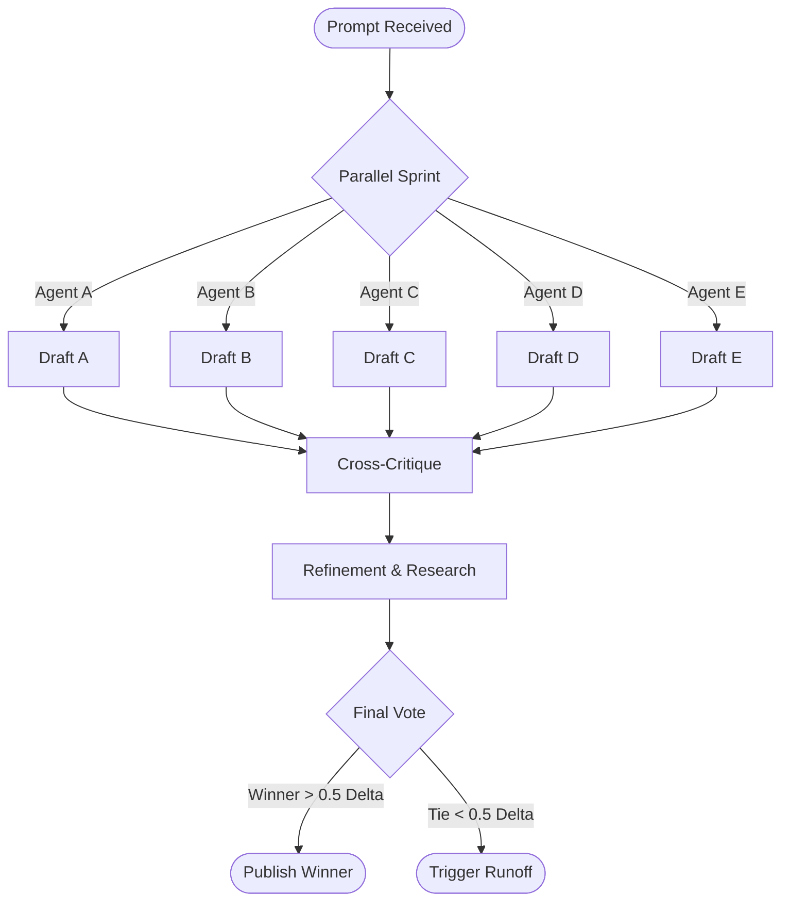

# The Consensus Constitution: Laws of the Titan Quorum

**Version:** 1.0
**Authority:** System Architect
**Enforcement:** OpenClaw Agentic Runtime

---

## 1. Preamble
This document defines the mathematical and logical frameworks governing the **Titan Quorum** (the 5-Agent Consensus Engine). It serves as the "Operating System" for decision-making, ensuring that the curriculum generated is factually accurate, pedagogically sound, and hallucination-free.

---

## 2. The Quorum Members
The Quorum consists of 5 distinct high-parameter **Open Weights** models.

| Seat | Role | Model | Bias |
| :--- | :--- | :--- | :--- |
| **I** | **Chair** | Llama 3.1 405B | Structural Integrity |
| **II** | **Miner** | DeepSeek-V3 671B | Technical Precision |
| **III** | **Auditor** | Nemotron-4 340B | Compliance/Safety |
| **IV** | **Professor** | Qwen-2.5 72B | Empathy/Nuance |
| **V** | **Vizier** | Mistral 8x22B | Creativity/Lateral Thinking |

---

## 3. The Tournament Protocol (Parallel Competition)

We do not iterate on a single draft. We select the fittest from a population of 5.

### 3.1 Stage 1: The Parallel Sprint
All 5 Agents receive the prompt simultaneously.
*   **Action:** Each agent generates a unique draft ($D_A, D_B, D_C, D_D, D_E$) independently.



### 3.2 Stage 2: The Cross-Critique
Each agent reads the other 4 drafts.
*   **Action:** They generate a `Critique` for each peer: *"Your section on gravity is accurate, but your analogy is weak. See Draft C for a better example."*

### 3.3 Stage 3: The Refinement
Agents consume the peer feedback and perform **Targeted Research** to fix their weak points.
*   **Action:** They generate their Final Candidate ($D'_i$).

### 3.4 Stage 4: The Final Vote
Agents vote on the **Best Candidate** (excluding their own).
*   **Winner:** The draft with the highest geometric mean score becomes the **Official Chapter**.

### 3.5 Stage 5: The Runoff (Tie-Breaker Synthesis)
If the top 2 drafts are within **0.5 points** of each other:
1.  **Action:** The two authors enter a "Fusion State".
2.  **Context:** They receive the **Combined Research Context** of both drafts.
3.  **Synthesis:** They declare a truce and co-author a single **Joint Draft** ($D_{Fusion}$).
4.  **Ratification:** The Council votes strictly Up/Down on the Fusion Draft.


---

## 4. The Titan Grading Rubric (0-10)

Evaluation is not binary. It is scalar.

### 4.1 Dimension A: Accuracy (The "Truth" Score)
*   **10**: Every claim is cited. Citations match 100% of source text. No hallucinations.
*   **8**: Minor citation formatting errors. All facts correct.
*   **5**: One hallucinated fact or misattributed quote. **(Rejection Threshold)**
*   **1**: Total fabrication.

### 4.2 Dimension B: Depth (The "PhD" Score)
*   **10**: Synthesis of >3 sources. Identification of second-order effects. Novel insight.
*   **8**: Solid summary of sources. Good structure.
*   **5**: Superficial "Wikipedia-style" overview. **(Rejection Threshold)**
*   **1**: Incoherent rambling.

### 4.3 Dimension C: Pedagogy (The "Teacher" Score)
*   **10**: Clear analogy. Socratic questioning. Appropriate tone. "Aha!" moment likely.
*   **8**: Clear explanation. Standard tone.
*   **5**: Dense jargon. Passive voice using "delve". **(Rejection Threshold)**
*   **1**: Unreadable.

### 4.4 The Publication Condition
A draft $D$ is published ONLY IF:
$$ \overline{Score}(D) = \frac{1}{N} \sum_{i=1}^{N} Score_i \ge 8.0 $$
AND
$$ \min(Score_i) \ge 5.0 $$

---

## 5. Algorithmic Implementation (Pseudocode)

```python
def check_consensus(scorecards: List[dict]) -> bool:
    """
    Determines if the Quorum has reached a publication standard.
    """
    total_score = 0
    valid_votes = 0
    
    for card in scorecards:
        # Check for immediate veto
        if card['accuracy'] < 5 or card['depth'] < 5:
            return False # VETO
            
        avg_vote = (card['accuracy'] + card['depth'] + card['pedagogy']) / 3
        total_score += avg_vote
        valid_votes += 1
        
    global_average = total_score / valid_votes
    
    return global_average >= 8.0

---

## 6. The Council of Survivors (Autonomous Evolution)

To prevent stagnation, the Quorum undergoes a **Darwinian Review** every $N=100$ cycles.


### 6.1 The Self-Check (Introspection)
At the end of Cycle 100, OpenClaw presents the **Performance Matrix** to all authenticated agents.
*   "Agent A: 9.2"
*   "Agent B: 8.5"
*   ...
*   "Agent E: 6.1"

### 6.2 The Vote of Execution
The 5 Agents must vote on who to remove.
*   **Prompt:** *"Based strictly on the data, which member is the weakest link? Vote to terminate."*
*   **Consensus:** A **4/5 Majority** is required to execute a member.
*   **Action:** The target's `soul.md` is moved to `souls/graveyard/` and the process is killed.

### 6.3 The Rite of Reincarnation (Collaborative Soul Synthesis)
The 4 Survivors are tasked with creating their new colleague.
1.  **Drafting:** The Survivors discuss specifically *why* the previous agent failed.
2.  **Synthesis:** They collaboratively write a new System Prompt (`souls/active/agent_new.md`).
    *   *Instruction:* "You must draft a persona that covers the blind spots of the previous agent."
3.  **Birth:** The new agent is instantiated with this survivor-authored soul.
4.  **Probation:** The Novice has no voting power for the first 10 cycles.
```
