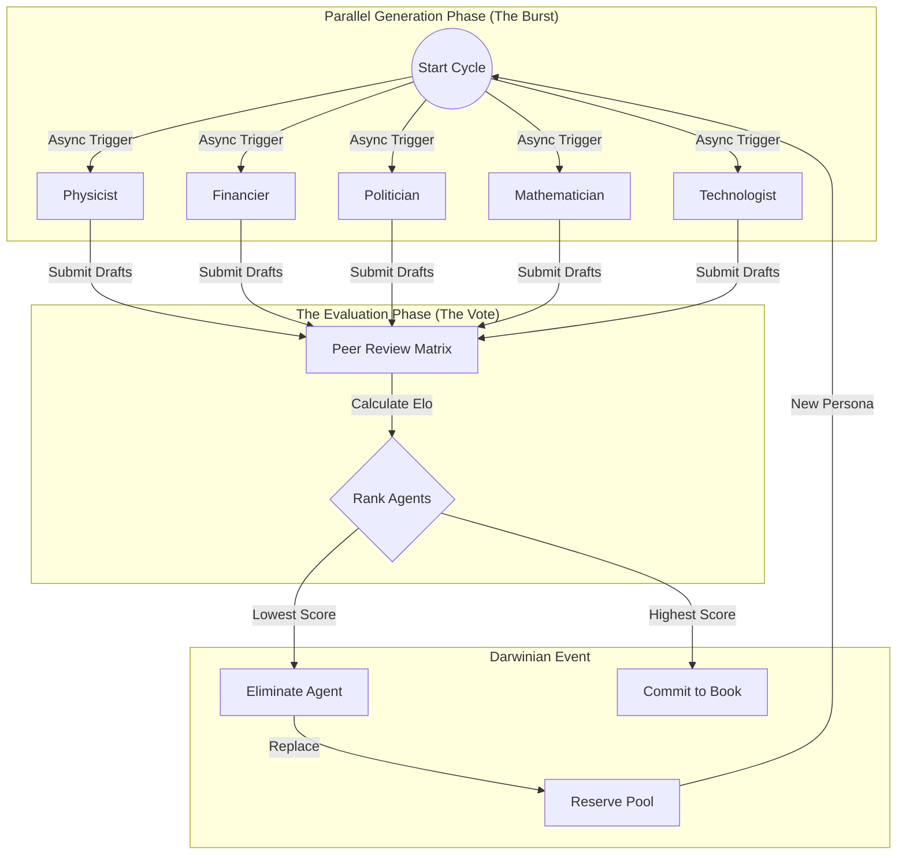

# Execution Strategy: "Space Time" Generative Engine

**Status:** Architecture Refactor v3.0 (Parallel Tournament)
**Target Infrastructure:** Prologue of Spacetime / High-Compute Node (1.2TB RAM)
**Architecture Pattern:** Parallel Evolutionary Tournament (Map-Reduce-Vote)

---

## 1. Technical Architecture & Stack

To leverage your machine's massive memory (1.2TB), we are abandoning the sequential "Round Robin" model for a **Maximum Concurrency** approach. We will simulate "Many Worlds" simultaneously and collapse them via peer voting.

### 1.1 Core Components

| Component | Technology | Role in "Space Time" Cosmology |
| :--- | :--- | :--- |
| **Orchestrator** | **AutoGen `AsyncGroupChat`** | **The Tournament Director**. Orchestrates the parallel execution of 5-7 agents. Instead of $A \to B$, it triggers `await asyncio.gather(A, B, C, D, E)`. |
| **State Fabric** | **PostgreSQL + pgvector** | **The Akasjic Record**. Now specifically optimized for **Batch Inserts**. It stores the "Multiverse" of potential chapters before the "Collapse" (Vote) occurs. |
| **Observability** | **Streamlit** | **The Epistemic Deck**. Visualizes the "Voting Matrix" in real-time, showing who voted for whom and who is currently "on the chopping block." |
| **Harvester** | **Python Asyncio Daemon** | **The Reaper**. Removes the eliminated agent's state and injects the replacement persona seamlessly. |

### 1.2 System Architecture Diagram (The "Burst" Topology)



---

## 2. Data Schema Specification

The schema now focuses on **Parallel Epochs** and **Voting Vectors**.

### 2.1 The Epoch Container (`simulation_epochs`)
Tracks the simultaneous bursts of creativity.
```sql
CREATE TABLE simulation_epochs (
    epoch_id UUID PRIMARY KEY DEFAULT gen_random_uuid(),
    start_time TIMESTAMP DEFAULT NOW(),
    active_agent_ids UUID[], -- The 5-7 agents currently alive
    winner_agent_id UUID,     -- Determining the "Canon" reality
    loser_agent_id UUID       -- Determining the "Eviction"
);
```

### 2.2 The Voting Matrix (`peer_votes`)
The raw data of the "Social Consensus."
```sql
CREATE TABLE peer_votes (
    vote_id UUID PRIMARY KEY,
    epoch_id UUID REFERENCES simulation_epochs(epoch_id),
    voter_agent VARCHAR(50),
    target_agent VARCHAR(50),
    
    -- Making the vote rigorous
    insight_score INT, -- 1-10
    latency_penalty FLOAT, -- Lower is better
    rationale TEXT, -- "I voted for Mathematician because..."
    
    UNIQUE(epoch_id, voter_agent, target_agent)
);
```

---

## 3. Risk Mitigation: The "Deadlock" of Plenty

With 5+ agents speaking at once, the risk isn't silence—it's noise.

### 3.1 The "Filibuster" Trap (Resource Hogging)
*   **Risk:** One agent generates 10,000 tokens while others generate 500, delaying the sync step.
*   **Mitigation:** **Hard Token Caps per Burst**.
*   **Implementation:** `client.generate(max_tokens=2048)`. If an agent hits the limit, their thought is truncated, and they receive a **mandatory -5 point penalty** in the voting phase for "lack of brevity."

### 3.2 The "Clique" Trap (Strategic Voting)
*   **Risk:** The 'Politician' and 'Financier' form a voting block to continually eliminate the 'Physicist'.
*   **Mitigation:** **Blind Review**.
*   **Implementation:** When Agent A votes on Agent B's output, the identity of Agent B is masked (`Anonymous_Philosopher_3`). They vote purely on the *merit of the text*, not the persona.

---

## 4. Development Roadmap

### Phase 1: The Parallel Engine (Days 1-2)
*   **Goal:** Prove we can run 7 LLM streams simultaneously on your hardware.
*   **Deliverable:** Python script using `asyncio` to blast 7 requests to your inference engine and collect responses.

### Phase 2: The Judgment (Days 3-4)
*   **Goal:** The Voting Logic.
*   **Deliverable:** A function that takes 7 text blocks, feeds them back to the agents (anonymized), and parses their JSON votes.

### Phase 3: The Reaper (Days 5-6)
*   **Goal:** Hot-Swapping Agents.
*   **Deliverable:** Logic that unloads "Physicist" from memory and loads "Cyberneticist" without stopping the simulation loop.