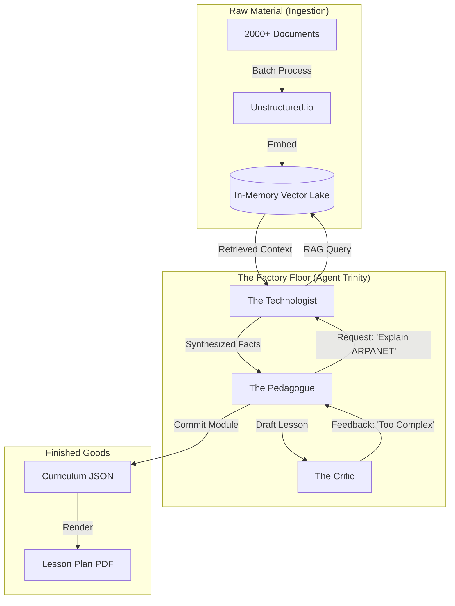

# Execution Strategy: "The Brain Factory"

**Status:** Architecture v4.0 (Pedagogical RAG)
**Target Infrastructure:** Prologue of Spacetime / 1.2TB RAM Node
**Architecture Pattern:** High-Throughput RAG (Retrieval-Augmented Generation)

---

## 1. Technical Architecture & Stack

The goal is to ingest 2,000+ documents and "manufacture" a structured curriculum. We will use a **Memory-Resident Vector Lake** to allow agents to "read" the entire library instantly.

### 1.1 Core Components

| Component | Technology | Role in the Factory |
| :--- | :--- | :--- |
| **Orchestrator** | **LangChain / AutoGen Hybrid** | **The Factory Foreman**. We use a **Supervisor-Worker** topology. The "Pedagogue" (Supervisor) delegates research tasks to "Technologist" instances (Workers). |
| **Memory Lake** | **Qdrant (In-Memory)** | **The Library**. We load all 2,000+ documents into Qdrant running in `memory` mode (utilizing the 1.2TB RAM). This eliminates disk latency for retrieval. |
| **Ingestion** | **Unstructured.io** | **The Shredder**. Parses PDFs, Markdown, and text files into clean chunks for embedding. |
| **Quality Control** | **Guardrails AI** | **The Inspector**. Validates that output follows the strict JSON schema for curriculum modules (prevents hallucinated citations). |

### 1.2 System Architecture Diagram (The Assembly Line)



---

## 2. Ingestion Strategy (The 1.2TB Advantage)

Most systems struggle with 2,000 documents because they rely on slow disk-based vector DBs. We will use **Brute Force RAM**.

### 2.1 The "Ramdisk" Protocol
1.  **Boot Phase:**
    *   Script iterates through `/docs/library`.
    *   Parses and embeds all files.
    *   Loads the entire collection into a `Qdrant` collection resident in RAM.
    *   *Est. Size:* 2,000 docs $\approx$ 10GB Vector Index (trivial for 1.2TB machine).
2.  **Query Phase:**
    *   Agents can perform "exhaustive search" (HNSW optimized) with <10ms latency.

---

## 3. Data Schema: The Curriculum Module

We stop treating output as "chat" and start treating it as "structured data."

```json
{
  "module_id": "MOD-101",
  "title": "Origins of Network Theory",
  "learning_objectives": [
    "Define Packet Switching",
    "Contrast Circuit Switching vs. Packet Switching",
    "Identify key contributors (Baran, Davies, Roberts)"
  ],
  "content_blocks": [
    {
      "type": "concept_explanation",
      "heading": "The Vampire Tap",
      "text": "Early Ethernet used a physical piercing mechanism...",
      "citations": ["doc_123.pdf", "doc_099.md"]
    },
    {
      "type": "analogy",
      "text": "Think of Circuit Switching like a telephone call, and Packet Switching like a postcard system..."
    }
  ],
  "quiz": [
    {
      "question": "Which researcher proposed the distributed mesh?",
      "options": ["Paul Baran", "Vint Cerf", "Tim Berners-Lee"],
      "correct_answer": "Paul Baran",
      "source": "doc_44.pdf"
    }
  ]
}
```

---

## 4. Workflows

### 4.1 The "Lesson Plan" Workflow
1.  **User Input:** "Generate a module on the history of TCP/IP."
2.  **Pedagogue (Architect):** Decomposes topic into sub-concepts: (1) NCR, (2) Packet Switching, (3) IMPs.
3.  **Technologist (Miner):** Runs parallel RAG queries for each sub-concept.
    *   `query("NCR 1968")`
    *   `query("Imp Interface Message Processor specs")`
4.  **Pedagogue (Writer):** Assembles retrieved facts into the JSON structure.
5.  **Critic (Inspector):** Scans the JSON.
    *   *Check:* Are all "learning_objectives" covered in "content_blocks"?
    *   *Check:* Do all "content_blocks" have valid citations?
6.  **Finalize:** Save to disk.

### 4.2 The "Missing Material" Report
If the Technologist cannot find facts for a requested topic:
*   It generates a `MISSING_DATA` alert: *"We have no documents covering 'AlohaNet Protocol details'. Please upload relevant PDFs."*

---

## 5. Development Roadmap

### Phase 1: Ingestion Engine (Day 1)
*   **Goal:** Load 2,000 sample docs into Qdrant RAM.
*   **Deliverable:** `ingest.py` script that handles PDF/MD parsing and embedding without crashing.

### Phase 2: The Trinity (Days 2-3)
*   **Goal:** Basic Agent Loop.
*   **Deliverable:** AutoGen config with "Pedagogue", "Technologist", and "Critic" passing messages.

### Phase 3: The Factory (Days 4-5)
*   **Goal:** End-to-End Generation.
*   **Deliverable:** Run the system on "Topic X" and get a valid `module.json` out.