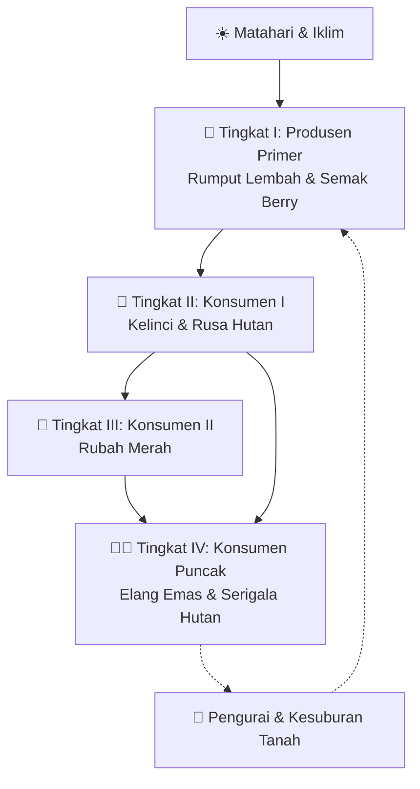

# 🌾 ECO-VALLEY: Harmony of the Food Chain
> **Simulasi Rantai Makanan & Keseimbangan Ekosistem Interaktif Terinspirasi Visual Cozy Farm Stardew Valley**

---

## 🌟 Konsep Game & Nilai Edukasi
**Eco-Valley** adalah game simulasi ekologi interaktif di mana pemain berperan sebagai seorang peneliti lingkungan di sebuah lembah pedesaan. Terinspirasi oleh estetika visual pixel art yang hangat, jam kayu melengkung (*wooden clock HUD*), dialog rustic, serta roh penjaga hutan (*Junimo*) dari game **Stardew Valley**.

Pemain belajar konsep **Keseimbangan Ekosistem & Rantai Makanan (Biologi)** secara mandiri melalui **eksperimen sebab-akibat langsung (*active learning & experimental causality*)**:
- Bebas menggeser slider populasi untuk mengamati apa yang terjadi saat rantai makanan tidak seimbang.
- Menganalisis masalah ekologis: apakah rumput gundul karena kelebihan herbivora? Apakah pemangsa kelaparan karena mangsa punah?
- Mengatur iklim dan 4 musim serta cuaca ekstrem (kemarau vs hujan).
- Berdiskusi dengan **Demetrius** (Ahli Ekologi) untuk meminta evaluasi dan petunjuk. Jika ekosistem stabil, Demetrius akan memberikan acungan jempol 👍!

---

## 🔬 Rantai Makanan & Tingkat Trofik Multi-Spesies

### Detail Tingkat Trofik & Peran Spesies
| Tingkat Trofik | Spesies | Makanan / Sumber Energi | Peran Ekologis |
|---|---|---|---|
| **Tingkat I (Produsen)** | 🌿 **Rumput Lembah** & 🍓 **Semak Berry** | Fotosintesis sinar matahari & air | Fondasi biomassa. Menopang daya dukung (*carrying capacity*) seluruh lembah. |
| **Tingkat II (Konsumen I)** | 🐇 **Kelinci** & 🦌 **Rusa Hutan** | Rumput liar & buah berry | Herbivora pemakan tanaman. Jika kenyang, bereproduksi (❤️). Menjadi mangsa pemangsa. |
| **Tingkat III (Konsumen II)** | 🦊 **Rubah Merah** | Daging kelinci | Mesopredator pengendali. Mencegah kelinci menggunduli seluruh rumput. |
| **Tingkat IV (Konsumen Puncak)** | 🦅 **Elang Emas** & 🐺 **Serigala Hutan** | Rusa, kelinci, & rubah | Pengendali puncak (*Apex Predators*). Menjaga rantai makanan agar tidak terjadi *Trophic Cascade*. |
| **Roh Pelindung Hutan** | 🍏 **Junimo** | Keseimbangan alam | Menari gembira saat ekosistem stabil dan memberi berkah kesuburan padang rumput. |

---

## 🌦️ Sistem Iklim & Cuaca Interaktif

Pemain dapat mengubah **Musim** dan **Cuaca** secara langsung pada panel pojok kiri atas:
1. **Musim (Seasons)**:
   - 🌸 **Musim Semi (Spring)**: Pertumbuhan rumput seimbang, bunga mekar, kelopak sakura beterbangan.
   - 🌻 **Musim Panas (Summer)**: Sinar matahari terik, regenerasi rumput dan berry sangat cepat.
   - 🍁 **Musim Gugur (Fall)**: Warna dedaunan dan rumput berubah menjadi kuning keemasan, guguran daun amber.
   - ❄️ **Musim Dingin (Winter)**: Salju menutupi tanah, pertumbuhan vegetasi melambat drastis.
2. **Cuaca (Weather)**:
   - ☀️ **Cerah Berawan (Sunny)**: Cuaca stabil normal.
   - 🌧️ **Hujan Subur (Rainy)**: Menyuburkan tanah, mempercepat tumbuhnya tunas rumput.
   - ⛈️ **Badai Petir (Storm)**: Hujan deras dan petir.
   - 🔥 **Kemarau Panjang (Drought)**: Tanah mengering, rumput layu, menguji ketahanan daya dukung lingkungan.

---

## 🕹️ Panduan Kontrol & Eksperimen

| Aksi | Keyboard (PC) | Mouse / Sentuh (Mobile/Tablet) |
|---|---|---|
| **Gerak Karakter (8 Arah)** | <kbd>W</kbd> <kbd>A</kbd> <kbd>S</kbd> <kbd>D</kbd> atau <kbd>Panah</kbd> | Klik/Tap pada peta atau gunakan D-Pad virtual |
| **Observasi / Inspect Spesies** | Tekan angka <kbd>1</kbd> atau Dekati lalu tekan <kbd>Spasi</kbd> | Klik icon 🔍 di hotbar atas |
| **Tanam Benih Rumput Subur** | Tekan angka <kbd>2</kbd> lalu tekan <kbd>Spasi</kbd> | Klik icon 🌱 di hotbar atas |
| **Bicara dengan Demetrius/Junimo** | Tekan angka <kbd>3</kbd> lalu tekan <kbd>Spasi</kbd> | Klik icon 💬 atau klik langsung NPC di peta |
| **Eksperimen Slider Populasi** | Geser slider pada dock kanan bawah | Geser slider dengan mouse/jari |
| **Minta Petunjuk Ekosistem** | Tombol *Minta Petunjuk Demetrius* | Klik tombol di panel kanan |

---

## 🚀 Cara Menjalankan

1. Buka direktori proyek: `d:\TuhanKuatkanAku\pythomori-game\`.
2. Klik dua kali file **`index.html`** untuk langsung membukanya di browser web (**Google Chrome**, **Microsoft Edge**, **Mozilla Firefox**, dll.).
3. Tanpa instalasi atau dependensi server — 100% berjalan instan di peramban Anda!
